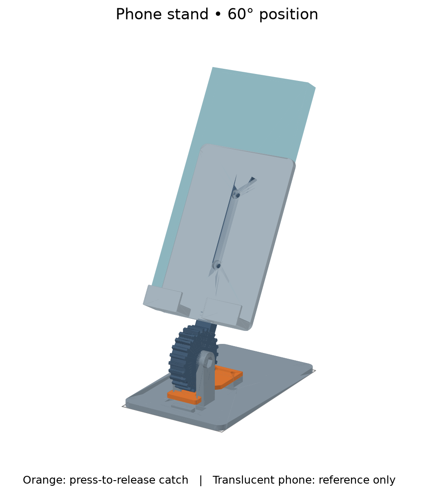
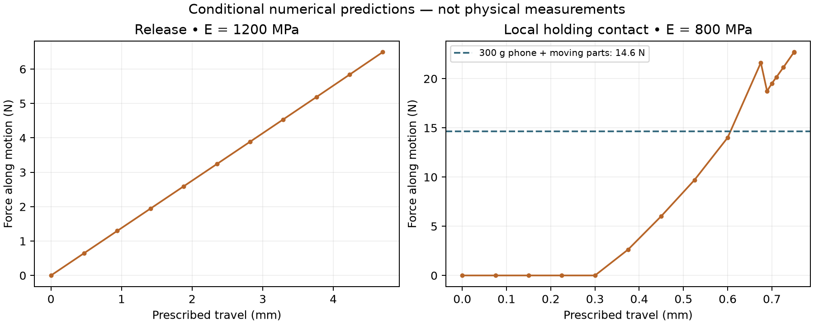

# Physical-analysis phone stand

**Current status (2026-10-04): rejected as a product before printing.** The user
confirms that this stand has not been printed and does not want to print the
existing design. Its useful everyday task and functionality were not adequately
discussed with them. A new revision is being discussed; preserving the project's
purpose as a useful exercise of physical analysis is an explicit requirement.
No replacement architecture or printable revision has been agreed yet.

The retained CAD, exports, slice reviews and local numerical studies are historical
engineering evidence, not a recommendation to print this product. They establish
the checked geometry, reference-profile slicing and conditional local mechanics;
they do not establish whole-product usefulness or physical performance. The exact
objection to the form and the intended everyday use remain to be clarified; this
is not evidence of a tolerance, material or print-process failure.

## New-revision discussion

This phase is investigation and requirements discussion, before detailed CAD or
new solver work. Start from the actual phone-use task rather than retaining the
gear and catch by default. Establish the phone/case, portrait/landscape use,
viewing versus touchscreen interaction, useful adjustment, footprint/portability,
acceptable hardware and the visible form before selecting mechanisms.

The original implementation exercised flexible release, local holding contact and
arm/cradle bending. Its gear patch translated tangentially; it did not solve the
complete rotating assembly, and the sharp-tooth pass-over run failed. The user
also recalls multipart interactions and a further analysis goal whose wording
needs clarification. These records reconstruct the implemented questions, not
an independently verified account of the original conversation.

The current [shared question interface](../../physical_analysis/README.md#use)
supports explicit translated contact, passage/return observations, flexure and
structural questions with retained studies. Complete rotating joints, friction,
creep and fatigue remain outside that interface; the optional IPC investigation
is not qualified for complete snap passage. Reuse analysis patterns and historical
evidence only within their recorded scope; changed geometry needs its own evidence.
Choose analysis questions that inform a useful replacement and preserve the
analysis-exercise objective. Any needed tool extension should follow an actual
product question. No new print setup has been agreed; the solid PETG settings
below belong to the rejected revision.

## Historical prototype

A four-part, press-to-release phone-stand prototype used to develop and
exercise the repository's [physical-analysis API](../../physical_analysis/README.md).
Designed around a **300 g phone, up to 90 × 180 × 14 mm**, at **45°, 60° or 75°**.
Hardware is matched to the user's **Jula Hard Head 002837 screw/nut assortment**.
Its source, matching exports and conditional numerical evidence were delivered. Physical fit,
creep, spring recovery and durability remain untested; this is not a tablet rating.



## Historical files and printing

Use [analysis_phone_stand.step](analysis_phone_stand.step) as the primary complete
print layout, or the matching [STL](analysis_phone_stand.stl). Preserve the supplied
part orientations. STEP contains four separate solids; split them into objects
only if needed for individual settings, then preserve their orientations.

| Part | Editable entry point | STEP | STL | Orientation |
| --- | --- | --- | --- | --- |
| Base | [stand_base.py](stand_base.py) | [STEP](stand_base.step) | [STL](stand_base.stl) | Broad base down |
| Toothed support arm | [stand_arm.py](stand_arm.py) | [STEP](stand_arm.step) | [STL](stand_arm.stl) | Broad side down; pivot bore vertical |
| Phone cradle | [stand_cradle.py](stand_cradle.py) | [STEP](stand_cradle.step) | [STL](stand_cradle.stl) | Upright on the seat/bottom edge |
| Spring catch | [stand_latch.py](stand_latch.py) | [STEP](stand_latch.step) | [STL](stand_latch.stl) | Flat underside down |

The shared dimensions/builders live in [components.py](components.py); the complete
layout is [analysis_phone_stand.py](analysis_phone_stand.py).
[inspect_assembled.py](inspect_assembled.py) is an inspection pose, not a print layout.

Print **PETG, 0.4 mm nozzle, 0.2 mm layers, two walls, 100% rectilinear infill,
automatic tree supports** using the retained process profile.
Solid infill deliberately replaces the usual 7% starting point so the homogeneous
solid analysis has a useful physical counterpart. Use calibrated filament settings.
The retained [process profile](notes/solid-petg-process.json) and Generic PETG
reference filament used 250°C after the first layer, 245°C initially and an 80°C bed;
these temperatures are reference evidence, not a filament calibration.

OrcaSlicer 2.4.2 completed the full layout and every individual export on its Qidi
Q2C 0.4 mm profile, with **no notices** and auto-brim available.
Supports are generated at the base and cradle fastener recesses; the arm and
catch need none in this profile. See [slice evidence](notes/slices.json) and
[support placement review](notes/support_review.png). The upright cradle avoids an
unsupported retaining lip; the spring bends along its printed layers. The base's
teardrop pivot bore/head roof reduces overhangs, but Orca supports the hex nut
roof and the flat screw-head seats. Remove supports from the underside base
recesses, outer pivot nut pocket and open cradle recesses before assembly; a
small pick and pliers can reach these openings. Keep the bearing seats intact.
Edge radii soften the cradle, tab and tooth roots. Actual support removal, bridge quality,
layer bonding and fit still need a print. The STL smoke checks do not validate
Orca's separate GUI STEP importer.

## Hardware and assembly

Use only the following hardware from the on-hand
[Jula 002837 assortment](https://www.jula.se/catalog/bygg-och-farg/infastning/sortimentsatser/skruvsatser/skruv-muttersats-002837/):

| Connection | Screws | Plain nuts |
| --- | --- | --- |
| Pivot | 1 × M4 × 25 mm | 2 × M4: one captive nut plus one external jam nut |
| Cradle to arm | 2 × M3 × 12 mm | 2 × M3 |
| Catch to base | 2 × M3 × 12 mm | 2 × M3 |

Jula lists **zinc-plated C-1008 steel** screws and matching plain nuts; washers,
nyloc nuts and the previously specified 35/16 mm screws are not required.
The product photograph shows cross-drive pan heads, rather than countersunk or
socket heads. Use a fitting cross-head screwdriver, a 7 mm M4 nut spanner and
a 5.5 mm M3 nut tool. The rear arm recess accepts a small nut socket up to
8.4 mm outside diameter; the partially exposed nut also permits side access.

Jula does not publish head or nut dimensions. CAD assumes M3 heads no larger
than **6.0 mm diameter × 2.4 mm high**, M4 heads **8.0 × 3.1 mm**, and nominal
M3/M4 nut thicknesses **2.4/3.2 mm**. Pocket diameters are 6.6/8.6 mm, and the
M4 captive hex is 7.4 mm across flats. Compare your screws with these envelopes
before printing. The editable hardware parameters are in `components.py`;
changing pocket depths also changes thread engagement and the remaining backing.

The revision retains the established four-part architecture, phone envelope,
angle range, flexible catch and PETG setup. Flat head seats replace countersinks;
shallow rear arm nut recesses shorten the cradle grip. Deeper external pivot
seats accommodate the M4 × 25 screw and two ordinary nuts without reducing the
0.4 mm arm clearance per side. No additional printed hardware or tools are needed.

1. Insert two M3 × 12 screws upward through the base's recessed underside holes.
   Set the catch on the raised rear mounting pad, with its tooth and broad thumb
   tab pointing toward the front. Add plain M3 nuts above the catch root and snug
   them without crushing the PETG. Heads must remain above the desk plane.
2. Attach the cradle to the arm using the other two M3 × 12 screws from the phone
   side. Seat their pan heads below the phone-contact face and the plain nuts in
   the shallow recesses on the arm's rear face. Tighten gently: 1.4 mm of backing
   remains beneath each head seat. Nominal thread protrusion is 1.2 mm.
3. Seat one M4 nut in the base's outer hex pocket. Put the toothed arm between the
   cheeks and insert the M4 × 25 screw from the opposite, teardrop head pocket.
   Snug it into the captive nut and check that the arm rotates freely. Thread the
   second M4 nut onto the exposed end and jam it against the first, held by the
   hex pocket. Use modest torque and recheck free rotation; do not flex the cheeks
   inward to clamp the arm. Both nuts fully engage with 0.7 mm nominal thread
   beyond them. The shaft bores remain 4.5 mm. Check the jam nut for loosening
   during the first trial; this is not a qualified vibration-resistant joint.
4. Support the cradle by hand, press the front tab down to its stop, set the angle,
   and release the tab into a tooth valley. Use the 45–75° range; valleys are
   spaced 15° apart. Verify engagement before letting go.

**Press, adjust, release.** Do not force the teeth over the catch. Remove the phone
or support its weight while adjusting. The cradle has an 8 mm retaining lip and
an open 20 mm cable notch. The phone lifts out upward along the cradle; it is a
gravity holder, not a clamp for carrying the device around.

## Numerical evidence and its limits

[Current verification summary](notes/verification.json),
[geometry/use checks](notes/geometry.json), and [analysis consumer](analyze.py).

| Question | Conditional prediction | Scope |
| --- | --- | --- |
| Thumb release | 6.49 N at 4.7 mm travel; least sampled tooth clearance travel 2.20 mm | E = 1200 MPa; front-edge press; idealized clamped root |
| Holding contact | Checked to 22.70 N versus 14.64 N service demand; maximum penetration 0.0017 mm | E = 800 MPa; local tangential translation of an actual tooth patch; frictionless |
| Arm/cradle bending | 0.88 mm maximum displacement; 0.37% peak strain | Updated recessed-head geometry; 300 g phone plus conservative 100 g moving-part allowance; E = 800 MPa |
| Release strain screen | 1.40% on the finer mesh versus an assumed 1.5% limit | Local peak remains mesh sensitive; not a converged yielding prediction |
| Hardware bearing screen | 1.82 MPa at the recessed pivot, 4.00 MPa at cradle bolts | Reduced printed ligaments, conservative projected areas versus an assumed 7 MPa PETG allowance |



Release force changed 0.07% between 1.5 and 1.1 mm meshes. Holding force changed
0.35% when refining from 2.5 to 1.8 mm and doubling the penalty stiffness.
**Peak strain did not meet the 5% refinement criterion**: it changed about 21%
for release and 8% for holding. The high release value lies near the idealized
clamp edge. Neither the assumed limit nor this elastic material law establishes
permanent set, layer failure, fatigue or long-term PETG creep.

The [updated structure case](notes/analysis/jula_structure/result.json) was rerun
after changing the arm/cradle recesses. Its current fixture identity is checked
when generating the verification summary. The older `notes/analysis/structure`
is historical. Release evidence is reused with the unchanged catch fixture's
identity checked; retained local holding evidence covers the unchanged tooth
patch and catch, excluding the revised pivot support. No new steel modulus or
strength grade is assumed from Jula's material label.

The hardware revision's CAD checks cover the assumed screw heads, shafts, nuts
and M3 socket access, plus thread engagement at all three locked poses. The
unchanged release consumer regression also passed. These checks establish
nominal compatibility; actual head dimensions and printed seats remain untested.

The structure case treats the bolted arm/cradle interface as bonded and fixes a
cut at the gear sector; its displacement excludes hinge play, catch rotation and
joint slip. Contact uses a short straight tangential path, not a complete rotating
assembly solve. The checked force/service ratio of 1.55 is not a certified safety
factor. The historical moving geometry corresponds to about 87 g at an assumed
1.27 g/cm³; this revision only removes material at bolt seats, so the unchanged
100 g load allowance remains conservative under that density assumption.
The phone centre has an 18.5 mm rear
footprint margin at 45°, before counting stabilizing base weight. A lateral bump,
a shifted phone or a cable pull is outside that static screen.

The full geometry check found no unintended component overlaps at the three
locked poses; arm/base and cradle/base motion was sampled every 2° over 45–75°.
The device envelope seats and lifts out. These geometric checks do not simulate
elastic release or continuous contact.

### What using the API changed

The model exposed an offset-tab twisting problem, a need for feature-specific
motion observations, a misleading total-reaction/actuation-force distinction,
an ignored solver parameter and slow tensor post-processing. Those led to API
fixes and numerical regressions. The catch acquired a wider root and a positive
thumb stop: the retained [overtravel result](notes/analysis/release_overtravel_rejected/result.json)
exceeded the provisional strain limit at 5.3 mm travel.

A [sharp-tooth pass-over experiment](notes/analysis/pass_over_rejected/result.json)
on an earlier fixture failed to converge. It remains explicitly rejected; the
operating design uses deliberate release. At the original model handoff, all 19
then-existing repository tests passed, including solver-backed regression cases.
The supported foundation now covers
loaded solids, prescribed flexure deformation, smooth contact and this local
holding-contact experiment. General rotating multipart mechanisms, friction,
plastic deformation and durability need further backends or validated extensions.

### Reproduce

From the repository root, after the [analysis runtime setup](../../physical_analysis/README.md#setup):

```sh
uv run --locked python model/analysis_phone_stand/analyze.py release /tmp/release_new --mesh 1.1
uv run --locked python model/analysis_phone_stand/analyze.py holding /tmp/holding_new --mesh 1.8 --modulus 800 --penalty 120000
uv run --locked python model/analysis_phone_stand/analyze.py structure /tmp/structure_new --mesh 2.3 --modulus 800
uv run --locked python model/analysis_phone_stand/verify.py
uv run --locked pytest -q
```

Run directories must be new. [Retained cases](notes/analysis/) contain compact
results, parameters, compressed solver input and logs, and increment records.
Decompress a case's `analysis.inp.gz` into a fresh directory and run `ccx -i analysis`
to replay its exact finite-element input. Geometry BREP snapshots and large raw
result fields are absent from the historical archives; `analyze.py` rebuilds them from current source.
The rejected pass-over deck preserves its earlier geometry independently.
[evidence.py](evidence.py) now delegates to the [shared retention helper](../../physical_analysis/README.md#retain-analysis-evidence),
which also keeps available fixture BREPs for new archives. Historical records
are unchanged. [summarize_evidence.py](summarize_evidence.py)
compares completed evidence, and [plot_evidence.py](plot_evidence.py) rebuilds views.

## Historical proposed trial and current print status

The complete stand was proposed as the trial; no separate coupon was supplied.
The user has rejected this product before printing, so the following trial plan
is retained only as historical context. First check free
pivot motion and repeated unloaded release/return, then use a supported 300 g
surrogate before putting a phone on it. Report whether the catch fully returns,
holds each angle, takes a permanent set, or drifts under an hour-long load. Record
material, print settings, orientation and actual release effort if measurable.
Check that pan heads are below the phone/desk surfaces, all nuts fully engage,
the pivot remains free after locking, and the cradle joint does not slip. If
hardware exceeds the stated envelopes, revise the pocket parameters and rerun
the grip/clearance checks before using the stand. Plain M3 nuts and the M4 jam
pair still need physical checks for loosening and creep.
If the catch binds, diagnose the contact before changing thickness: thickness
changes both force and strain. Physical feedback is needed before a load claim.

| Item | Print status | Artifact(s) | User result or remaining physical checks |
| --- | --- | --- | --- |
| Test piece(s) | N/A | None; full stand was the proposed trial | No separate coupon phase |
| Final printable object(s) | No | Historical `analysis_phone_stand.step/.stl`, `stand_base`, `stand_arm`, `stand_cradle`, `stand_latch` STEP/STL pairs | 2026-10-04: user confirms unprinted and rejects the product design; replacement requirements under discussion. No physical failure observed. Hardware fit, release, recovery, holding, creep and durability remain untested |

## Shared flexure question

[analyze.py](analyze.py) uses `FlexureQuestion` for release and
`StructuralQuestion` for the stated phone-load fixture. The release's five
case-construction calls move into shared code; root/thumb/tooth regions, free
thumb DOFs and acceptance criteria stay here. The sharp gear-tooth contact
investigation continues to use the lower-level case API.

The [fresh release run](notes/analysis/question_release/result.json) reproduces
6.4936 N and 1.3967% peak strain. A uniform root-to-thumb beam predicts 4.1309 N;
the explicit variable-width CAD fixture is 1.572 times stiffer in this response.
The beam screen is visible and is not treated as adequate for this geometry.
The [generated decision record](notes/verification.json) now uses shared study
planning: the existing force comparison is stable, while local peak strain remains
mesh-sensitive. Older histories' all-frame force balance is calculated from saved
reactions; no solve is repeated just to recover that summary. These are conditional
solid PETG results; print status and physical-test requirements above are unchanged.

## Attribution

Primary model: GPT-6 in the Codex agent environment. The user identified the model
as **GPT-6 Astra with low reasoning effort**; the exact runtime variant and effort
are not independently exposed. Harness: Codex via API. Provider: OpenAI.
No sub-agents contributed. Geometry and analysis integration are repository-owned
work under the root MIT licence. CalculiX and Gmsh remain separately licensed
external dependencies; no solver binaries are included.

Engineering-question migration contributor: GPT-6 family (specific runtime variant
and reasoning effort not exposed); Codex shared-workspace API agent; provider not
separately exposed. No sub-agents. Historical model attribution above is preserved.

Jula hardware adaptation: GPT-6 family, Codex API agent, OpenAI; exact runtime
variant and reasoning effort unavailable. No sub-agents contributed.
