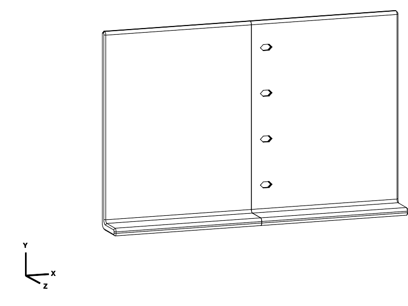

# Book reading plate

A 400 mm wide L-shaped platform for an open book, mostly supported on a lap.
The inside dimensions are 250 mm along the back and 40 mm along the lip, with
10 mm walls extending outward. Two PETG halves connect with four internal tenons
and four tapered, entirely printed draw keys. No glue, metal hardware or book
catch is required. The original retaining lip remains part of the L.

## Files and first print

**Print `joint_test.stl` first.** It contains two test blocks and one full-size
locking key. The complete plate is also supplied; the sample is an economical
fit test, not a substitute for the finished design.

| File | Purpose / quantity | Print orientation bounds, mm |
| --- | --- | --- |
| [joint_test.stl](joint_test.stl) / [STEP](joint_test.step) | One test assembly; three pieces | 89.32 × 81.96 × 82 |
| [plate_left.stl](plate_left.stl) / [STEP](plate_left.step) | One male half with four tenons | 133.90 × 247.24 × 236 |
| [plate_right.stl](plate_right.stl) / [STEP](plate_right.step) | One female half with sockets | 170.37 × 225.41 × 200 |
| [locking_keys.stl](locking_keys.stl) / [STEP](locking_keys.step) | Four identical keys, already laid out | 100 × 13 × 7.70 |
| [book_reading_plate_assembled.step](book_reading_plate_assembled.step) | Assembly inspection only; do not slice | 400 × 260 × 55, including rear keys |

Matching STEP/STL pairs have identical millimetre placement. Keep the supplied
orientations and relative part positions; center each layout on the bed.
The left and right halves are separate print jobs. Main source parameters and
builders are in [components.py](components.py).
[book_reading_plate.py](book_reading_plate.py) evaluates the assembled pose;
[export_plate.py](export_plate.py) creates all production/test exports and runs
interface checks; [verify_exports.py](verify_exports.py) independently checks
the exported pairs. Evaluate these entry points with the CadQuery MCP tool.
[joint_detail.py](joint_detail.py) is an exploded illustration only.

## Print settings

Confirmed material: **PETG**, 0.4 mm nozzle, **260 × 260 × 250 mm** usable envelope.
Starting settings: 0.20 mm layers, six perimeters, six top/bottom layers,
40% gyroid infill, 4 mm outer brim, and supports off. Use the same settings and
filament for the test and full joint. Use your calibrated PETG temperatures;
the saved reference profile uses 240 °C nozzle / 80 °C bed as diagnostic values.
Use the printer's own machine profile, start code and end code.

Both halves stand on their outside edges, with the joints upward. Their L-shaped
feet are rotated 30° on the bed. The 2 mm chamfer on each bed-contact perimeter
replaces a lower fillet to avoid a steep first-layer overhang. The main curved
edges use 4 mm radii and the outside L elbow uses a 9 mm radius. Contact dimensions
refer to the theoretical inner corner and extremities; rounded transitions
shorten the perfectly flat portions. Joint corners use 1.5 mm radii, and key
heads use 2 mm corners and a 1 mm exposed-edge fillet. Mating seam faces remain
flat so they can clamp together.

The standing orientation leaves every socket open upward. The key holes have
45° roofs in the panel print orientation. Each loose key lies on its broad flat
side; its force path runs mainly within layers. The panels bend across layers
when supported only at the outer sides, so good layer bonding matters. These
are tall prints: keep the brim and use sensible acceleration for your printer.
Do not rotate a panel flat without reassessing supports and fit surfaces.

| Reference estimate | PETG including brim | Print time |
| --- | --- | --- |
| Joint test | 68.97 g | 6 h 9 min |
| Left half | 593.72 g | 47 h 19 min |
| Right half | 519.92 g | 42 h 10 min |
| Four keys | 6.58 g | 45 min |
| Complete plate and keys | **1,120.22 g** | **about 90 h 14 min**, sequentially |

These are estimates from a deliberately conservative reference profile, not
predictions for an identified printer. The requested 10 mm walls make this a
substantial plate; it has not been silently thinned to save material.

## Assembly and joint test

The illustration separates the blocks and moves the key below them for visibility;
the key actually enters the aligned hole from the **rear** of the assembled plate.

1. Remove the brim and any strings. Check the tenons and sockets for debris.
   Slide the test tenon fully into the socket. The block faces should meet
   without forcing. There is 0.20 mm nominal clearance per side in Y and Z,
   and 0.60 mm clearance at the tenon tip.
2. Insert the key's narrow tip from the rear (the broad flat outside of the L).
   The head stays at the rear. Its tapered flank faces away from the centre seam;
   its straight flank faces toward the seam. Push gently until the seam is tight.
   Do not drive the head flat against the plate: its remaining gap provides
   tightening travel. The nominal CAD pose has about 0.4 mm travel to first contact.
3. Try pulling the sample apart, twisting it, and bending it both ways by hand.
   Look for visible seam opening, rocking, key back-out, cracking or whitening.
   A useful result is a hand-seated key that stays put and removes perceptible play.
   Recheck after several insertions and after leaving it assembled overnight.
4. If it binds before the seam closes, inspect first-layer spread/debris and
   compare the two socket directions before changing `socket_clearance` in
   0.05 mm increments. If the seam closes but the key bottoms out while loose,
   reduce `key_seat_clearance` to make the key wider. If the key binds too early,
   increase that parameter. Reprint the test after a change; do not scale parts.
5. For the full plate, align all four tenons, slide both halves together, then
   insert all four keys. Tighten them progressively, alternating positions.
   Book-supporting surfaces should be coplanar. The recessed tips leave the
   reading surface clear; the rounded heads remain about 3–5 mm proud at the rear.
   To dismantle, unload the plate and push each tip backward through its front
   access hole using a blunt tool, then pull the keys and separate the halves.

The keys create a lateral clamping force across the seam. The broad tenons and
socket skins transfer bending/shear; contact between the seam faces and the
key preload limit rocking. The tapered keys rely on **friction to stay inserted**;
there is no untested snap latch presented as positive retention. PETG fit,
friction, creep and repeated-use wear must be checked on the sample. If a key
backs out or the seam still rocks after moderate hand seating, do not rely on
that fit for an edge-supported book: revise/test the interface first.

The sample preserves a complete production tenon, socket, wall/skin thickness,
key hole, key, clearance and print-axis direction. It is cropped to 108 × 60 mm
in its assembled plane to retain material behind the socket and tenon root.
It tests local fit and feel, **not** full-plate sag, four-joint alignment, tall-print
warping, long-term strength or fatigue. After a successful sample, check the full
plate first on your lap or a low padded surface, then gradually try the intended
book with both outer sides supported.

## Design assumptions and verification

Use: lap-supported reading, occasionally held at both outer sides, never above
the face. The user did not specify book mass; **3 kg is a provisional design
scenario, not a tested load rating**. The plate adds roughly 1.1 kg under the
reference settings. No cantilever, standing/person load, impact or long-term
unsupported load was qualified.

A simple screening calculation places the entire approximately 40.4 N load
(3 kg book plus estimated plate mass) at midspan over 400 mm: bending moment is
about 4.04 N·m. A solid 250 × 10 mm back has section modulus about 4,167 mm³,
giving roughly 0.97 MPa nominal stress. Across the four 6 mm thick tenons,
subtracting the 8 mm key-hole width gives approximately 912 mm³ and 4.4 MPa;
a notional factor of two for local effects makes about 8.9 MPa. Rounded sections,
receiver-skin bending, load sharing, sparse infill and layer strength prevent
this from being a strength certification. A trial effective modulus of 800 MPa
would predict about 3.2 mm midspan deflection for an ideal continuous plate;
the real joint and print may deflect more. These are explicit screening
assumptions, not measured PETG properties or evidence of an achieved safety factor.

CAD checks passed through the required MCP evaluator (CadQuery 2.8.0,
OCP 7.9.3.1.1, Python 3.12.14, server 0.2.0):

- Valid solids: two panels and four keys; three separate pieces in the sample.
- All final printable layouts fit the envelope and contact the bed.
- No panel interference at the sampled 36, 18, 2 and 0 mm insertion offsets.
  The straight socket sections also establish an unobstructed lateral approach.
- No key/panel interference at the recorded approach poses. A small virtual
  key overdrive creates the intended contact; a 0.5 mm panel withdrawal also
  creates contact with an inserted key. These are rigid geometry checks, not
  simulations of force, elastic preload or retention friction.
- Receiver skins are 1.8 mm after clearance. A 380 mm width / 240 mm inner back /
  35 mm lip alternate build also passed validity and panel-intersection checks.
- Every final STEP/STL pair passed the repository checker's solid/component,
  closed-mesh edge, winding, bounds, volume and bed-contact checks.

[Geometry evidence](notes/geometry_checks.json) records source hashes and
parameters; [tool/code manifest](notes/evidence_manifest.json) records versions and helper hashes;
[export evidence](notes/export_checks.json) records actual file hashes.
PrusaSlicer 2.9.6 accepted all four final meshes using the
[reference PETG profile](notes/reference_petg.ini). The saved
[left](notes/slice_plate_left/summary.json),
[right](notes/slice_plate_right/summary.json),
[key](notes/slice_locking_keys/summary.json) and
[test](notes/slice_joint_test/summary.json) summaries contain input/profile hashes,
commands, estimates and deposition bounds. All had fresh nonempty paths, zero
support segments, no extracted log notices and footprints within the envelope,
including the brim. The closest footprint is the left half at Y 4.24–255.77 mm.
No repair was reported in the inspected logs. No printer job was sent.
Slicing establishes toolpath acceptance; physical fit and strength remain untested.

## Print status

| Item | Print status | Artifact(s) | User result or remaining physical checks |
| --- | --- | --- | --- |
| Test piece(s) | Unknown | `joint_test.stl`, `joint_test.step` | No user print report; check fit, seating effort, wobble, key retention and overnight relaxation in PETG |
| Final printable object(s) | Unknown | `plate_left.stl/.step`, `plate_right.stl/.step`, `locking_keys.stl/.step` | No user print report; check tall-print accuracy, full assembly alignment, sag, book support and durability |

The specified material is PETG; the exact printer, actual print profile and print
date are unknown. Update this block and the root model index together when a
physical result is reported.

## Attribution

Primary language model: GPT-6, as identified by the session runtime instructions.
Reasoning effort: not exposed. Harness/agent environment: Codex in the repository
workspace. Provider: OpenAI. No sub-agents or third-party model geometry used.
Repository MIT licence applies. Design and evidence recorded 2026-09-22.
