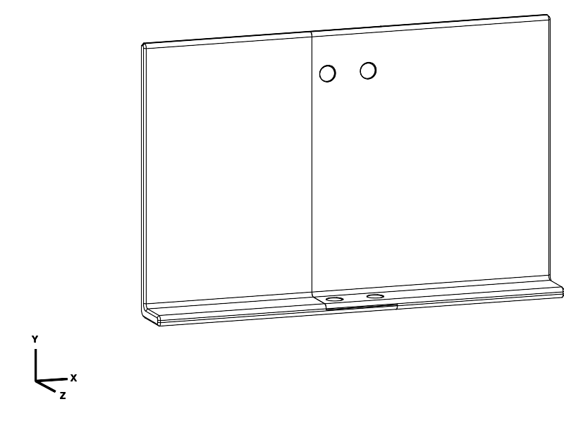
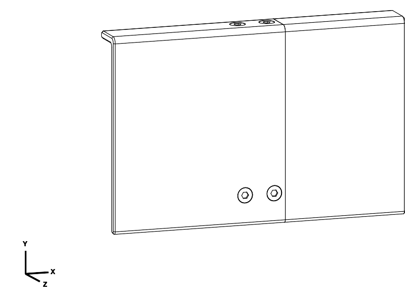
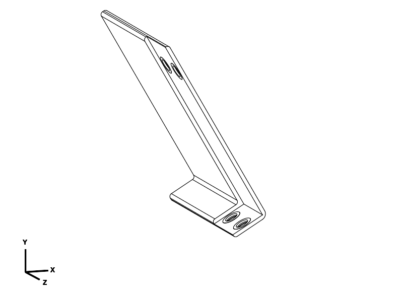
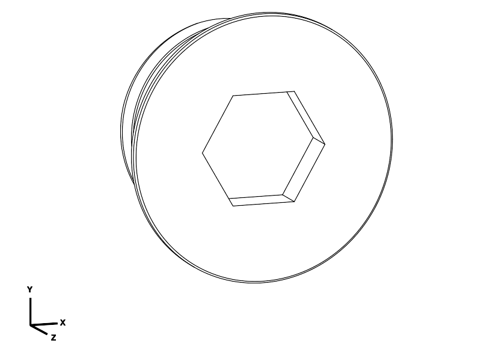
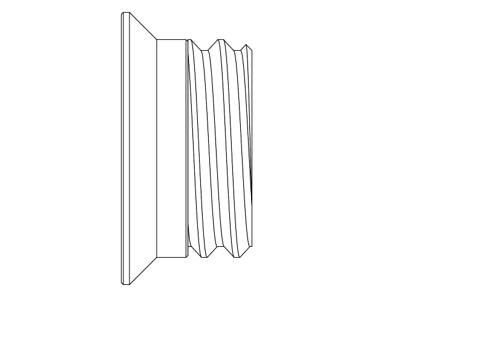

# Book reading plate — final printable set

Two PETG plate halves, joined by four printed screws. **Print one left half, one right half and the four-screw layout, all at 100% scale.** Use your existing **8 mm Allen key**; no printed tool is supplied. This set replaces all previous plate and joint-test files.

The usable dimensions remain **400 mm wide × 250 mm inner back height × 40 mm inner lip**, with **10 mm walls extending outward**. Overall assembled envelope: 400 × 260 × 50 mm. The 70 mm-wide overlap continues through the back and around the lip. Two screws fasten the lip; two fasten the back near its upper end. Exterior faces align, and both ends of every seated screw are nominally **0.2 mm recessed**.

## Download and print

| File | Print quantity | Oriented CAD bounds, mm | Reference material / time |
| --- | --- | --- | --- |
| [plate_left.stl](plate_left.stl) · [STEP](plate_left.step) | 1 | 134.27 × 247.24 × 235 | 759.27 g / 48 h 14 min |
| [plate_right.stl](plate_right.stl) · [STEP](plate_right.step) | 1 | 134.27 × 247.24 × 235 | 757.25 g / 47 h 53 min |
| [screws.stl](screws.stl) · [STEP](screws.step) | 1 layout containing **4 screws** | 98 × 20 × 9.60 | 9.71 g / 1 h 3 min |
| [book_reading_plate_assembled.step](book_reading_plate_assembled.step) | Inspection only; do not slice | 400 × 260 × 50 | — |

Print the halves as **separate jobs**. Keep the supplied orientations and centre each layout on the bed; do not lay the plate halves flat. The outside end of each half rests on the bed, and the diagonal footprint leaves room for brim/support within **260 × 260 × 250 mm**. The screws stand **thread-tip down, head and hex socket up**.

Use PETG, 0.4 mm nozzle, 0.20 mm layers, six perimeters, six top/bottom layers, **100% rectilinear infill**, and a 4 mm brim. Use supports for the plate halves' horizontal holes and local overhangs; **supports off for the screws**. The plate bores open on both sides and are accessible for cleaning. Carefully remove support from the seating cones, threads and small internal seating rings; residue there can prevent flush seating. Avoid enlarging the smooth shoulder bores or cutting thread flanks.

These solid-print settings are part of the structural assumptions. The finished geometry is approximately **1.50 kg** at 1.27 g/cm³; reference extrusion including print aids is about **1.53 kg total**. The long print estimates above are from a deliberately modest reference profile, not predictions for your printer. Lower infill is not covered by the calculations. Calibrate PETG temperature, flow and cooling for your filament; the saved 240 °C / 80 °C profiles are diagnostic examples, not machine-ready G-code.

## What changed after the successful L sample

The successful L sample's custom 16 × 2.4 mm thread, 0.24 mm radial thread clearance and 0.10 mm diametral shoulder clearance are retained. These are not ISO M16 threads. The thread lead is now 0.8 mm long for a 45° tip transition in its new print orientation.

The revised screw has a **45° underside cone and matching plate seat**, rather than a flat overhanging shoulder. Its **8.2 mm across-flats socket is 2.6 mm deep**, open upwards during printing; the former 1.2 mm-deep downward-facing pocket is gone. Head and tip recesses are both 0.2 mm rather than 0.4/0.3 mm. Nominal recesses are not guaranteed as-printed tolerances: never force a protruding screw below the surface by over-tightening.

Both lap interfaces now have 0.12 mm background clearance. Four 24 mm-diameter seating areas around the screw axes bridge that clearance and contact the other half. Tightening therefore seats against defined surfaces while allowing room for small irregularities elsewhere. The smooth shoulders and conical seats locate the fasteners; the threads clamp and resist withdrawal. There are no exterior bosses. The outside L bend is R8, the other extruded profile corners R4, and the end edges use printable 2 mm chamfers.

## Assembly and use

1. Clean the print aids and test that the new screws turn smoothly in the new female half. Use this matching set; old flat-head screws do not have the new seating geometry.
2. Bring the two L halves into their overlapping position with the book faces aligned. Keep the mating surfaces slightly apart while aligning, then settle them onto the seating areas. The pads need about 0.12 mm clearance during alignment; do not force the halves along each other while pressed together.
3. Start all four screws loosely from the outside faces. Seat them alternately with an 8 mm Allen key, using gentle fingertip torque. Stop when the heads seat and the joint is firm. Do not use a power driver or the long arm for leverage. The calculation assumes screw preload no greater than 40 N; actual torque/preload is uncalibrated. Around 0.04 N·m is only a rough starting ceiling based on assumed dry friction, not a measured installation specification.
4. Check both exterior faces with a straightedge, confirm every head and tip remains below its surrounding surface, and check for rocking, whitening or cracks. Resistance before the head reaches its seat indicates binding or debris, not successful tightening.
5. Begin use supported on your lap or a table. Increase book load gradually, check edge-held carrying briefly over a table, and recheck screw tightness after the first session and overnight. Ordinary threaded screws resist straight withdrawal but can loosen by turning; no vibration-proof lock is claimed.

The plate is intended for lap/table use and occasional carrying at both sides. Avoid treating one unsupported corner as a handle. Printed PETG flexes and creeps; this is not an overhead support or a certified load-rated platform. The prior sample's successful fit is useful physical evidence, and the user has since reported that the complete revised plate printed with a really nice result. Specific load and long-term creep observations were not supplied.

## Mechanical review

The [reproducible calculations](load_checks.py) use [measured final CAD sections](notes/sections.json) from [measure_structure.py](measure_structure.py), including holes and lap reductions. [Calculation results](notes/load_checks.json) record all assumptions and source hashes. No FEA or destructive physical test was performed.

Assumptions: **3 kg central book load**, **1.6 kg distributed plate allowance**, 400 mm simply supported span, and **2× handling load**. This gives 3.728 N·m service and 7.456 N·m peak design bending moment. Design transverse shear is 45.13 N. A 125 mm grip eccentricity gives 5.641 N·m design torsion, and a separate 50 N widthwise pull is included. These cases model load shared into the L-section while holding both sides; local one-corner gripping and arbitrary impact are not covered.

The material reference is the [Prusament PETG datasheet v1.1](https://storage.googleapis.com/prusa3d-content-prod-14e8-wordpress-prusament-prod/2023/10/9f8d2165-tds_prusament-petg_n_en.pdf): interlayer adhesion 18 ± 4 MPa and printed tensile modulus 1.5–1.6 GPa. Choosing 14 MPa and dividing by two gives a **7 MPa normal allowance**; 14 MPa is not a guaranteed statistical lower bound. A 4.04 MPa shear allowance assumes an isotropic relationship. Effective modulus is reduced to 800 MPa. These are screening assumptions for sound, solid PETG, not measured properties of your filament.

Bending transfers through the 40 mm widthwise screw spacing; torsion transfers between the lip and upper-back rows, 215 mm apart. The fastener envelope allows 60/40 row sharing, 1.25 prying and 40 N preload. Per-screw envelopes are 141.91 N transverse and 216.39 N axial. No friction strength between lap faces is credited. Local stress factor is 1.5, with 2.5 at lap roots. The conical-head strip screen also includes a 1.25 radial width factor. Actual bending moment at each measured section is used; root moment is lower than the centre-span maximum.

| Final strength screen | Stress, MPa | Chosen allowance, MPa |
| --- | ---: | ---: |
| Whole L-section bending | 1.67 | 7.00 |
| Rear / front lap bending | 4.78 / 5.57 | 7.00 |
| Most demanding combined lap bending + torsion | 6.53 | 7.00 |
| Rear shoulder bearing | 6.22 | 7.00 |
| Screw combined axial, bending and shear | 4.12 | 7.00 |
| Conical head bending / seat splitting | 6.51 / 5.52 | 7.00 |
| Male / female thread stripping | 3.30 / 3.15 | 4.04 |
| Rear edge tear-out | 3.76 | 4.04 |

The minimum remaining margin is **1.073**, after the stated factors. It is modest and conditional, not proof of safety for every print. Cone-seat splitting, local hole stresses, load sharing and lap-root stress concentration are simplified analytical screens; actual contact and printed anisotropy remain uncertainties.

Full-span L-beam integration predicts about **1.11 mm service sag**, including estimated fastener/bearing compliance and free shoulder clearance. A separate plain-back beam estimate, giving no credit to the lip or joint, is **3.14 mm**; this illustrates sensitivity to how load spreads into the lip rather than being an additional sag term or an upper bound. The eccentric-grip torsion estimate is **1.81°**, excluding restrained warping and fastener torsional compliance. These models do not establish zero movement, a universal deflection limit or long-term creep performance. Lap support is the normal use case.

## Verification evidence

- CadQuery MCP: valid full assembly of six solids; sampled screw insertion/removal and joint assembly paths clear; direct screw withdrawal obstructed; all four seating rings contact; ±1° rotations about each axis encounter fastener bearing; standard 8 mm key access clear. [Geometry report](notes/geometry_checks.json). These are geometric checks, not force validation.
- Final STEP/STL pairs: expected solid counts **1 / 1 / 4**, closed manifold meshes, matching bounds/volumes and bed contact. [Export report](notes/export_checks.json). Both formats come from the same build and print placements.
- PrusaSlicer 2.9.6 reference slices: fresh nonempty output for all three jobs, no reported warnings/repairs in inspected logs. Deposited footprints including brim/support: left **140.03 × 253.24 × 235 mm**, right **140.19 × 253.14 × 235 mm**, screws **100.60 × 22.70 × 9.60 mm**. All fit the 260 × 260 × 250 mm practical envelope. Supports are generated for the halves; none for screws. Reports: [left](notes/final_plate_left/summary.json), [right](notes/final_plate_right/summary.json), [screws](notes/final_screws/summary.json).
- Targeted [screw toolpath inspection](notes/final_screws/head_socket.png): the solid socket floor precedes upward-growing hex walls; the 45° head expands gradually. No roof is printed over the hex opening. No support or bridge-role paths occur in the screw job; short overhang-role paths remain on the threads. This resolves the orientation defect geometrically and in this reference profile, not by claiming measured print quality.
- Final book-face, outside-face, screw and print-placement views were inspected. Source/export/profile hashes and tool versions are recorded in [manifest](notes/evidence_manifest.json).

## Physical status

On 2026-09-23 the user identified the **L sample** from the previous recessed-screw trial and reported usable threads and a joint that appeared to work. The head/socket printed poorly and was difficult to drive. The apparent exterior mismatch was clarified as screw-end recess depth, not a confirmed step between plate halves. The successful thread clearance is retained; head/seat, socket depth, orientation and seating pads are revised. Exact printer, slicer profile and printed artifact hash were not supplied; intended filament is PETG. The corresponding source/export set was committed at `9850b82` (no CAD changes in `e4e9e68`). Prior failed trials and obsolete tools/exports have been removed from the current tree; Git retains their history.

Also on 2026-09-23, the user reported that the **complete revised plate** was printed and that the result was really nice. The exact printed file revision/hash, printer, material, orientation and slicer profile were not supplied; no specific load or long-term creep observations were reported.

| Item | Print status | Artifact(s) | User result or remaining physical checks |
| --- | --- | --- | --- |
| Test piece(s), prior | Yes | Former structural_joint/joint_test.stl at 9850b82; removed as obsolete | User reports usable threads/joint; poor head/socket printing; no quantified load or creep result |
| Test piece(s), current | N/A | None | User requested full pieces, without another L sample |
| Final printable object(s) | Yes | plate_left.stl, plate_right.stl, screws.stl | User reports the complete plate print result was really nice (2026-09-23); exact printed file revision and print settings unknown; no specific load or long-term creep observations supplied |

## Source and reproduction

[components.py](components.py) owns parameters and shared geometry; [book_reading_plate.py](book_reading_plate.py) displays the assembly. Evaluate [export_plate.py](export_plate.py), [measure_structure.py](measure_structure.py) and [verify_exports.py](verify_exports.py) with `uv run --locked python scripts/evaluate_model.py <entry-point> --views none` from the repository root. Then run `uv run --locked python model/book_reading_plate/load_checks.py` for arithmetic. The width and inner height are adjustable; a 360 × 230 mm alternate was built to check those dependencies. Thickness, screw proportions and clearances form a coupled mechanism and must be rechecked if changed.

The saved profiles are [plate halves](notes/reference_petg.ini) and [screws](notes/reference_screws.ini). The screw profile differs only by disabling supports. Inspection-only entries are [rear_view.py](rear_view.py), [screw_view.py](screw_view.py) and [print_preview.py](print_preview.py). Do not print their inspection poses in place of the supplied STLs.

## Attribution

Primary language model: GPT-6 Astra (user-reported); reasoning effort: low (user-reported). Harness: Codex API agent; provider: OpenAI. No other agents contributed. This final plate builds on the repository's earlier joint work; historical provenance remains in Git. User print feedback drove the head-up screw and recess revisions.
