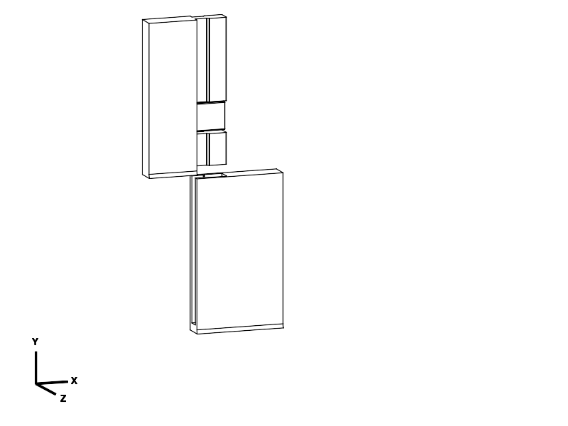
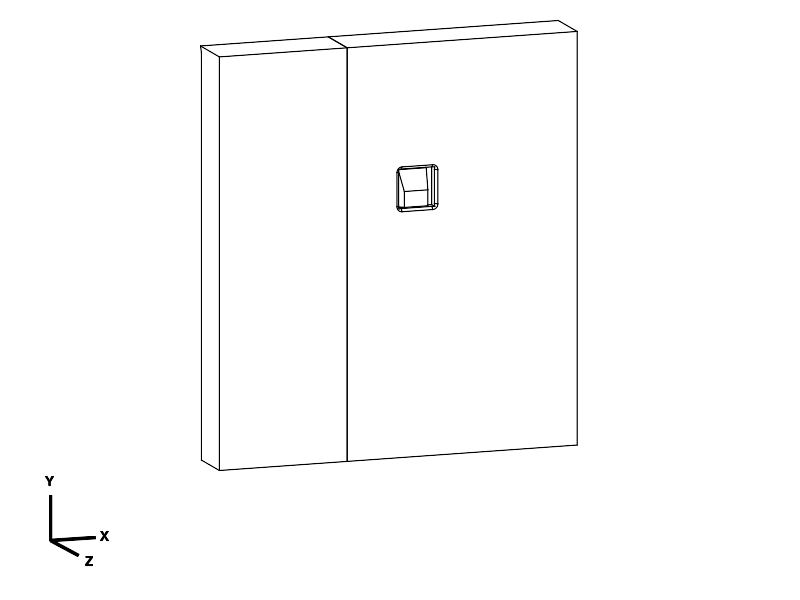

# Book reading plate — two-piece sliding joint

**Current status: [joint structural review failed](lock_trials/STRUCTURAL_REVIEW.md).**
Plate development remains paused. Neither the legacy plate nor the A/B samples
have an approved structural joint for the edge-held load case. The files below
are historical; the recommendation to print the A/B trials is withdrawn.

**Two printed halves, no separate connectors.** One half has a continuous shaped
tongue; the other has a matching channel with a closed lower end. The tongue
slides down into the channel, and one catch built into the tongue clicks into a
small internal shoulder to stop it sliding back out.

The dovetail shoulders hold the halves together across the seam and through the
plate thickness. The closed end and catch restrain the two directions along the
channel. Tongue depth alone would not prevent reverse sliding; that is the
specific job of the integral catch.

The plate remains **400 mm wide**, with **250 mm inner back height**, **40 mm inner
lip**, and **10 mm outward walls**. Both broad faces have no projecting connectors.
There is one small, beveled release opening on the rear; the release pad is
recessed 0.6 mm. Overall assembled size is 400 × 260 × 50 mm.

## Assembly

1. Hold the right half with its channel open at the top. Position the left half
   above it, with its tongue aligned with that opening and both book faces facing
   the same way. The picture shows the actual insertion alignment of the sample.
2. **Slide the left half downward along the channel.** Do not push the tongue
   sideways through the narrow channel mouth. At full depth, the bottom edges
   and lips line up and the built-in catch should click into place.
3. Try sliding it back upward without pressing the release. The catch should
   stop it. There are no keys, caps or additional assembly steps.

For the full plate, the initial height offset is approximately 244 mm; the sample
needs only about 74 mm. Keep the faces aligned throughout the slide. To take it
apart, unload the plate, press the recessed rear pad inward by about 1 mm using
a fingernail or blunt tool, and slide the left half upward. The pad stays attached.

## Files and first print

**Print [joint_test.stl](joint_test.stl) first.** It contains exactly two parts.
It reproduces the mating cross-section, closed end, full catch/flexure, release
opening and print-axis directions. Its rail is shortened to save material.

| File | Purpose | Print orientation bounds, mm |
| --- | --- | --- |
| [joint_test.stl](joint_test.stl) / [STEP](joint_test.step) | Two-piece joint test | 107.78 × 72.82 × 45 |
| [plate_left.stl](plate_left.stl) / [STEP](plate_left.step) | One half with integral tongue and catch | 133.90 × 247.24 × 216 |
| [plate_right.stl](plate_right.stl) / [STEP](plate_right.step) | One half with stopped channel | 170.37 × 225.41 × 200 |
| [book_reading_plate_assembled.step](book_reading_plate_assembled.step) | Two-part inspection assembly; do not slice | 400 × 260 × 50 |

Use this complete matching set. It replaces the earlier separate-key designs
at `e7fd4d2` and `f5f16bf`; their keys are no longer needed or supplied. Both halves
have changed. STEP and STL use matching millimetre placement and orientation.

[components.py](components.py) contains the parameters and builders;
[book_reading_plate.py](book_reading_plate.py) shows the assembly;
[export_plate.py](export_plate.py) exports the three print layouts and checks the
mechanism; [verify_exports.py](verify_exports.py) independently checks the files.
Evaluate these entry points through the CadQuery MCP tool. The `joint_detail.py`,
`joint_locked.py` and `print_preview.py` entry points supply inspection views.

## PETG printing and fit test

Confirmed envelope: **260 × 260 × 250 mm**, 0.4 mm nozzle, PETG. Keep the supplied
orientations: both halves stand on their outside ends, rotated 30° on the bed;
the joint features face upward. Center each layout. Each full half is a separate
print job. Starting settings are 0.20 mm layers, six perimeters, six top/bottom
layers, 40% gyroid infill, a 4 mm outer brim and supports off. Use your calibrated
PETG and actual printer profile. The saved reference profile assumes 240 °C / 80 °C
and is not a validated machine job.

The dovetail is 238 mm long and 16 mm deep, with a 5 mm neck and 7 mm head.
Its retaining shoulders slope at 45° in both standing print orientations.
The single leaf grows from its root in the print direction, and the hook has
a gradual growth ramp; it is not a floating bridge over a slot. The left panel's
internal relief retains front/rear skins. Exterior edges use 4 mm radii, the
outside L elbow uses 9 mm, and bed-contact end edges use a printable 2 mm chamfer.
Internal rail edges use smaller functional radii and the release mouth is beveled.

Remove brim and strings, then slide the two test pieces together by hand. Check
that the catch engages, upward withdrawal is blocked, both faces stay aligned,
and the joint does not rock noticeably. Invert and gently shake the sample over
a tray. Check deliberate release, several repeated assemblies, and an overnight
assembled hold for binding, whitening, cracks or loss of retention.

`rail_clearance` is a **0.12 mm normal gap** at straight mating faces, not a claimed
printed fit. If loose, reduce it in approximately 0.03 mm increments; if binding,
check debris and print dimensions first, then increase it. Rebuild/reprint the
sample after changing fit. Do not scale the parts. The catch's square shoulder
provides positive retention even if the fit is loose, but tightness and lack of
rocking still need a physical trial.

The short sample does **not** prove full-length sliding friction, rail straightness,
tall-print warping, full-plate stiffness or load capacity. A successful short fit
must be followed by a full assembly check. Gradually try the actual book over a
low padded surface before holding the loaded plate at its outer sides.

## Verification and limits

The intended use remains lap-supported reading, sometimes held at both outer
sides, never above the face. Book mass was unspecified: **3 kg is a provisional
design scenario, not a tested load rating**. The plate adds roughly 1.1 kg under
the reference settings. Impact, person-support and cantilever loads are not rated.

Final CadQuery MCP checks (CadQuery 2.8.0, OCP 7.9.3.1.1, Python 3.12.14,
server 0.2.0) establish:

- Exactly two valid solids in the assembly and two in the sample; no loose hardware.
- Print-layout fit and bed contact; the catch stays inside the 10 mm wall both
  normally and in the modeled release pose.
- No overlap in the seated assembly. With the catch retracted, no interference
  at the recorded sliding offsets from 0 to 246 mm. This is a sampled rigid
  clearance check, not a simulation of elastic insertion or full-path proof.
- The normal catch contacts the channel during insertion. In the locked state,
  reverse sliding first meets the actual shoulder at about **0.15 mm**. Tested
  widthwise pull-apart, front/rear lifting and travel beyond the end stop also
  produce contact. The released catch clears the sampled removal path.
- A 380 mm width / 240 mm inner back / 35 mm lip alternate build also passed.
- All three final STEP/STL pairs passed component count, closed-mesh edge,
  winding, bounds, volume and bed-contact checks. Optimal CAD bounds determine
  bed placement rather than loose bounds derived from triangulation.

The leaf is 2 mm thick and 14 mm wide. Ideal-cantilever screening with a 28 mm
release length and 1 mm displacement gives about **0.38% root strain** and
**1.02–2.30 N** force for an assumed effective modulus of 800–1800 MPa. Separately,
a provisional 20 N reverse-slide load, 34 mm lever and 1200 MPa modulus give
about **0.87% strain** across the leaf's wider dimension. A provisional 1% strain
screen is a design assumption, not a measured PETG limit. Local contact, printed
layer bonding, wear and creep still need testing.

A solid-section screen of the rail neck, excluding the catch opening, gives
approximately **4.4 MPa nominal bending stress** under a 40.5 N central load across
the 400 mm span. It omits stress concentration, sparse infill, receiver-lip
flexibility and unequal load sharing; it is not an achieved safety factor.

See [geometry evidence](notes/geometry_checks.json),
[export evidence](notes/export_checks.json) and the
[tool/code manifest](notes/evidence_manifest.json) for parameters, tests and hashes.
Slicer results below establish mesh-to-toolpath acceptance, not physical function.

## Reference slices and estimates

PrusaSlicer 2.9.6 accepted all three final meshes with the
[saved PETG reference profile](notes/reference_petg.ini). Each produced fresh
nonempty toolpaths, no support segments, no extracted warnings, and a footprint
within 260 × 260 × 250 mm including the brim. No repair was reported in the
inspected logs. No printer job was sent.

| Final layout / report | PETG including brim | Reference time |
| --- | --- | --- |
| [Two-piece test](notes/dovetail_final_joint_test/summary.json) | 53.75 g | 4 h 45 min |
| [Left half](notes/dovetail_final_plate_left/summary.json) | 571.53 g | 45 h 12 min |
| [Right half](notes/dovetail_plate_right/summary.json) | 527.10 g | 41 h 26 min |
| Complete plate | **1,098.63 g** | **about 86 h 38 min**, sequentially |

These are reference estimates; the user's actual machine profile is unknown.
The requested 10 mm walls account for the substantial material use. Reports
record actual mesh/profile hashes, commands, versions and deposition bounds.

## Print status and prior feedback

The user initially said they had “tried this” and rejected the previous recessed-key joint
as complicated and ineffective at preventing sliding. Whether that involved a
physical print has not been clarified, so no print or failure mode is invented.
That feedback concerns the superseded `f5f16bf` design, not this two-part revision.

| Item | Print status | Artifact(s) | User result or remaining physical checks |
| --- | --- | --- | --- |
| Test piece(s) | Partial | Prior sliding-joint design at 50% scale; exact printed file unknown | User reported thin/unstable socket. Full-scale prior test unconfirmed; new captured trials have no print report |
| Final printable object(s) | Unknown | `plate_left.stl/.step`, `plate_right.stl/.step` | Check full-length fit, joint stiffness, book load and durability; no report for this revision |

Later feedback confirms a physical print of the sliding-joint design at 50% scale.
The user found the outer socket thin and unstable; no fracture was explicitly
reported. Exact file and settings are unknown. The proposed open-overlap samples
were then rejected from pictures for bending concerns. See the
[new trial record](lock_trials/README.md#print-status).

PETG is the intended material. Exact printer, actual profile and print date remain unknown.
Update this block and the root index together when physical feedback is reported.

## Attribution

Primary language model: GPT-6, identified by session runtime instructions.
Reasoning effort: not exposed. Harness: Codex in the repository workspace.
Provider: OpenAI. No sub-agents or third-party model geometry used. Repository
MIT licence applies. Design/revision evidence recorded 2026-09-22.
