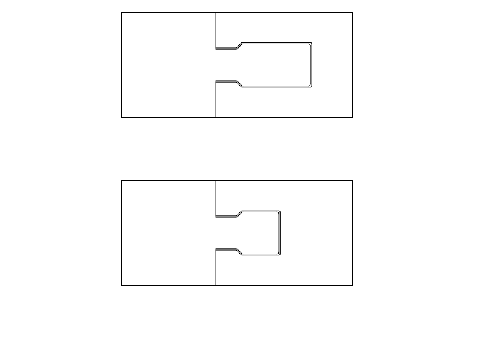
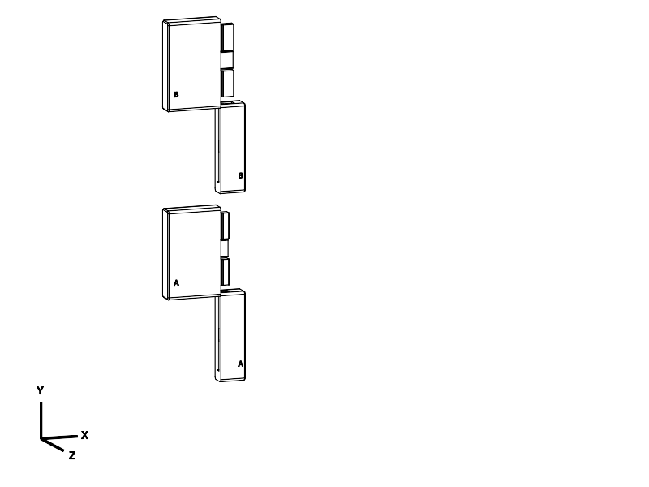

# Captured joint samples — structurally rejected

**Do not print these as load-bearing plate trials.** The
[full-load CAD and structural review](STRUCTURAL_REVIEW.md) rejects both A and B,
even with solid material assumed. The files below are retained as historical
evidence, not current print recommendations. A replacement has not been approved.

Two **full-scale local joint experiments**, each with two printed parts and no loose
connector. These replace the uncommitted open-finger A/B/C trials shown earlier.
They are not yet integrated into the reading plate. The historical samples use full-scale geometry.

The purpose is to test **bending resistance and positive retention together**.
Both use the same stopped, captured dovetail and recessed integral catch; they
compare structural engagement depth, rather than comparing an unretained detent
with a lock. The previous recommendation to print A first is withdrawn.

| Sample | Print-ready STL / STEP | Comparison | Reference PETG / time |
| --- | --- | --- | --- |
| A | [Compact 6 mm STL](A_compact_6mm.stl) / [STEP](A_compact_6mm.step) | Shorter socket walls, less engagement leverage | 23.83 g / 2 h 11 min |
| B | [Deep 9 mm STL](B_deep_9mm.stl) / [STEP](B_deep_9mm.step) | More engagement leverage, longer walls that can flex | 24.29 g / 2 h 18 min |

Each assembled sample is **47 × 52 × 10 mm**. Print layouts are 32 × 52 × 38 mm
(A) and 32 × 52 × 41 mm (B), before brim/supports. Both parts are engraved with
A or B; match letters. Extra `_assembled.step` files are for inspection only.

## What carries the bending load

The structural tongue has a **3 mm neck and 4 mm head**. The socket has at least
**2.88 mm above and below the head**, away from the deliberately separate catch
opening. It has a solid back wall connecting these two sides. The previous
production joint had approximately 1.38 mm skins and a much deeper 16 mm tongue.
The sample changes both thickness balance and wall reach; it does not merely
add a bigger retaining tooth.

On bending, the tongue bears against opposing socket surfaces. Its undercut
shoulders oppose widthwise separation. A closed lower stop opposes downward
sliding and a square catch shoulder opposes upward sliding. The catch flexure
is not counted as a bending support. Its local relief leaves 1 mm cover skins
in the grip; these are excluded from the structural beam calculation.

There is **0.12 mm nominal normal clearance**, so these are not claims of zero
play or infinite stiffness. Rail-only rigid rotation first meets the receiver at
about 1.19° (A) / 0.78° (B) in either bending direction about the seam centre;
these are geometric contact angles, not predicted assembled wobble. Seam contact,
translation, printed dimensions and deformation all affect the actual feel.
Test both: deeper engagement is not automatically stiffer because its walls also
extend farther. No physical strength or book-load rating has been established.

## Assemble and release

1. Remove brim and supports, especially around the rail, catch and channel. Check
   the leaf is free before assembly. Keep mating edges intact; do not force a bind.
2. Keep engraved faces facing the same way. Hold the wider tongue half **above**
   the narrower socket half, as pictured. Feed the bottom of the rail into the
   open top of the channel. Initial height offset is approximately 46 mm.
3. Slide the tongue half **down along the seam** until the lower edges align and
   the catch engages. Do not force it sideways through the narrow channel mouth.
4. Check that it cannot slide back up without releasing the catch. For removal,
   turn it over and press the recessed pad through the small rear opening toward
   the engraved face, about 1.3 mm, with a blunt narrow tool. Hold it depressed
   while sliding the tongue half upward. The pad stays attached.

All mechanism parts remain within the 10 mm thickness, including the release
position. There are no exposed knobs, separate pins or keys. The release pad is
2.1 mm recessed; its access opening is not a projecting lap-contact feature.

## Historical printing and comparison instructions — superseded

PETG, 0.4 mm nozzle, supplied standing orientations, 0.20 mm layers, six perimeters,
six top/bottom layers, 40% gyroid, 4 mm brim. **Enable removable supports everywhere**
(the reference uses snug supports, 45° threshold, 0.2 mm top gap). Do not flatten,
scale, or auto-orient these parts. The print direction is preserved for both trials;
layer bonding across the tongue and spring remains a real test variable.

Supports can be accessed through the channel's open end/seam and rear release
opening. Both samples have stable outside-end bed faces. Outside grip edges use
1.5 mm radii and 0.6 mm end chamfers; rail/spring edges use small functional radii.
The hook's growth ramp and rail shoulders are approximately 45° in the print pose.
Support cleanup and 0.12 mm fit clearance require care: verify free sliding before
loading. The diagnostic profile is not a validated machine job.

Try the same sequence on A and B:

- Assemble/release five times. Report binding, catch engagement, release effort,
  support-removal damage or visible whitening/cracks.
- With the catch engaged, try pulling the halves apart across the seam and sliding
  them backward along it. Both should remain captured.
- Hold the two solid grips close to the seam and apply gentle bending **both ways**,
  then gentle twist. Compare initial play and how much the socket walls open.
  Stop at cracking or whitening; this is a comparison, not a destructive proof load.
- Repeat after leaving it assembled overnight. Report which feels firmer and
  whether the catch still holds. Photos of any wall opening help identify the cause.

These short samples do not prove a full-height joint's straightness, full-plate
stiffness, fatigue life or performance while holding a book by the plate edges.
A selected interface still needs integration and full-size verification later.

## Verification and engineering limits

[Geometry checks](notes/geometry_checks.json) cover valid single-solid parts,
no seated overlap, sampled released insertion offsets 0–48 mm, blocked pull-apart,
reverse sliding, over-insertion, front/rear displacement, and ±5° rotations about
all three axes. **Rotation checks use only the structural rail, with the catch
and seam face excluded**, so ordinary seam contact cannot stand in for capture.
A 56 mm-height / 0.16 mm-clearance alternate configuration also built successfully.
Released leaves are translated rigidly for clearance checks, not simulated elastically.

An ideal solid-beam screen at an assumed **100 N·mm moment** (5 N at 20 mm) gives
2.22 MPa tongue-root stress for both; approximate socket-wall stress is 2.95 MPa
(A) / 2.75 MPa (B). With an assumed effective modulus of 800 MPa, the wall-only
cantilever deflections are 0.032 / 0.066 mm. Release-strain estimates are 0.37% /
0.30%. These screens omit contact redistribution, stress concentration, print
anisotropy, sparse infill, creep and local cover-skin behaviour. They are neither
allowable stresses nor safety factors, and do not establish pull-out strength.

[Independent export checks](notes/export_checks.json) passed both final STEP/STL
pairs: two closed components, consistent winding, matching bounds/volume and bed
contact. CadQuery 2.8.0, OCP 7.9.3.1.1, Python 3.12.14, MCP server 0.2.0.

PrusaSlicer 2.9.6 accepted both final meshes using the saved
[PETG reference profile](notes/reference_petg.ini): fresh nonempty paths, supports
present, no extracted notices, no repair reported in inspected logs. Each footprint,
including brim/supports, was approximately 39.1 × 59.1 mm and inside the confirmed
260 × 260 × 250 mm envelope. Evidence: [A slice](notes/slice_A/summary.json),
[B slice](notes/slice_B/summary.json). Actual printer/profile are unknown. No print
job was sent. [Manifest](notes/evidence_manifest.json) records source/tool hashes.

## Print status

| Item | Print status | Artifact(s) | User result or remaining physical checks |
| --- | --- | --- | --- |
| Test piece(s) | Unknown | `A_compact_6mm.stl/.step`, `B_deep_9mm.stl/.step` | No print report; rejected by full-load structural screen; do not use for loaded plate |
| Final printable object(s) | N/A | No revised plate in this experiment | User explicitly paused plate work until choosing the joint |

The user reported printing the preceding sliding-joint design at **50% scale** and
finding the outer socket too thin/unstable. Exact printed file, date and settings
are unknown; PETG was the stated intended material, not separately confirmed for
that print. The open-overlap trial was rejected from pictures; no print was reported.
That feedback is not physical validation or failure evidence for these new samples.

## Source and attribution

[lock_trials.py](lock_trials.py) owns parameters and geometry. Evaluate
[export_trials.py](export_trials.py) through CadQuery MCP to export and check;
[verify_trials.py](verify_trials.py) independently checks the final pairs.
Preview and section entry points are inspection-only. No production plate source
or mesh was changed.

Primary language model: GPT-6 (runtime instruction); reasoning effort: not exposed.
Harness: Codex; provider: OpenAI; no subagents. Revision record: 2026-09-22.
Repository MIT licence applies.
