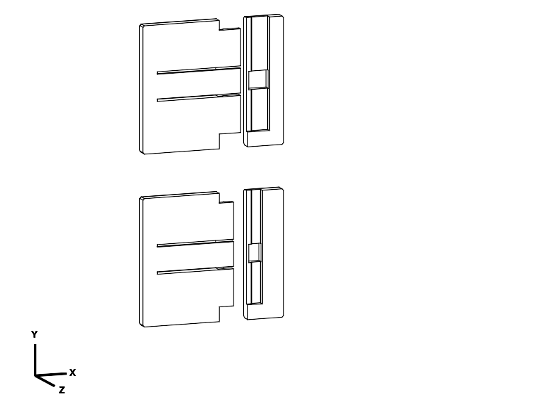

# Structural review — A and B are not approved for the reading plate

**Result: reject the current joint for the stated edge-held book use. Do not print
A or B as a strength-qualified prototype.** The earlier 100 N·mm coupon screen
was not derived from the plate load and was insufficient. Geometry capture and
clean slicing did not establish structural adequacy. This review supersedes the
previous recommendation to print A first.

The review uses actual CAD section properties plus a documented conservative
beam/contact model. It is a **rejection screen, not nonlinear FEA or certification**.
It does not predict the exact load at which a particular print breaks. A changed
load path may redistribute forces; that must be analysed before approval, not
assumed to rescue this design.

## 3D load-path review



The front half of the thickness is removed and the socket is moved sideways
**for inspection only**; this is not the assembly motion. Also see the actual
[transverse sections](renders/section/section_trials_top.png).

[measure_structure.py](measure_structure.py), evaluated through CadQuery MCP,
measures 0.2 mm solid slices using their centroidal inertia, excluding the full
catch band. [CAD evidence](notes/structural_review/cad_sections.json) records:

- Both original parts are valid single solids with zero seated overlap.
- Each coupon has only **30 mm of effective structural rail length** after
  excluding the catch relief. The 3 mm neck's bending section modulus is
  **45 mm³**, measured from CAD, not from a bounding box.
- Both sockets have **2.88 mm skins** away from the catch, confirmed by a volume
  measurement over the actual surface. B increases their unsupported reach.
- The catch root's measured sideways-bending section modulus is **26.29 mm³**.
  It is a long, flexible transverse load path for withdrawal, despite geometric
  engagement of the tooth.
- The supplied standing print orientation puts the rail-root bending stress
  across layer interfaces. Bulk-filament tensile strength is not the right
  sole design reference.
- The existing plate's projecting lower lip meets at a butt seam. It has no
  interlock that can carry tension in both bending directions. This review
  therefore credits no lip moment capacity across that seam.

## Explicit load and material basis

These are design assumptions; book mass and filament brand have not been supplied.

| Quantity | Basis |
| --- | --- |
| Book | 3.0 kg, concentrated at midspan |
| Plate | 1.6 kg mass budget, uniformly distributed |
| Hand/support separation | 400 mm, supporting both outer sides |
| Handling load factor | 2.0 on gravity loads; not an impact/drop qualification |
| Candidate full seam | 238 mm rail less 12 mm catch relief = 226 mm |
| Load sharing | Compare 100% effective seam and 50%; neither measured |
| Structural material model | Fully solid PETG; 40% infill gets no solid-section credit |
| Effective modulus | 800 MPa, conservative assumed value for screening |
| Stress-concentration multiplier | 1.5, assumed screen; not a computed notch factor |
| Provisional normal-stress allowance | 7 MPa |
| Provisional shear allowance | 7/√3 = 4.04 MPa; assumed isotropic screen only |
| Withdrawal demand | 50 N; approximately 2× the weight of half the loaded assembly |
| Service stiffness goals | ≤2 mm full-span sag and ≤0.25° joint rotation, proposed targets |

The 1.6 kg mass budget exceeds the 1.524 kg mass of the **entire unrounded 10 mm
L envelope made solid** at 1.27 g/cm³: 400 × (260 × 10 + 40 × 10) mm³.
Increasing overall thickness would require a new self-weight calculation.

The [Prusament PETG technical sheet](https://storage.googleapis.com/prusa3d-content-prod-14e8-wordpress-prusament-prod/2023/10/9f8d2165-tds_prusament-petg_n_en.pdf)
reports interlayer adhesion of 18 ± 4 MPa and printed tensile moduli of about
1.5–1.6 GPa under its own process. This screen uses 18−4 = 14 MPa as a reference,
then divides by two to obtain 7 MPa. **That is an engineering assumption, not a
statistical lower bound or a guaranteed value for the user's PETG.** The sheet's
mechanical specimens use 100% rectilinear infill. Material and process still need
qualification for an eventual positive strength claim.

## Calculation and results

For a central book load and uniformly distributed plate weight:

```text
M_service = (3 × 9.81 × 400)/4 + (1.6 × 9.81 × 400)/8
          = 3,727.8 N·mm
M_design  = 2 × M_service = 7,455.6 N·mm
V_design  = 2 × (3 + 1.6) × 9.81 / 2 = 45.126 N
```

Treating all weight as central would raise the design moment to 9,025.2 N·mm.
The lower 7,455.6 N·mm case already fails. Extrapolating the actual 45 mm³ coupon
section to the **optimistic full 226 mm seam** gives `S = 45 × 226/30 = 339 mm³`.

The selected tongue screen assigns seam moment to that neck: `σ = K × M/S`.
For a socket skin, use a tip-loaded cantilever along X with `R = M/(depth−1)`,
`L = depth + clearance`, and `σ = K × 6RL/(b t²)`. This represents opposed contact
reactions acting on the socket walls; exact contact positions and seam-face
compression are not solved. It is not a claim of a unique stress distribution.

| Full-width, solid-section case | A: 6 mm reach | B: 9 mm reach | Criterion |
| --- | ---: | ---: | ---: |
| Tongue nominal bending stress, before K | 21.99 MPa | 21.99 MPa | — |
| Tongue design stress, K=1.5 | **32.99 MPa** | **32.99 MPa** | ≤7 MPa |
| Socket nominal bending stress, before K | 29.21 MPa | 27.20 MPa | — |
| Socket design stress, K=1.5 | **43.81 MPa** | **40.81 MPa** | ≤7 MPa |
| Governing margin, allowance/demand | **0.160** | **0.172** | ≥1 |
| Transverse shear design stress | 0.150 MPa | 0.150 MPa | ≤4.04 MPa |

Thus bending, not simple vertical shear, governs this screen. With only half the
seam participating, bending demands double. The original 100 N·mm coupon screen
should instead have been approximately **990 N·mm** even with ideal full-seam
sharing, or 1,979 N·mm with half sharing, to reproduce the design moment per unit
rail length. No destructive test of those loads is requested.

The free-cantilever catch calculation at 50 N gives nominal root stresses of
about 57 MPa (A) and 63 MPa (B), before K. These extrapolations cease to describe
actual stress once the leaf contacts its relief sides. A 1 mm free-tip displacement
screen reaches about 13.3 MPa (A) / 11.0 MPa (B), already above the 7 MPa allowance;
the side-contact load path has not been shown to provide adequate capacity.
The hook's simple shear-area check also fails. The catch needs a backed-up
structural load path, rather than reliance on this bending leaf alone.

## Stiffness and infill

The socket-wall-only linear service calculation indicates roughly 3.6° / 4.7°
rotation. **These are excessive-compliance indicators, not reliable actual-angle
predictions**, because the stress/contact assumptions break down. An ideal solid
250 × 10 mm back strip also gives about 3.14 mm service sag across 400 mm; that
omits L-section stiffening within each half and 3D spreading from point grips.
A final design needs those effects and the lip connection assessed explicitly.

The 0.12 mm fit clearance also permits initial motion before full bearing contact;
strength and zero play are different requirements. A tighter fit alone does not
increase the section modulus or establish a safe bending load.

**100% infill cannot fix a joint that fails a solid-section calculation.** It
removes one source of weakness, but does not increase the CAD wall thickness or
repair weak layer interfaces. A later structural revision should use solid material
in its joint and adjoining load-transfer region, with that region specified in
CAD/slicer coordinates. No modifier or 100%-infill profile is issued as a remedy
for A/B, because that would imply an adequacy this review does not support.

## Redesign decision

Keeping this same thin-neck/skin architecture, the simplified sizing equations
at the **current mass** require approximately 22 mm total thickness with ideal
full-width load sharing, and 30–31 mm with half-width sharing. Those are **screening
estimates for this architecture**, not an approved replacement dimension or a
proof that all 10 mm joints are impossible. Added self-weight, contact and catches
would need fresh calculations. Silently increasing thickness would also violate
the user's original 10 mm requirement.

The two legitimate paths are therefore:

1. Keep the 10 mm flat envelope and replace the load path, including the lip/seam
   connection and catch backing. Calculate it before issuing another coupon.
2. Allow greater overall thickness, then size and verify a revised section and
   its increased self-weight. Both broad faces would still need to remain flat.

The thickness question has been sent to the user. **No replacement is signed off,
and no new printable design is claimed complete.** The existing plate remains
paused. Current A/B exports are retained solely as identified historical evidence.

## Reproduce and evidence

1. Evaluate [measure_structure.py](measure_structure.py) through CadQuery MCP.
2. Run `python3 model/book_reading_plate/lock_trials/structural_audit.py`.
3. Inspect [load_audit.json](notes/structural_review/load_audit.json), including the
   50%-sharing sensitivity case, section hashes and calculation assumptions.

The assertions verify the rejection results; they are not a passing structural
qualification test. Previously exported geometry did not change, so existing
mesh/slice evidence remains applicable only to manufacturing acceptance. No
reslice was necessary for this read-only geometry audit and documentation change.

Review attribution: GPT-6 (runtime instruction), reasoning effort not exposed;
Codex/OpenAI, no subagents. Reviewed 2026-09-22. Physical print status is unchanged.
