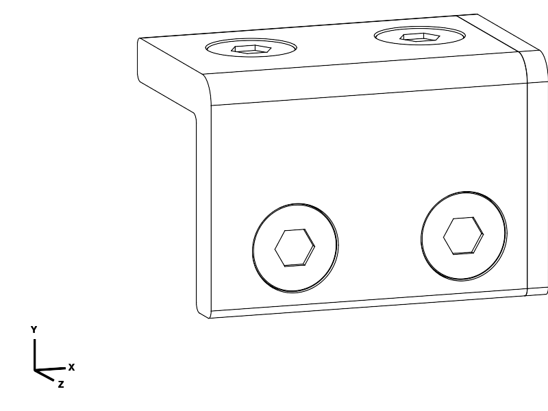
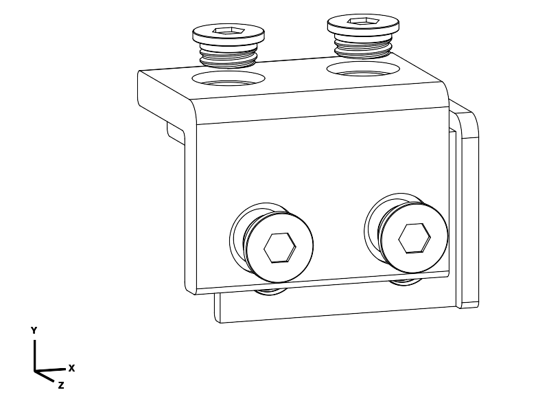

# Recessed printed-screw L joint — structural prototype

Current joint experiment, replacing the rejected sliding-lock trials. **Print the small thread-fit set first, at 100% scale.** The complete plate remains paused at the user's request. This is a calculated prototype, not a physically established book-weight rating.

The two L-shaped halves overlap by 70 mm. Four printed shoulder screws retain them: two through the lip and two through the back. Bring the halves together sideways, align the holes, then turn the screws in. There is no long sliding rail or snap-fit socket. Threads prevent direct withdrawal; broad L sections and separated screw bearings resist bending and twisting. Ordinary screws can loosen through rotation; this is not a vibration-proof or permanently captive fastening system.

All assembled walls stay 10 mm thick. Heads are recessed 0.4 mm and tips 0.3 mm. No hardware or adhesive is required. The lap-contact skins are approximately 5 mm each; the screw counterbores locally leave 2.2 mm, explicitly included in the bearing and tear-out calculations. The existing 50 mm overall lip height supplies beam depth rather than adding an external rib.

The exploded view separates the layers for visibility; assemble by translating the halves sideways until their ends register, not by pushing the screw threads straight through the holes. Insert all four screws loosely, then seat them alternately. Use the printed driver gently, stopping when the heads seat and the joint stops rocking. Do not use a powered driver or tighten hard. The load model assumes no more than 40 N screw preload; torque/preload is not calibrated. A rough 0.04 N·m tightening ceiling assumes dry friction around 0.1 and is only a starting estimate, not a measured installation specification. If smooth running and a firm seat cannot both be obtained, the fit trial has failed: do not force it.

## Files and first print

| Deliverable | Contents | CAD print bounds, mm | Reference cost |
| --- | --- | --- | --- |
| [thread_fit.stl](thread_fit.stl) / [STEP](thread_fit.step) | Two matched 28 mm square block pairs and two screws; female blocks marked 12 / 24 | 62 × 60 × 28 | 21.37 g; 2 h 34 min |
| [joint_test.stl](joint_test.stl) / [STEP](joint_test.step) | Two L halves and four identical screws | 115 × 90 × 75 | 97.21 g; 8 h 34 min |
| [hex_driver.stl](hex_driver.stl) / [STEP](hex_driver.step) | Optional printed 7.8 mm across-flats driver | 40 × 12 × 22 | 4.84 g; 28 min |
| [joint_test_assembled.step](joint_test_assembled.step) | Inspection assembly; not a print layout | 80 × 55 × 50 | — |

Both fit variants use the same screw and shoulder clearance. **12** has 0.12 mm radial thread clearance; **24** has 0.24 mm. The complete structural sample uses **24**. Compare smooth hand turning, complete seating, withdrawal resistance and rocking. If only 12 is satisfactory, change the named clearance parameter and regenerate the structural sample; the supplied main sample is not secretly the tighter version. The threads are custom 16 × 2.4 mm trapezoidal threads, not ISO M16 hardware threads.

The small blocks preserve actual thickness, thread, head recess, shoulder bore and print axis. They do not test L-section bending. The 80 × 55 × 50 mm structural sample retains the full lip, lap length and widthwise screw spacing. Its back is shortened from 260 to 55 mm and back screws move from Y=220 to Y=40, so it cannot reproduce full-plate torsional stiffness or load distribution. Do not scale either test.

Use PETG, 0.4 mm nozzle, 0.20 mm layers, six perimeters and **100% rectilinear infill for all these samples and screws**. Keep supplied orientations: L halves stand on their outside X ends; screws print head-down; fit blocks stand on edge. Use a 4 mm brim and accessible supports, including the horizontal bores. Remove support and brim carefully without cutting load-bearing thread flanks or enlarging shoulder holes. Check the downward-facing hex recesses are clear. All bores are open, approximately 5 mm long; there are no enclosed support cavities. Actual PETG temperature, cooling, flow and support release must follow your calibrated profile. The saved 240/80 °C reference profile is diagnostic, not printer-ready G-code.

The L bend has R6 outside rounding and R2 cross-section corners. Screws have edge chamfers and a tapered thread lead. The sample's cut ends and mating boundaries retain functional edges; deburr printing residue. Production-plate corner finishing has not been revised here.

## Mechanical basis and limits

[Reproducible calculations](load_checks.py) use measured CAD sections from [measure.py](measure.py), including conservatively oversized smooth holes in place of female threads. [Results](notes/load_checks.json) and [sections/thread surfaces](notes/sections.json) record source hashes. These are hand-model strength and stiffness screens, not FEA or a safety certification.

Assumed load: a 3 kg book concentrated centrally across a 400 mm span, plus 1.6 kg uniformly distributed plate mass, with a factor of two for handling. Service bending moment is 3.728 N·m; design moment is 7.456 N·m. Design shear is 45.13 N and eccentric-grip torsion is 5.641 N·m. A separate 50 N widthwise pull is included. Fully solid original plate envelope mass is approximately 1.524 kg at 1.27 g/cm³, within that mass allowance.

Material reference: [Prusament PETG datasheet, v1.1](https://storage.googleapis.com/prusa3d-content-prod-14e8-wordpress-prusament-prod/2023/10/9f8d2165-tds_prusament-petg_n_en.pdf), interlayer adhesion 18 ± 4 MPa and printed tensile modulus 1.5–1.6 GPa. Taking 14 MPa then dividing by two gives a **chosen 7 MPa normal-stress allowance**; 14 MPa is not a guaranteed statistical lower bound. Shear allowance 4.04 MPa assumes an isotropic von Mises relationship. Effective stiffness is reduced to 800 MPa. These are conservative modelling choices, not properties measured from your filament. All calculations require solid joint material and sound layer adhesion.

Bending transfers as opposing vertical forces at screw stations X=−20 and +20 mm, a 40 mm lever arm. Both rows participate. Torsion transfers between lip and back rows, 215 mm apart in the intended full-height section. The calculation envelopes 60/40 sharing, adds direct shear and pull, and uses a 1.25 prying multiplier plus 40 N preload for screw tension. Per-screw envelopes are 141.91 N transverse and 216.39 N axial. Strength does not credit friction between lap faces. Local stress multiplier is 1.5; lap-root notch screening uses 2.5. These factors are assumptions, not a resolved stress-field simulation; load sharing, notch response and prying remain physical uncertainties.

| Screen | Calculated MPa | Allowance MPa |
| --- | ---: | ---: |
| Rear / front net-section bending | 5.09 / 5.67 | 7.00 |
| Rear / front shoulder bearing | 6.05 / 4.00 | 7.00 |
| Screw combined axial, bending and shear | 4.12 | 7.00 |
| Head annulus bending | 5.98 | 7.00 |
| Male / female thread stripping | 3.31 / 3.19 | 4.04 |
| Rear / front edge tear-out | 3.70 / 3.15 | 4.04 |

Minimum remaining margin is **1.09**, after the stated load and material factors. This is a modest residual margin and does not cover arbitrary over-tightening, impact, poor bonding or hot/long-term creep. Male stripping surface uses converged thin-shell CAD intersections; female surface uses actual-solid point classification at two angular resolutions because OCC's thin-annulus boolean was unreliable. Both measured areas are reduced another 5% in the screen.

Estimated service rotation: 0.234° from lap bending, approximately 0.202° from simplified fastener/bearing springs, plus up to 0.143° unloaded shoulder play. Their sum corresponds to approximately **1.01 mm joint-related midspan movement** at a 400 mm span. It is not a whole-plate sag prediction or proof of zero play. The earlier 0.25° aspiration is not established for the complete joint. Full-plate warping, actual contact stiffness, torsion and creep require integration and physical checks. Snug seating may reduce free play; no such reduction is credited here.

For eventual plate integration, preserve the four-station geometry and use solid material across the overlap and at least 15 mm beyond each lap root. Nominal 235 mm half width including overlap can fit the 250 mm print height, but the complete plate orientation, supports, load spreading and exterior finish must be verified anew. No replacement production plate is exported in this experiment.

## Verification and physical experiment

CAD checks pass for valid single-solid components; zero assembled penetration; unobstructed lateral assembly at sampled positions; sampled helical screw removal; interference with straight withdrawal; and bearing contact for ±1° rotation about all three axes. The last check establishes geometric restraint, not strength. The 0.15 mm shoulder-to-thread chamfer removes a tessellation defect without relying on slicer repair.

All three matching STEP/STL pairs pass the independent [export checks](notes/export_checks.json): expected component counts 6/6/1, closed manifold meshes, positive volumes, matching bounds/volumes and bed contact. CadQuery 2.8.0 / OCP 7.9.3.1.1. Final actual-geometry views were inspected for lap placement, screw access and recessed faces.

PrusaSlicer 2.9.6 reference smoke slices all produce fresh deposition with no reported warnings or repairs in the inspected logs. Brim/support footprints are 123.09 × 97.99 × 75 mm (joint), 69.99 × 67.95 × 28 mm (fit), and 47.30 × 19.30 × 22 mm (driver), within 260 × 260 × 250 mm. Supports are generated for the joint and fit set, none for the driver. Reports: [joint](notes/slice_joint_final/summary.json), [fit](notes/slice_fit/summary.json), [driver](notes/slice_driver/summary.json). These establish reference slicing, not actual thread finish or strength.

First observe support removal and smooth screw engagement in both fit variants. Check complete seating, no cracks/whitening, no straight pull-out and no perceptible rocking after seating. Assemble/unassemble ten times, then leave assembled overnight and repeat the check for looseness. With the complete L sample, grip both ends and apply bending in both directions and twist; inspect around bores and lap roots. Invert and gently move it over a tray: a seated screw should not escape without turning. Mark screw positions to detect rotation. These hand checks are diagnostic, not a quantified proof load. The short coupon cannot reproduce the full 400 mm span or the full-height torsion case; do not label it a 3 kg load test. A controlled full-geometry load/creep test remains necessary before claiming that rating.

| Item | Print status | Artifact(s) | User result or remaining physical checks |
| --- | --- | --- | --- |
| Test piece(s), current | Unknown | thread_fit.stl, joint_test.stl, hex_driver.stl | No user report; fit, support release, tightening, bending, retention and creep untested |
| Test piece(s), historical | Partial | Prior sliding joint, exact artifact/settings unknown | User printed at 50% scale and reported thin/unstable receiver; not validation of current geometry |
| Final printable object(s) | Unknown | Legacy plate files in parent directory; no new production plate | No full plate report; legacy joint withdrawn, production integration paused |

## Reproduction and checklist

[joint.py](joint.py) is authoritative parametric geometry. Evaluate [export_joint.py](export_joint.py), [measure.py](measure.py), then [verify_exports.py](verify_exports.py) through the CadQuery MCP evaluator. Run `python3 model/book_reading_plate/structural_joint/load_checks.py` for arithmetic. [preview.py](preview.py) and [assembled_view.py](assembled_view.py) are inspection-only poses. Re-run affected slices after changing meshes or profile.

- [x] Scope, user constraints, load assumptions and MCP availability established.
- [x] Functional geometry, insertion, retention, print orientation and edges reviewed.
- [x] CAD sections, local strength and approximate stiffness checked with stated limits.
- [x] Final exports checked; reference smoke slices completed; final views inspected.
- [x] Fit experiments, evidence, print status and outstanding physical limitations recorded.
- [ ] Physical fit/load/creep validation; full-plate integration deliberately deferred.

Provenance: primary language model GPT-6 (runtime family identification); exact variant and reasoning effort not exposed. Harness: Codex API agent; provider: OpenAI. No other agents contributed. This record applies to this structural-joint experiment; historical plate attribution is retained in the parent documentation.
