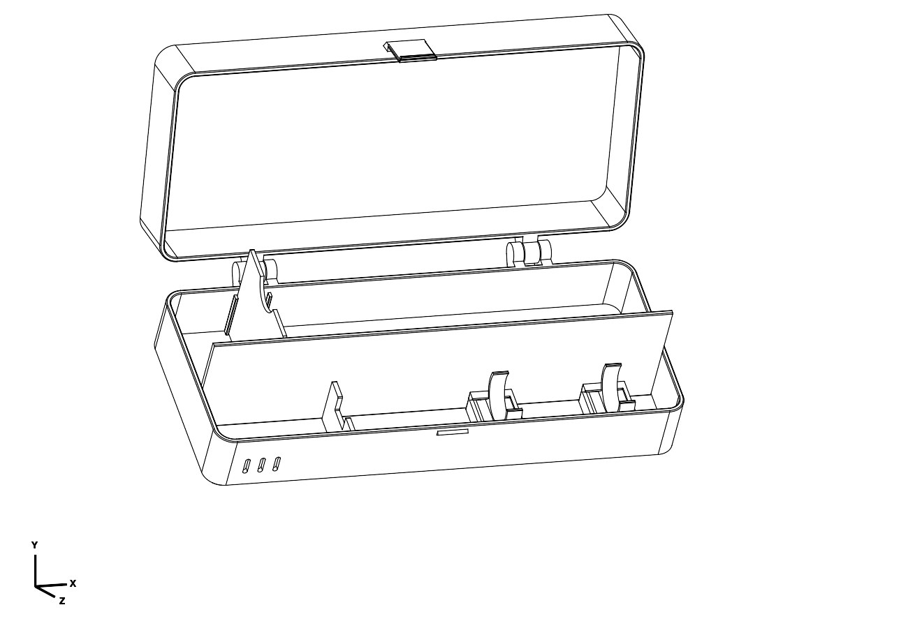

# Dental travel case — first printable version

Parametric PETG case for a Philips-style electric brush **with its head attached**,
a full-size toothpaste tube and a floss dispenser. Charger excluded. No purchased
parts, glue, TPU or separate hinge pin required. Items are assumed dry before packing.

## What to print

| File | Purpose |
| --- | --- |
| `dental_travel_case.stl` | Main case: both captive shells, printed together open and flat. |
| `accessories.stl` | Two removable handle clips and one flat-printed storage divider. |
| `test_pieces.stl` | All three mechanism/fit tests on one plate; optional first print. |
| `handle_test.stl` | Clip, raised production socket on a small base, and a separate shoulder-stop gauge. |
| `hinge_test.stl` | One complete captive hinge with representative wall/root sections. |
| `latch_test.stl` | Two wall samples carrying the actual latch and keeper. |
| `handle_clip.stl`, `storage_divider.stl` | Individual replacement accessories. |

Every listed STL has a matching STEP in the same print pose and millimetres.
`dental_travel_case_assembled.step` is a **separate closed inspection assembly**;
it is not the primary print export. Inspection Python files are not print layouts.
Print either the combined accessories plate or two individual clips and one divider,
not both. Likewise, the combined test plate contains the individual tests.

## Size and provisional fit

- Main shell: **249.8 × 106.2 × 64.8 mm closed**.
- Including external hinge/latch: approximately **249.8 × 125.7 × 64.8 mm**.
- Main print layout: **249.8 × 236.44 × 61.8 mm**. With a 3 mm brim on each side,
  its bounding footprint stays inside the confirmed 260 × 260 mm bed. Safe Z is
  250 mm. Center the object, disable skirts, preserve relative shell placement.
- Provisional brush: 238 mm overall, 26 mm round handle, 169 mm shoulder-to-butt.
  Its approximate head envelope is 28 × 18 × 22 mm. These are not measurements
  of the user's brush. Handle button is assumed to face up between the clips.
- Toothpaste envelope: **200 × 55 × 40 mm** including its cap, lying flat.
- Floss envelope: **30 mm along case length × 60 mm across × 55 mm tall**.
  The dispenser stands on its narrow edge to fit beside a full-size tube.
- The divider's other two positions enlarge the floss bay by 7 or 14 mm while
  reducing available toothpaste length by the same amount. They do not enlarge
  the case. Nominal 200 mm toothpaste was checked in the first position only.

The 238 mm reference length was informed by the Philips HX4031-family manual:
https://www.documents.philips.com/assets/20251106/4f8c701e7f254900834db38d008c6d44.pdf
Its stated complete-brush dimensions are approximately 238 × 25 × 26 mm.
The 169 mm shoulder location, circular handle, toothpaste and floss envelopes are
working assumptions. The generated reference image is inspiration, not dimensional
or manufacturing evidence. `renders/fit/fit_preview_top.png` shows the checked
approximate envelopes, not exact product replicas.

## Small tests, in a useful order

Use **PETG and the intended final layer settings**. PLA tests can check rough
space but cannot establish PETG hinge, spring or interference-fit behavior.
The complete test plate is about 38 g in the diagnostic profile, versus roughly
370 g for the case plus accessories. Actual slicer estimates vary with your profile.

For the cheapest initial check, print `handle_clip.stl` alone (about 3 g before
brim) and try it on the handle. If that fits, continue with the full socket test.

1. **Handle test.** Slide the loose clip's broad foot into the socket from
   the open end until it reaches the back stop. Small sloping ribs provide friction;
   it should resist accidental sliding yet be removable toward the entry end.
   Snap the actual handle into the clip, at both proposed holding locations. It
   should release without excessive force, scratching or whitening the PETG.
   Use the separate notched gauge against the handle/neck transition: the neck
   passes through, while the wider handle shoulder stops against it. Check that
   this corresponds to a 169 mm shoulder-to-butt distance before a full print.
   Do not force a mismatched brush into the gauge.
2. **Hinge test.** Keep both printed halves together. Remove only the brim and
   incidental strings, then gently free the joint and rotate through 180 degrees.
   It must remain captive without cracking or excessive play. The two shells of
   the full case also print together; do not split or auto-arrange them separately.
3. **Latch test.** Turn the spring-bearing sample over so its exterior floor faces
   up. Bring the plain top rims together, with the spring outside the keeper wall.
   Press shut; the tooth should catch beneath the keeper. Pull the spring outward
   at the grip before lifting. Check deliberate release and resistance to light
   pulling. Short samples preserve the full spring/root, but not large-panel flex.

The sample clip can be reused in the full case if successful. Print only the tests
that remain uncertain. No large dummy toothbrush or tube is needed: use your items.
These samples do **not** validate full-case crush resistance, long-term fatigue,
real-world button clearance, drying performance or universal brand compatibility.

## Assembly and use

Slide each clip into its socket **toward the handle-butt end**; slide it back toward
the head to remove it, with the brush removed first. The dovetail prevents vertical
and sideways escape; longitudinal retention relies on the tested friction ribs.
Drop the divider into a matching pair of grooves. Its near-roof height keeps it
from lifting out when closed. A finger scoop helps remove it when open.

Load the brush head toward the vented end, button upward, then gently press the
handle into the clips. Raised supports put the handle roughly 8 mm above the front
rim for retrieval. The shoulder stop limits motion toward the bristles; the shell
limits motion in the opposite direction. The continuous internal partition keeps
the tube out of the brush lane even when the case is inverted. Small movements of
consumables inside their compartment are expected; this is not a snug moulded tray.

Put floss upright in the short bay and toothpaste in the long bay. Open fully onto
a surface when loading. Pull the latch outward to release it. Remove the divider
and clips for cleaning; the shell corners and accessible rims are rounded. Side
vents are not a waterproof seal or a guarantee of drying in a packed bag. Open the
case for drying after travel.

## Print approach

PETG, 0.4 mm nozzle, 0.2 mm layers are the intended starting point. The diagnostic
slice used 4 perimeters, 8 top and bottom layers, 25% gyroid, 3 mm brim, no skirts,
and no supports. Use your own printer's PETG temperature and motion settings;
the saved diagnostic INI/G-code is not a validated machine job.

Keep the provided orientations: case exterior panels down, clip feet down,
divider broad face down, coupons exactly as exported. Do not enable automatic
supports in captive hinge gaps. Large flat panels depend on reliable bed adhesion;
keep the brim within the stated margin. Long-term spring force and hinge movement
remain physical test questions.

## Parametric changes and regeneration

Edit **`../parameters.py`**, then evaluate **`../export_and_check.py` with CadQuery
MCP `evaluate_file`**. That rebuilds the complete case and tests, checks nominal
contents and lid movement, and exports all paired STEP/STL artifacts. No local
Python environment setup is needed for this workflow. Source modules live entirely
inside this object directory. Dependency imports are refreshed between MCP runs.

| Feedback | Parameters to revisit |
| --- | --- |
| Brush too long or shoulder in wrong place | `BRUSH_LENGTH`, `HANDLE_LENGTH`, `BRUSH_END_CLEARANCE` |
| Handle too thick, thin, oval or clip too firm | `HANDLE_DIAMETER`, `CLIP_CLEARANCE`, `CLIP_THROAT`, `CLIP_WALL`; an oval may require changing the profile |
| Clip foot too tight/loose | `GRIP_BUMP` for interference, then `SOCKET_CLEARANCE`; small incremental changes |
| Hard to lift brush | `CRADLE_LIFT`; recheck lid clearance after changing |
| Larger consumables | `PASTE_*`, `FLOSS_*`; derived case dimensions must still fit the printer |
| Divider binds | `SLOT_CLEARANCE` |
| Hinge binds or has too much play | `CONE_CLEARANCE` and `END_CLEARANCE`, separately |
| Latch too stiff | `LATCH_THICKNESS`; test before relying on it in a bag |

Cone clearance is radial at fixed X; the shortest 45-degree mating gap is that
value divided by sqrt(2). Divider clearance is per side. Clip bore clearance is
radial. The clip throat is deliberately narrower than the nominal handle.

This is an adjustable design, not an arbitrarily scalable one. Current build-volume
assertions reserve 3 mm around the model. Large changes, a different neck shape or
moving the button under a clip require renewed design review and tests. Do not
uniformly scale the STL: that would also scale every hinge and fit allowance.

## Verification status

CadQuery MCP builds passed for main case, assembled inspection, nominal loaded
inspection and all test pieces. Export checks confirm valid solids, paired mesh
edges and matching STEP/STL bounds within 0.03 mm. Nominal item/body/lid/divider
intersections are zero. Loaded lid clearance was checked every 10 degrees; the
shoulder stop blocks a 1 mm rearward shift of the nominal handle. Tiny intentional
clip-rib/socket interference is reported separately in `verification.json`.

A variant with 27 mm handle, 165 mm handle length, 25 mm throat, 190 mm paste and
55 × 50 mm floss width/height also built through MCP (249.8 × 226.44 × 56.8 mm open
print bounds). Final defaults were restored and re-evaluated/exported. This proves
one useful variation builds, not every combination or physical fit.

See `slicer_review/report.md` for final slicer evidence. **No physical prints have
been tested yet.** Preserve the source revision and PETG/profile settings when
reporting test results so the next adjustment can be small and traceable.
