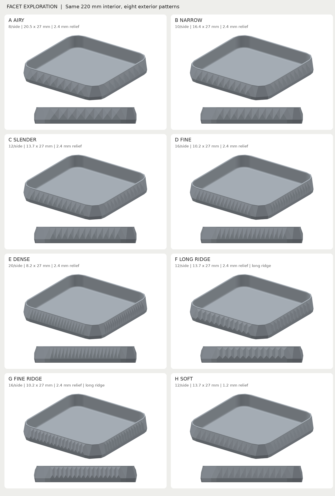

# Faceted tray: eight narrower patterns

The previous six-panel pattern was nearly square (27.3 × 27 mm). This exploration keeps the 27 mm decorative wall height and narrows the panels, producing tall rectangular proportions. The approved [original tray](../storage_tray/README.md) is untouched. The earlier six-panel decorative version remains in Git history at `67526b0`.

[Open the full comparison sheet](renders/print/comparison.png). Each option includes the same shaded camera view plus a straight-on wall view, under identical lighting. These are renders of the exported meshes, not photos or physical tests.

## Options and files

**C Slender is the current default**: approximately twice as tall as wide, with a clear triangular pattern. D gives a finer rhythm; F gives more elongated, crystal-like ridges. These are visual judgments offered for comparison, not an assumed user selection.

| Version | Panels per side | Panel width × height, mm | Relief, mm | Visual intention | Files |
| --- | --- | --- | --- | --- | --- |
| A Airy | 8 | 20.5 × 27 | 2.4 | More open spacing | [STL](variants/a_airy/a_airy.stl) · [STEP](variants/a_airy/a_airy.step) · [Preview](variants/a_airy/iso.png) |
| B Narrow | 10 | 16.4 × 27 | 2.4 | Gentle narrowing | [STL](variants/b_narrow/b_narrow.stl) · [STEP](variants/b_narrow/b_narrow.step) · [Preview](variants/b_narrow/iso.png) |
| C Slender | 12 | 13.7 × 27 | 2.4 | Balanced tall facets; default | [STL](variants/c_slender/c_slender.stl) · [STEP](variants/c_slender/c_slender.step) · [Preview](variants/c_slender/iso.png) |
| D Fine | 16 | 10.2 × 27 | 2.4 | Fine vertical rhythm | [STL](variants/d_fine/d_fine.stl) · [STEP](variants/d_fine/d_fine.step) · [Preview](variants/d_fine/iso.png) |
| E Dense | 20 | 8.2 × 27 | 2.4 | Densest triangular texture | [STL](variants/e_dense/e_dense.stl) · [STEP](variants/e_dense/e_dense.step) · [Preview](variants/e_dense/iso.png) |
| F Long Ridge | 12 | 13.7 × 27 | 2.4 | Long crystal-like ridges | [STL](variants/f_long_ridge/f_long_ridge.stl) · [STEP](variants/f_long_ridge/f_long_ridge.step) · [Preview](variants/f_long_ridge/iso.png) |
| G Fine Ridge | 16 | 10.2 × 27 | 2.4 | Fine elongated ridges | [STL](variants/g_fine_ridge/g_fine_ridge.stl) · [STEP](variants/g_fine_ridge/g_fine_ridge.step) · [Preview](variants/g_fine_ridge/iso.png) |
| H Soft | 12 | 13.7 × 27 | 1.2 | Shallower, quieter relief | [STL](variants/h_soft/h_soft.stl) · [STEP](variants/h_soft/h_soft.step) · [Preview](variants/h_soft/iso.png) |

Every variant has its own small `.py` entry point beside its exports. They call the shared [parametric builder](faceted_storage_tray.py). `build_tray(wall_panels=..., facet_relief=..., ridge_fraction=...)` controls pattern density, depth and peak form. F/G extend the peak into a 12.15 mm vertical ridge; their side faces and triangular ends give the elongated appearance. All other options have point peaks. The ridges remain shallow surface relief.

The root [STL](faceted_storage_tray.stl) and [STEP](faceted_storage_tray.step) are byte-identical copies of C, for convenient printing. [Default preview](renders/print/shaded_preview.png) and [CAD edge view](renders/print/view_tray_isometric.png) show C. No mixed layouts or multi-tray print jobs are supplied.

## Shared dimensions and print plan

- Interior: **220 × 220 mm between straight walls**, 28 mm corner radius, 34 mm depth. Rounded corners reduce corner clearance; the 4 mm floor blend reduces the flat central floor span to 212 mm.
- Overall: **238 × 238 × 38 mm** for A–E/H and default C. F/G are **240.05 × 240.05 × 38 mm** because their extended ridges reach farther outward.
- Floor 4 mm; straight rim wall 4 mm before rounding; minimum nominal corner chord thickness approximately 2.91 mm. Rim fillet 0.8 mm, underside chamfer 0.6 mm, upper border 2 mm.
- One solid each, millimetres, XY centred at zero, underside at Z=0. Matching STEP/STL print placement. No assembly.

Print open side up, flat underside down. Reference assumptions: PLA, 0.4 mm nozzle, 0.2 mm layers, four perimeters, five top/bottom layers, 20% gyroid infill, no supports/skirt/brim. Use your machine's own material profile; reference inspection G-code is not a printer job. All eight fit the 250 × 250 × 250 mm practical envelope. If adding a brim, allow at most 4 mm per side for every option and check the full slicer footprint.

Broad bed contact supports ordinary tabletop storage. Smooth interior walls and floor blends preserve insertion, retrieval and cleaning. Exterior facet edges are deliberately crisp; the rim remains rounded. Point-peak relief develops over 13.5 mm of height; ridge relief develops over 7.425 mm at each end. These have supporting material beneath them, with no floating ornaments, roofs or trapped supports. Walls accommodate multiple extrusion paths. The narrowest panel is 8.2 mm wide, comfortably above nozzle scale. Layer direction, large-floor warping, texture feel and strength with real contents remain physical uncertainties.

No coupon is provided: the purpose is a visual comparison of full trays, and a small sample would not establish full-footprint flatness. All eight complete models are available; there is no need to print them all to compare the rendered proportions.

## Verification and reproducibility

All eight were built through CadQuery MCP, exported as STEP/STL from the same solid, then independently checked using [build_exploration.py](notes/build_exploration.py). [Build summary](notes/exploration_build.json) records individual bounds. Versions: CadQuery 2.8.0, OCP 7.9.3.1.1, Python 3.12.14, server 0.2.0. Each `checks.json` records source/builder and export hashes. The final default source also rebuilt successfully through the CAD view entry point.

For every alternative:

- Valid single STEP solid and closed consistently wound STL; component bounds, volume agreement and bed contact passed.
- Exported interior wall planes verified at X/Y = ±110 mm.
- Sampled horizontal wall separations at Z=9, 20, 30 and 37 mm all exceed 2.8 mm; the smallest sample is approximately 2.91 mm. These are sampled section distances, not a global minimum claim.
- Final STEP symmetric-difference volume was 0.0 mm³ for 90° rotation and reflection across X=Y, under a 0.01 mm³ threshold. This checks matching corners, matching sides and diagonal mirror symmetry of the complete solid including fillets.
- PrusaSlicer 2.9.6 generated fresh nonempty deposited toolpaths, zero supports, no notices and no repairs reported in the inspected logs. All deposited footprints fit the practical envelope: A–E around 6.001–243.999 mm, F/G 4.992–245.008 mm, H 6.010–243.990 mm on each centred axis; height 38 mm.

One [reference profile](notes/review.ini) was used throughout. [Slice runner](notes/slice_exploration.py) records a separate command, hashes and report under each variant. Root C reuses C's export/slice evidence because its actual file hashes match. Estimates below are reference-profile results, not predictions for the user's machine.

| Version | PLA estimate | Time estimate | Evidence |
| --- | --- | --- | --- |
| A Airy | 317.08 g | 1d 1h 53m 55s | [CAD/export checks](variants/a_airy/checks.json) · [Slice](variants/a_airy/slice_review/summary.json) |
| B Narrow | 317.25 g | 1d 1h 55m 47s | [CAD/export checks](variants/b_narrow/checks.json) · [Slice](variants/b_narrow/slice_review/summary.json) |
| C Slender | 317.47 g | 1d 2h 2m 22s | [CAD/export checks](variants/c_slender/checks.json) · [Slice](variants/c_slender/slice_review/summary.json) |
| D Fine | 317.84 g | 1d 2h 6m 9s | [CAD/export checks](variants/d_fine/checks.json) · [Slice](variants/d_fine/slice_review/summary.json) |
| E Dense | 318.21 g | 1d 2h 10m 48s | [CAD/export checks](variants/e_dense/checks.json) · [Slice](variants/e_dense/slice_review/summary.json) |
| F Long Ridge | 318.75 g | 1d 2h 6m 40s | [CAD/export checks](variants/f_long_ridge/checks.json) · [Slice](variants/f_long_ridge/slice_review/summary.json) |
| G Fine Ridge | 319.60 g | 1d 2h 12m 3s | [CAD/export checks](variants/g_fine_ridge/checks.json) · [Slice](variants/g_fine_ridge/slice_review/summary.json) |
| H Soft | 313.83 g | 1d 1h 26m 42s | [CAD/export checks](variants/h_soft/checks.json) · [Slice](variants/h_soft/slice_review/summary.json) |

The [comparison renderer](notes/preview_renderer/compare.py) uses the actual STL files with a depth buffer, identical lighting and camera settings. Reproduce with `uv run --directory model/faceted_storage_tray/notes/preview_renderer python compare.py`; dependency lock is retained. Inspected the complete sheet and C's CAD edge view for proportion, continuity, smooth cavity and rim. No physical result is inferred from these images or slice checks.

### Design checklist

- [x] User intent, prior reference, approved original preservation and MCP availability checked.
- [x] Eight distinct comparisons defined; common interior, symmetry, access and edges reviewed.
- [x] Every configuration built and exported; final default C built and inspected.
- [x] Actual exports, interior planes, sampled walls, symmetry and oriented bounds checked.
- [x] Final generic FDM review and eight reference smoke slices passed.
- [x] Individual exports, comparison views, print instructions, evidence and physical status saved.

## Physical print status

| Item | Print status | Artifact(s) | User result or remaining physical checks |
| --- | --- | --- | --- |
| Test piece(s) | N/A | None | Complete alternatives are the visual exploration and potential physical trials. |
| Default final printable object (C copy) | Unknown | `faceted_storage_tray.stl`, `faceted_storage_tray.step` | No user print report; same geometry as C below. |
| A Airy — final printable object | Unknown | `a_airy.stl`, `a_airy.step` | No user print report; check appearance, feel, flatness and stiffness. |
| B Narrow — final printable object | Unknown | `b_narrow.stl`, `b_narrow.step` | No user print report; check appearance, feel, flatness and stiffness. |
| C Slender — final printable object | Unknown | `c_slender.stl`, `c_slender.step` | No user print report; check appearance, feel, flatness and stiffness. |
| D Fine — final printable object | Unknown | `d_fine.stl`, `d_fine.step` | No user print report; check appearance, feel, flatness and stiffness. |
| E Dense — final printable object | Unknown | `e_dense.stl`, `e_dense.step` | No user print report; check appearance, feel, flatness and stiffness. |
| F Long Ridge — final printable object | Unknown | `f_long_ridge.stl`, `f_long_ridge.step` | No user print report; check appearance, feel, flatness and stiffness. |
| G Fine Ridge — final printable object | Unknown | `g_fine_ridge.stl`, `g_fine_ridge.step` | No user print report; check appearance, feel, flatness and stiffness. |
| H Soft — final printable object | Unknown | `h_soft.stl`, `h_soft.step` | No user print report; check appearance, feel, flatness and stiffness. |

## Attribution

Primary model: GPT-6-based Codex agent; exact runtime variant and reasoning effort not exposed. Harness: Codex/API coding environment. Provider: OpenAI. No subagents. Derived from the approved tray whose primary model was GPT-6 Astra, low reasoning effort (user-supplied attribution), and the subsequent decorative variant. The user supplied the original reference photograph; its creator/licence are unknown and no photograph authorship or relicensing is claimed.
