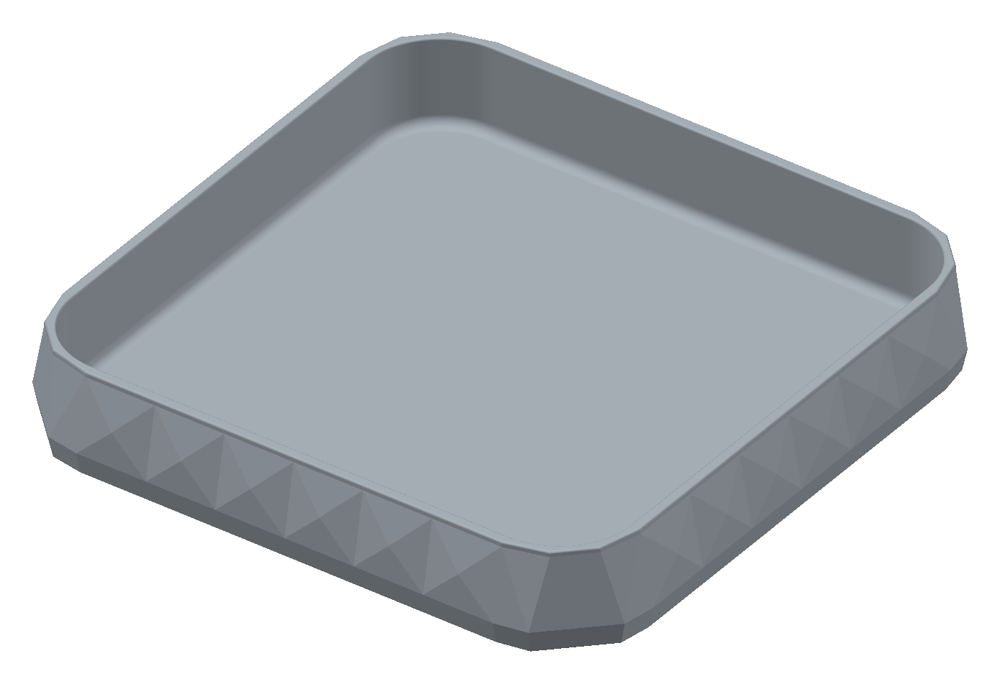

# Decorative faceted storage tray

A separate decorative exploration derived from the approved [storage tray](../storage_tray/README.md) at commit `9f0a553`. The original object's files are untouched. This version adds six shallow pyramidal panels along each exterior side: **96 triangular wall facets**, plus the mirrored corner facets. A 2 mm rim band and lower band frame the pattern. Each panel rises 2.4 mm from the tapered side plane, giving real relief rather than engraved lines. Repetition and mirror symmetry were chosen for a calm, deliberate geometric pattern.

## Deliverables and dimensions

- [Printable STL](faceted_storage_tray.stl), [STEP](faceted_storage_tray.step), [parametric Python](faceted_storage_tray.py).
- [CAD edge preview](renders/print/view_tray_isometric.png) makes facet boundaries explicit. Shaded preview uses the actual final STL, with illustrative lighting and colour; it is not a photo or physical print.
- Interior **220 × 220 mm** between straight walls, 28 mm corner radius, 34 mm usable depth. The floor blend reduces the flat central floor span to 212 mm.
- Outside **238 × 238 × 38 mm**; 4 mm floor, 4 mm straight rim wall before rounding, approximately 2.91 mm corner chord thickness before edge rounding.
- One solid, millimetres, XY centred at zero, underside at Z=0. STEP/STL share geometry and print placement. No assembly.

The smooth interior, 4 mm floor blend and 0.8 mm rounded rim preserve access and cleaning. Exterior facet edges and shallow peaks are intentionally crisp; they are broad surface relief, not projecting spikes. `WALL_PANELS` controls pattern density (even integer), `FACET_RELIEF` its depth, and `RIM_BAND_HEIGHT` the top border. The source is self-contained and does not import or modify the approved tray.

## Print and use

Print underside down, open side up. Reference assumptions: PLA, 0.4 mm nozzle, 0.2 mm layers, four perimeters, five top/bottom solid layers, 20% gyroid infill. No supports, skirt or brim in the reference slice. Use your own machine/material profile for printing; inspection G-code is not a printer job.

Broad bed contact and thick walls support ordinary tabletop storage. The cavity is open for insertion/removal; walls retain loose items on the desk. Facets add material outside the tapered wall. Their lower triangles grow outward gradually over 13.5 mm; no floating details, roofs or trapped supports exist. The lower band grows 2 mm outward over 9 mm. The 238 mm footprint fits the practical 250 mm envelope; if adding a brim, limit it to 5 mm per side and confirm the complete footprint in your slicer. Large-floor warping, tactile finish and strength with actual contents remain physical uncertainties. A small coupon would not represent full-tray warping, so none is supplied.

## Verification

- CadQuery MCP: valid single solid, 238 × 238 × 38 mm, 416,888.29 mm³. CadQuery 2.8.0 / OCP 7.9.3.1.1 / Python 3.12.14 / server 0.2.0.
- Source SHA256: `3ef47f326a4cbdd2508c696857534dae7902deef7b9bb2152d968e938cefe2d6`.
- [Export evidence](notes/export_checks.json), generated by [check entry point](notes/check_exports.py): valid STEP, closed consistently wound STL, one matching component, bounds/volume agreement and bed contact passed. Actual exported inner wall planes verified at ±110 mm.
- Sampled horizontal wall separations at Z=8.1, 9, 20, 30 and 37 mm: 5.35, 5.53, 4.46, 3.49 and 2.91 mm. These are sampled section distances, not a global thickness proof.
- Final STEP has zero detected symmetric-difference volume under 90° rotation, reflection across X=0 and reflection across X=Y (threshold 0.01 mm³). All four sides and corners match within CAD tolerance.
- [Parameter check](notes/check_parameters.py): 200 mm interior, four panels per side and 3 mm relief built successfully, then the final 220 mm / six-panel / 2.4 mm geometry was rebuilt. This checks a representative variation, not every possible setting.
- [Reference smoke slice](notes/slice_review/summary.json), [profile](notes/review.ini), [command](notes/slice_review/command.json): PrusaSlicer 2.9.6, fresh nonempty paths, zero support segments and no log notices or reported repairs. Deposited XY bounds after centering: 6.001–243.999 mm on each axis, height 38 mm. Reference estimate **316.95 g PLA, 25 h 55 min**; actual machine estimates will differ.
- Inspected CAD edge and shaded previews for panel relief, continuity, rim and smooth cavity. Shaded preview generated with `uv run --directory model/faceted_storage_tray/notes/preview_renderer python render.py`; renderer dependencies and lock are retained there. The display-only CAD wrapper rotates for the viewer and is not an export entry point.

### Design checklist

- [x] Reference, approved design, scope and required MCP checked; original files preserved.
- [x] Interior/access, repeat pattern, symmetry, edges, physical uncertainty and printer envelope reviewed.
- [x] Parametric source, alternate configuration, final CAD validity and views checked.
- [x] Actual STEP/STL pair, interior dimensions, symmetry and sampled walls checked.
- [x] Final generic FDM review and reference slice completed.
- [x] Source, exports, previews, reproducible evidence and print status saved.

## Physical print status

| Item | Print status | Artifact(s) | User result or remaining physical checks |
| --- | --- | --- | --- |
| Test piece(s) | N/A | None | Full tray is the first physical trial; no fitted interface. |
| Final printable object(s) | Unknown | `faceted_storage_tray.stl`, `faceted_storage_tray.step` | No print report; check flatness, surface feel, visual effect and stiffness. |

## Attribution

Primary model: GPT-6-based Codex agent; exact runtime variant and reasoning effort not exposed. Harness: Codex/API coding environment. Provider: OpenAI. No subagents. Derived from the approved tray whose primary model was GPT-6 Astra, low reasoning effort (user-supplied attribution). The user supplied the original reference photograph; its creator/licence are unknown and no photograph authorship or relicensing is claimed.
