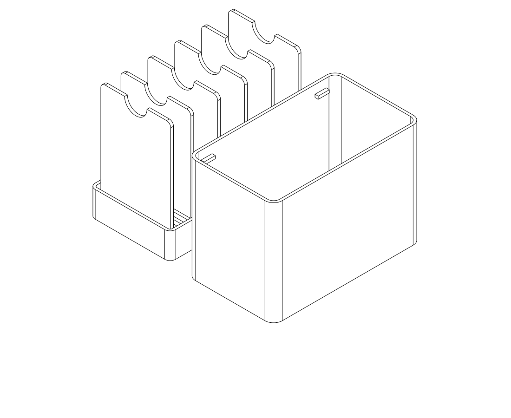
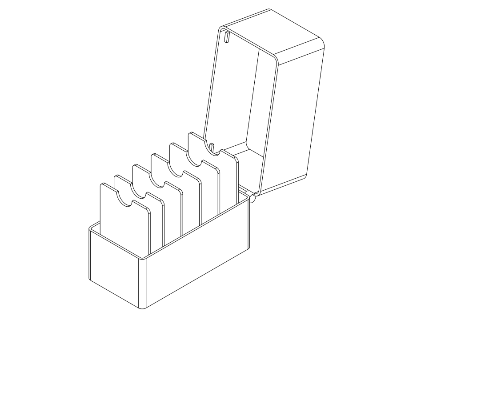

# Upright swatch box — rough concept comparison

Two **inspection-only** concepts for the existing [archive swatch](../filament_archive_swatch/README.md).
Cards stand **80 mm vertically × 50 mm horizontally × 2 mm thick**, with the
notch at the top. Twenty individual lower guides keep cards independent of their
neighbours; the six-card views show a sparse collection distributed across the
tray. No screws, nuts, magnets, glue or other materials are proposed.

**Recommended direction: A, a low guided tray with a removable deep hood.** It
exposes more of each card and needs only two printed parts. B keeps the cover
attached but requires a higher body, greater front/back clearance and a hinge.
The next decision is the cover arrangement and whether bag transport requires
positive retention. Neither concept has a working catch. The intended result is
fully covered ordinary storage, not a tested seal.

## Concepts and normal use

| | A — removable hood | B — flip-open hood |
| --- | --- | --- |
| Approximate closed exterior, mm | 62 × 106 × 86.8 | 62 × 124.5 × 86.8, including pivot envelopes |
| Body rim above bed | 18.4 mm | 44.4 mm |
| Card exposed above rim | 64 mm | 38 mm |
| Opening | Lift hood vertically and put it aside | Swing hood backwards approximately 100° |
| Main benefit | Full side access and little surrounding wall | Cover stays attached |
| Main cost | Loose cover occupies a separate place | More material, rear working space and hinge development |





For A, rest the tray on the desk, remove the hood and pinch a card at its exposed
side edges. Lift vertically at least 14 mm to leave the guides, then remove it.
Keep a hand on the tray while selecting. Insert a returned card into one empty
groove before lowering the hood. Only the lower edge is guided; the upper notch
is unobstructed. B uses the same grooves, with less exposed card height.

The [full-row view](renders/full/inspect_full_isometric.png) shows twenty cards
and one middle card raised 10 mm, still partly guided. This depicts the extraction
path, not a demonstrated comfortable grasp. There is 2.8 mm between the broad
faces of adjacent nominal cards at the 4.8 mm pitch; dense-row selection is a
specific physical handling question. The [empty-guide view](renders/guides/inspect_guides_isometric.png)
shows how six cards can remain individually supported. [Closed A](renders/closed/study_isometric.png)
shows the full exterior cover.

## Dimensions, architecture and evidence

The authoritative swatch remains its original SCAD file. [study.py](study.py)
reads its three overall dimensions directly. Its reference cards reproduce the
outline and notch in the revised orientation, omitting engravings, concave recess
and thickness/edge tests. No replacement swatch is supplied.

- Twenty grooves, 2.8 mm wide, on 4.8 mm centres; intervening ribs are 2 mm.
- 14 mm guide height above a 2.4 mm floor. Nominal 2 mm cards have 0.8 mm total
  groove allowance. A simple rigid parallel-face estimate permits roughly 3°
  of lean, rather than falling against adjacent cards. Real printed fit, card
  flatness and the original surface details remain untested.
- 2 mm clearance at each short card edge. Nominal rim and cover geometry use
  1.8 mm walls, 6 mm overlap, 0.4 mm cover clearance per side and 2 mm headroom.
- The comb floor supports the card bottom; the vertical groove faces constrain
  forward/backward lean; tray side walls limit sideways movement. Removing the
  closure mechanism entirely leaves a coherent card rack and cover.
- Four small hood lands seat on the tray rim. They sit outside the card width,
  so they do not sweep through the tall card edges in concept B. The hood
  walls guide A's downward placement; no friction or snap retention is assumed.
- A low-pivot hinged deep hood is not interchangeable with A's cover: it would
  sweep into tall cards. B deliberately raises the rim/pivot and enlarges its
  front/back margins. Its cylinders only mark the intended pivot location;
  hinge attachments, opening stops and retention are not developed.
- All proposed shell parts are well inside the Qidi Q2C 270 × 270 × 256 mm
  envelope. The intended FDM orientation is tray upright and hood roof-down,
  with a 0.4 mm nozzle. Final process/material choices and hinge manufacture are
  deferred until the concept choice; there are no print-ready files or slice claims.

The repository's earlier rejected swatch boxes were consulted as negative
product evidence. No rejected latch or its numerical work was reused. The
accepted sunglasses case demonstrates that a fully printed captive hinge is
possible, but its success does not qualify this taller box or require a hinge.
The architecture comparison precedes detailed closure design, simulations or
physical coupons.

Evaluated 2026-10-02 with `evaluate_model.py`, CadQuery **2.7.0**, Python
**3.12.14**. All five inspection entry points produced valid geometry and their
selected isometric renders. The [targeted checks](check_study.py) passed:
nominal cards clear the comb and A's closed hood; B's hood clears the seated
cards and body at 5° samples from closed through 100°. These samples are rigid
clearance evidence, not a continuous-motion proof or a qualified hinge. Actual
slot friction, sparse-card steadiness, dense-row picking and cover effort need
physical observation after a worthwhile concept is selected.

Reproduce the specific checks from the repository root:

```sh
./evaluate_model.py model/filament_swatch_box_study/check_study.py --views none
```

Render `study.py` for closed A, `inspect_lift_off.py` for sparse A,
`inspect_flip.py` for sparse B, `inspect_full.py` for full A, or
`inspect_guides.py` for the empty comb. **Do not export or slice these inspection
entry points**: they include reference cards or undeveloped concept geometry.

## Physical print status

Status reviewed 2026-10-02. This phase delivers rough geometry and review views.

| Item | Print status | Artifact(s) | User result or remaining physical checks |
| --- | --- | --- | --- |
| Test piece(s) | N/A | None in this rough-study phase | No physical test recommended before concept selection |
| Final printable object(s) | N/A | No print-ready STEP/STL in this phase | Cover arrangement, retention requirement and physical handling remain open |

## Attribution

Primary language model: **GPT-6** (runtime identifies this family; exact variant
and reasoning effort not exposed). Harness: **Codex**, shared repository
workspace. Provider: **OpenAI**. No subagents. Swatch dimensions and outline
come from the existing user-provided SCAD source; its historical Gemini
attribution remains with that object.
