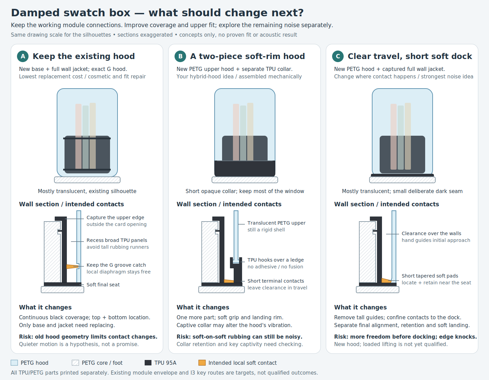
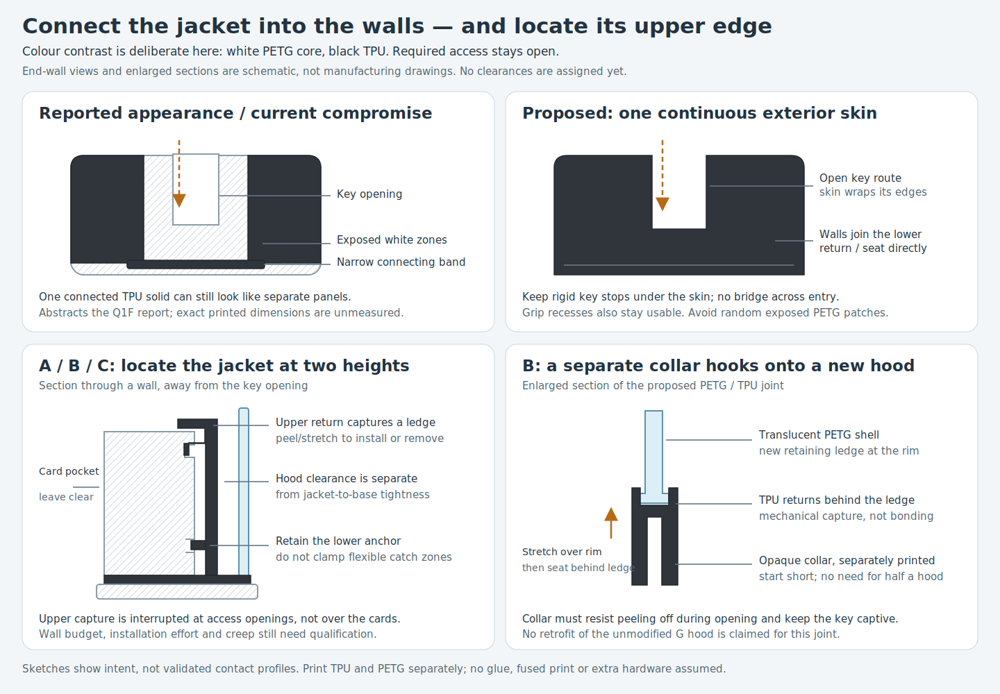
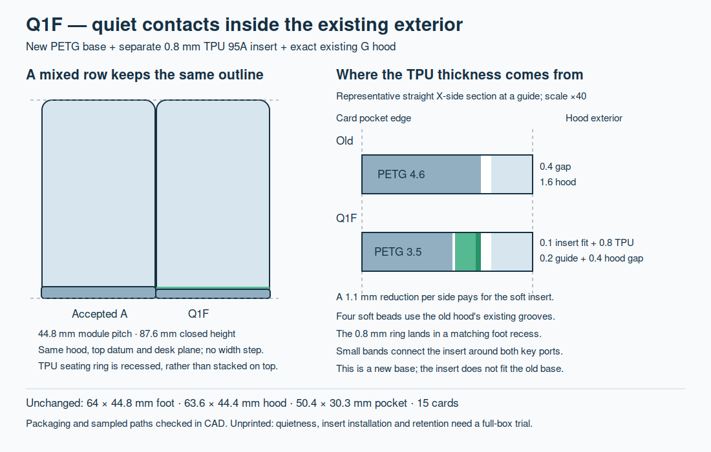
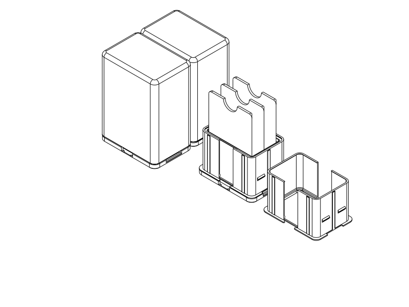
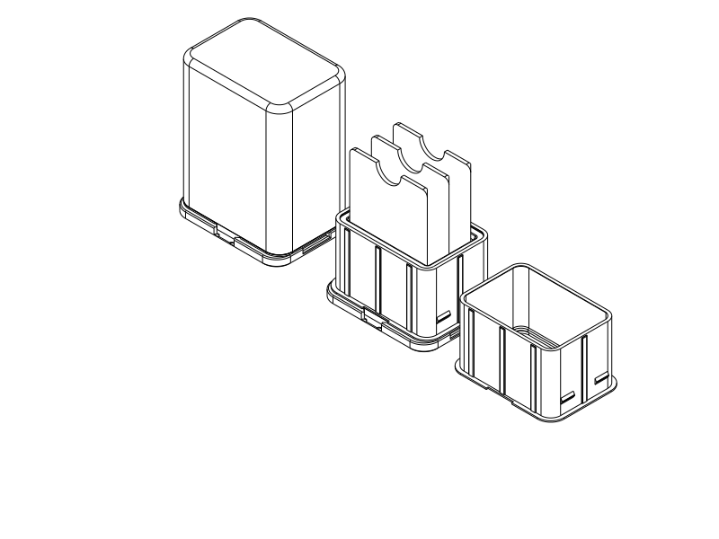

# Filament swatch box — display and compact archive

## TPU damping discontinued, 2026-10-06

**The user has ended this damping project.** Q1/Q1F and the follow-up SVG
directions are retained experiment history, with no further development or print
recommendation planned unless the user reopens the work. The accepted
[archive A / PETG G hood / I3 key baseline](#archive-r2--four-printable-15-card-trials)
remains available; its reported rigid-contact noise remains unresolved. This
decision does not change the separate deferred J4/K4 issues.

The user printed the **G hood geometry unchanged, fully in TPU**, and tried it
against the jacketed base from the Q1F trial. TPU-on-TPU rubbing still produced
clearly audible sound. It was somewhat quieter by the user's judgment, but
still above the acceptable level: the damping goal was not met. This adds a
physical all-TPU hood result to the earlier PETG-hood/TPU-jacket report; it is
not a print of the proposed two-piece hood collar or terminal-dock designs.

The upper TPU hood also showed local shape distortion: some regions looked
expanded, others shrunken, and the shell could be moved around rather than
holding the nominal STL shape rigidly. **It remained usable and still did its
job.** The user likens this to the earlier
[PETG vase-mode hood](#v1-single-wall-vase-hood--additional-transparency-trial).
These are separate material/construction trials with similar reported shape
instability; a common cause has not been established. Whether the TPU shape
change occurred during printing, assembly, handling or dwell is unknown.

| Lesson to retain | Observation, consequence and scope |
| --- | --- |
| Soft-on-soft contact does not ensure quiet sliding | In this printed TPU hood/jacket pair, rubbing remained unacceptable despite some subjective reduction. Separate impact cushioning from frictional sliding sound; substituting TPU alone did not solve this product's problem. This is not evidence that every TPU application is noisy or unsuitable. |
| A material substitution needs its own whole-shell shape/feel assessment | The unchanged G geometry in TPU remained usable but deformed visibly. Earlier successful PETG fit, CAD geometry and export validity do not qualify a TPU shell's shape stability. Check the intended material/construction and handling when those can change function; do not infer that a usable fit means the shape is satisfactory. |
| Keep suspected layer-line effects separate from the result | The user suspects printed lines/roughness cause the rubbing sound. Contact locations, surface measurements and acoustic mechanism are not isolated. No roughness diagnosis, process defect, calibrated material property or guaranteed smoothing remedy is established. |

The reported material is TPU; the known available stock is ordinary 95A, brand
unknown. Exact hood/base/insert file hashes, actual TPU hood grade and print
settings/orientation are not separately confirmed. The user's description
identifies the G design; it does not identify byte-for-byte printed artifacts.
No new CAD, material-qualified slice, sound measurement or mechanical analysis
was performed for this report. Successful Q1F joining remains valid within its
reported use even though the damping direction is discontinued.

| Item | Print status | Artifact(s) | User result or remaining physical checks |
| --- | --- | --- | --- |
| Test piece(s) | N/A — complete hood/box trial | No separate coupon reported | Feedback concerns complete-shell sound and deformation |
| Final printable object(s), Q1F damping experiment | Yes — Q1F confirmed in earlier report | Existing Q1F base/insert exports below; actual printed hashes unknown | Joining succeeds in reported use; coverage, upper fit and sliding sound were unsatisfactory. Damping development discontinued |
| Complete experimental G hood in TPU | Yes — reported 2026-10-06 | User reports unchanged [G source](cap_g_hood_5.py) / [STEP](cap_g_hood_5.step) / [STL](cap_g_hood_5.stl) design; actual printed file unknown | TPU-on-TPU rubbing slightly quieter but unacceptable; upper shape distorted/movable, still usable. No durability, shape-recovery or acoustic rating |
| Follow-up SVG directions | N/A — visual concepts, no printable deliverables | Existing comparison/detail SVGs and PNGs below | Superseded by the decision to stop; not accepted or physically tested |

Feedback is attributed to the user. Record/reflection attribution: GPT-6-based
Codex (active variant and reasoning effort not exposed), Codex shared repository
environment, OpenAI; no subagents. Historical modelling attribution is preserved.

## Damped prototype print feedback and SVG exploration, 2026-10-06

**Historical first report and proposal phase; superseded by the discontinuation
above.** The following records preserve what was known and proposed at that stage.

**Q1F has now been printed: module connections work, but appearance,
upper-jacket fit and remaining closing noise are unsatisfactory.** The user
reports joining the damped modules together and with other modules without a
problem. The user confirms Q1F and identifies sliding as the main noise event,
felt as noise from the PETG hood. Printed file hashes, print settings and tested
neighbour identities/ends are not confirmed; do not transfer the result to Q1
or claim every mixed-row interface was physically qualified.

| User observation | Engineering consequence and remaining uncertainty |
| --- | --- |
| Modules connect together and to other modules successfully | Preserve the working joining arrangement. No new key mechanism is requested; loads, durability and every port combination remain unmeasured. |
| White PETG base with black TPU looks poor because the TPU does not continuously cover the visible base and the jacket's connecting bands stand out | Revise coverage as a deliberate continuous contrasting surface, connecting it into the walls rather than leaving isolated-looking bridges. Keep the actual key and finger routes open. Cosmetic rejection is a physical use result, not a printing defect. |
| Upper TPU is not tight to the base; too many regions feel loose/floating | Locate the upper edge positively as well as the lower anchor. Tighten the jacket-to-base relationship independently of the hood's running clearance; no measured gap or cause is established. |
| TPU provides some damping, but substantial sound remains while sliding the hood; the user feels the PETG hood making the noise | The quietness goal is not met. The user believes the hood rubs only TPU. The perceived shell source is useful feedback, but the exciting contact/mechanism has not been isolated. Soft material contact is not proof of quiet sliding. |
| User may try a hood partly translucent PETG and partly TPU | Explore separately printed, mechanically captured TPU hood parts. Do not depend on PETG/TPU bonding or assume TPU-on-TPU sliding will be quiet. No hybrid hood print is reported. |

The previous CAD checks and reference slices remain evidence for their declared
geometry and profiles. They did not qualify perceived sound, contrasting-material
appearance or upper-jacket feel. Keep the existing sources and exports as the
tested baseline, with revised readiness: **printed family, partial functional
success; the exploration was subsequently discontinued as recorded above**. Materials remain PETG
and the user's ordinary TPU 95A (brand unknown); reported colours are white base
and black insert. The hood is PETG; actual printed files and parameters are
unconfirmed. No print is newly reported for the larger Q1.

| Item | Print status | Artifact(s) | User result or remaining physical checks |
| --- | --- | --- | --- |
| Test piece(s) | N/A — complete damped box was tested | No separate coupon reported | Sound and handling feedback concerns the complete assembly |
| Final printable object(s), Q1F damped prototype | Yes — Q1F confirmed, reported 2026-10-06 | Existing Q1F deliverables below; actual printed file hashes unconfirmed | Joining succeeds in reported use; contrasting coverage, upper fit and sliding noise require revision. No force, acoustics, creep or durability rating |
| New SVG concepts | N/A — rough visual phase | SVG/PNG proposals; no new print files | Concepts for discussion, not dimensioned or qualified replacements |

<a id="three-directions-for-discussion"></a>

### Three directions for discussion — retained concept history



[Editable comparison SVG](renders/concepts/damped_revision_options.svg).
All three keep the storage pocket and normal lift-off action. The working I3 key,
its rigid stops, upward entry, grip access and hood captivity should be preserved;
no new connector is proposed. Matching the accepted 64 × 44.8 mm foot,
63.6 × 44.4 mm hood and 87.6 mm closed height remains a **design target**, not a
qualification for these sketches. New mating bases/jackets are allowed; the
current Q1F insert is not promised compatible with any new base. A reuses the
unmodified G hood as a target; B/C deliberately allow a revised hood.

| Concept | Proposed change and normal use | Trade-off / unresolved decision |
| --- | --- | --- |
| **A — existing G hood, fuller captured jacket** | Rebuild the base/jacket so TPU wall panels join the lower return directly around the required key opening. Capture the upper edge on an outside ledge as well as the lower groove. Recess broad panels and remove unnecessary tall raised runners, while retaining the G groove's local soft catch and final seat. Load cards, lower the existing hood, and release by lifting while holding the recessed base grips. | Two replacement parts, retained hood. Best direct response to appearance/upper fit; the existing hood limits where contact/retention can move. More clearance can allow rocking. Noise reduction, entry-wall strength and peel-on installation are unqualified. |
| **B — PETG upper hood + separate TPU lower collar** | Use the same improved base coverage/upper capture. Print a new largely translucent hood and a short opaque TPU collar separately; stretch the collar over a retaining rim and seat it behind a ledge. The collar grips/lands at local final contacts while its bore should clear the jacket during most travel. Keep a rigid hood feature blocking key escape rather than relying on a floppy lip alone. | Four assembled parts rather than three. This explores the user's hybrid-hood idea without fused printing. A short collar preserves visibility; increasing it towards half-height is possible to explore but hides more cards. It might change shell vibration, but additional TPU-on-TPU rubbing could worsen sound. Collar pull-off, creeping retention and practical fit are unknown. |
| **C — clearance hood with a short final soft dock** | Revise the hood interior and remove tall contact features so broad jacket walls are set back during travel. Put short tapered alignment pads, a local catch/recess and soft landing near the final dock, separating guidance, retention and stopping. Most of the approach is hand-guided; the final short stroke aligns and retains the hood. | Three parts, new hood. This most directly changes the sliding-contact architecture. More approach freedom can produce edge knocks or snagging; tilted travel, shell bowing, final play and accidental release need qualification. No full-load hood-lift rating transfers from accepted A/G. |



[Editable detail SVG](renders/concepts/damped_revision_details.svg). The present
inward bypass bands kept Q1F's jacket connected after cutting its ports; they
were a topology repair, not a complete contrasting-material finish. Filling the
actual key path would break joining. A better direction is continuous TPU on
the surrounding end walls and access edges, connected into the lower return,
while the real swept key route stays empty. The white foot stripe in the
comparison is deliberate; these proposals replace patchy wall exposure, not
promise that every visible surface becomes TPU. A fully black foot would need
its own recessed skin/wall budget and preserved port/grip access.

Upper capture should stop panels lifting away without occupying the card-entry
opening or immobilising the local catch diaphragms. Keep base-to-jacket location
separate from hood clearance: globally squeezing the sleeve could pull the
hood-contact beads outward and increase drag. Install by progressive stretch/peel
with cards removed; assembly effort, tear resistance, removal and long-term
settling need an actual printed assembly, not a rigid envelope claim.

**Noise interpretation remains provisional.** Feeling the PETG hood vibrate does
not identify what excites it. Sliding against TPU, intermittent unintended
contact, catch travel and jacket movement remain possible causes. Experiments
on other soft–rigid interfaces show that compliant contact can itself generate
sound; those materials/speeds do not diagnose printed PETG/95A TPU here.
[Djellouli et al., Nature (2026)](https://www.nature.com/articles/s41586-026-10132-3).
Q1F already had nominal centred hood clearance and no intended running preload;
simply drawing an air gap again is insufficient. C would need actual additional
contact relief, short terminal features and checks with off-centre hand approach
and plausible shell/jacket movement. No numerical acoustic reduction is claimed.

PETG/TPU bonding is **unqualified for the user's filaments**. Manufacturer
[mixed-material guidance](https://help.prusa3d.com/article/combining-materials-xl_498103)
notes that different materials can fail to adhere and rigid deposition can move
underlying flexible layers; it does not establish a reliable bond for this pair.
These options therefore use separately printed, mechanically captured parts on
the existing single-material printer. They require neither glue nor a material
swap during one print, and do not claim that PETG and TPU can never bond.

The historical comparison favoured A for coverage/attachment repair, C for
changing sliding contact, and B for the hybrid-hood idea. **That recommendation
is superseded by discontinuation.** None was acoustically qualified. Suggested
hand-restraint diagnostics were not reported performed; no result is inferred.

This phase delivers SVG proposals and PNG previews, both rendered and visually
reviewed. It makes no CAD, STEP/STL or slicer claim for A/B/C. Existing printable
files remain experiment history. No detailed variant CAD followed this proposal
phase; the user subsequently ended the project. The assembly API was unchanged.

Print feedback is attributed to the user. New drawing/reflection attribution:
GPT-6-based Codex (active model variant and reasoning effort not exposed), Codex
shared repository environment, OpenAI; no subagents. Historical attribution below
is preserved.

## Named assembly engineering, 2026-10-06

Q1 is the first quiet prototype; Q1F is its flush-exterior option. These physical
designs remain available. The assembly-API work is an engineering-code revision,
not a new geometry variant or a new printable box.

[QuietAssembly](quiet_assembly.py) builds the actual components once per candidate
from the existing Q1/Q1F builders and captures native `cq.Assembly` configurations:
closed/loaded, prescribed hood lift/offset, three separate single-component print
jobs, and new/new or accepted A/J4 rows at both ends. Named `base`, `insert`, `hood`,
`cards/card_00` and `new/base` paths keep component identities through placements.
The [inspection entry](inspect_quiet_q1_flush.py) and
[shared engineering checks](check_quiet_q1.py) now consume that same object-owned
configuration layer. Geometry dimensions remain in the existing builders.

Pair requirements distinguish forbidden overlap, required floor/seat contact and
required obstruction for insert retention, key captivity and key-head capture.
Native sampled paths retain the component pair, parameter, requested poses,
measurements and first unsuccessful pose. A failed Boolean/distance calculation
is inconclusive rather than accepted as zero interference. Prescribed placements
need no constraint solve; the configuration API does not discover how to assemble
the parts or establish a fully constrained physical mechanism.

| Engineering state/question | Actual parts or explicit reference | Requirement retained |
| --- | --- | --- |
| Closed assembly and hood withdrawal | Hood/base; hood/insert; hood/insert-without-beads reference | Forbidden overlap, sampled full lift and small-offset paths; full insert contact restricted to bead masks |
| Loaded storage | Actual cards, base/insert/hood and actual floor region | No penetration, floor gap at most 1e-7 mm, and downward support witness |
| Insert stays located | Insert/base | Required rigid obstruction at 1 mm lift and 3° twist; release force unknown |
| Soft landing and grip | Actual hood/insert seating region and grip references | Required seating witness; finger envelope clears hood/insert |
| Joining and independent opening | Named new/adjacent modules and actual I3 key | Key entry, four flank captures, closed-hood captivity, adjacent clearance and opening at both ends |
| TPU installation access | Independent expanded upper sleeve and seating-ring references | Sampled rigid access only; no connected elastic assembly or strain claim |

The original numerical volume thresholds remain local: 1e-6 mm³ for forbidden
overlap/retention obstruction, 1e-4 mm³ for floor/soft-seat witnesses and 1e-5 mm³
for key-flank witnesses. API criteria are inclusive at their limits. These are
engineering screens, not measured kernel accuracy or physical tolerances.
No detected overlap does not establish positive clearance; required contact and
obstruction therefore have their own criteria.

The non-retention insert, diaphragm subset, seating patch, card-entry envelope
and independent expanded installation envelopes remain explicitly named analysis
references. They are not added to physical part configurations or print jobs.
The local mask check still establishes that intentional hood/insert overlap occurs
only at the soft beads; rigid overlap screens cannot establish elastic release.
Connectivity and the thin Q1F crest screens also remain object-specific.

[API qualification entry](check_quiet_assembly.py) exercises the full checks for
both variants, compares the retained legacy outcomes and independently checks
native placements against previous print/inspection arrangements. Deliberate
wrong hood placement, missing retention beads and a floating card must fail the
appropriate requirements. STEP/STL files, print sources and historical reports
are retained. Existing material slices continue to describe those same print
files; no new print or physical observation is implied.

The trial exposed a regression-method limit: both whole-scene subtraction and
coincident source-card subtraction returned invalid Booleans. Those calculations
were rejected, never interpreted as zero difference. Inspection qualification
now checks the exact component set and each positioned part. Cards use the native
placement plus transformed source vertex datums (1e-7 mm arithmetic comparison),
not a Boolean identity claim. The API's stable geometry-copy qualification and
unchanged card builders retain their own scope.

The migration also strengthened two local requirements. Floor witnesses now crop
the actual base with the floor-region mask, so an auxiliary full block cannot
stand in for missing support material. Bead-contact and outside-bead mask Booleans
must be valid before their volumes can qualify retention/contact location.

Verification: the final [Q1 report](notes/quiet_q1_assembly_checks.json) contains
354 pair/path records and matches 20 retained legacy outcomes;
[Q1F](notes/quiet_q1f_assembly_checks.json) contains 355 records and matches 26.
Motion records contain their individual sampled measurements. Both variants pass
the placement/print-selection regressions and reject all three deliberate bad
states. Final source and original STEP/STL fingerprints match their reports.
The unchanged API's 27 regression tests pass. No geometry, material profile or
print artifact changed, so the existing slice evidence was not repeated.
The native assembly also passed the existing CAD evaluator; its
[isometric](renders/quiet_assembly/inspect_quiet_q1_flush_isometric.png) and
[top](renders/quiet_assembly/inspect_quiet_q1_flush_top.png) views were inspected.
[Evaluation report](notes/quiet_assembly_views.json), Python 3.12.14/CadQuery 2.7.0.

Run from the repository root:

```sh
./execute.py --threads 2 model/filament_swatch_box_study/check_quiet_assembly.py --variant q1f
./execute.py --threads 2 model/filament_swatch_box_study/check_quiet_assembly.py --variant q1
```

Assessment: named configurations and explicit contact/obstruction requirements
are useful for this multipart product. The former shared checker was one long
procedure with repeated inline placements and mostly Boolean assertions; sharing
the checks between variants was already useful, but component identity and
failure diagnostics were weaker. Native snapshots now organize that evidence
without a second assembly tree. Splitting every check into another module or
forcing flexible contact masks into a generic all-pairs checker would obscure
the product's intent. The remaining physical uncertainties belong to the existing
full-box trial, not a code revision.

The trial now informs the design skill's recommended assembly representation,
with an explicit opt-out. The shared API record owns the
[remaining gaps and extension decisions](../../assembly_geometry/README.md#remaining-gaps-and-extension-decisions),
including local proxy/coverage responsibilities, rigid-motion limits, report
verbosity and the failed comparison method. No additional geometry or API
implementation revision is needed for this trial.

Assembly-code attribution: GPT-6-based Codex, exact active model variant/reasoning
effort not exposed; Codex shared repository environment, OpenAI, no subagents.
Historical geometry attribution below is preserved.

## Quiet TPU revision — Q1F with the accepted exterior, 2026-10-05

**Q1F fits the TPU inside the accepted module's exterior and reuses the exact G
hood geometry.** It is a complete **printed prototype**, with a new PETG base
and one separately printed TPU 95A insert. **Damping development is discontinued**;
the files and instructions below are retained experiment history. The larger Q1
also remains historical. Accepted A/G evidence is retained. Q1F joining worked,
but appearance, upper fit and sliding-noise goals were not met.

| Dimension | Accepted A / G | Q1F |
| --- | --- | --- |
| Foot width × row length | 64 × 44.8 mm | 64 × 44.8 mm |
| Hood width × row length | 63.6 × 44.4 mm | Same G hood |
| Closed height / hood rim height | 87.6 / 5 mm | 87.6 / 5 mm |
| Card pocket / floor / wall height above floor | 50.4 × 30.3 / 2.4 / 40 mm | Unchanged |

Butted modules keep the same centre spacing, side widths, desk plane and hood
top. The hood gap stays 0.4 mm in old/new and new/new rows. The foot's soft-seat
recess changes its local detail; matching exterior dimensions does not mean every
base surface is identical. The new insert **does not fit the old A base**, and
Q1F parts are not substitutes for the larger Q1 parts. Existing I3 keys remain
the joining parts. K4's reported bad port and J4's card tilt remain deferred.

| Part | Primary print file | Matching source / mesh | Orientation |
| --- | --- | --- | --- |
| New PETG base | [STEP](quiet_q1_flush_base_15.step) | [Python](quiet_q1_flush_base_15.py) · [STL](quiet_q1_flush_base_15.stl) | Floor down |
| New TPU 95A insert | [STEP](quiet_q1_flush_jacket_95a.step) | [Python](quiet_q1_flush_jacket_95a.py) · [STL](quiet_q1_flush_jacket_95a.stl) | Seating ring down |
| Existing translucent PETG G hood | [Retained STEP](cap_g_hood_5.step) | [Python](cap_g_hood_5.py) · [STL](cap_g_hood_5.stl) | Existing roof-down file, or reuse the printed hood |

Print PETG and TPU separately, then assemble; no fused materials, glue or hardware.
The new print files each select one component, centred at X/Y135. The
[Q1F parametric builder](quiet_q1_flush.py) owns the revised dimensions and reuses
the existing builders without mutating their parameters.



[Editable SVG](renders/concepts/quiet_q1_flush.svg). The section shows how thinner
rigid walls pay for the TPU; the row drawing is schematic. The CAD view below
shows accepted A and Q1F joined on the left, open Q1F with three actual cards in
the middle, and the detached insert on the right. Monochrome does not identify
materials. [Top view](renders/quiet_q1_flush/inspect_quiet_q1_flush_top.png).



The rigid body's outer dimensions shrink by **1.1 mm per side**, to 57.4 × 38.2
mm. This makes room for **0.1 mm per-side insert allowance, 0.8 mm TPU walls and
0.2 mm raised guides**. Guide tips retain the old body's travel envelope and
0.4 mm nominal per-side clearance to the lower hood; broad panels have 0.6 mm.
Centred travel has no designed rubbing preload. Four soft beads use the G hood's
existing blind grooves, with 0.3 mm nominal release overlap and 0.8 mm recessed
rigid backing space. They replace the rigid closure catches.

The **0.8 mm soft seating ring is recessed into the foot**, from Z4.2 to Z5,
so the old hood retains its original rim and roof height. Port notches leave the
key routes open. Small inward bands connect the ring around those notches;
matching channels in the rigid end walls let the bands descend to their seats.
This corrects a rough-CAD defect where the two ports severed the insert into two
pieces. The final connectivity check specifically guards that observed defect.
The sleeve's inward anchor bead has 0.55 mm nominal capture in the sloped base
groove; the rectangular wrap locates rotation.

**Thickness trade-off:** ordinary straight rigid walls are 3.5 mm on X sides and
3.95 mm on Y ends, versus 4.6 and 5.05 mm previously. The accepted two-millimetre
entry flare remains. Its straight side walls narrow to 2.3/2.75 mm before edge
rounding. Local end-access channels leave 1.45 mm at the flare and about 0.85 mm
at the crest after inner rounding and the new 0.2 mm access-lip chamfer.
A conservative rounded-corner geometric screen leaves
about 0.84 mm at the thinnest entrance crest; the rim radius is 0.4 mm. Anchor
grooves and diaphragm recesses also remove local material. This is feasible
packaging, **not a stiffness or printed-strength qualification**.

With cards removed, align the insert's port notches, gently spread the lower
anchor over the rounded base top, and lower it progressively until the ring
seats in its recess and the anchor engages. The inward bands follow their end
channels. Load cards, then close with the existing G hood. Hold the base down
through the retained upward-facing grip recesses while opening. The insert
should stay on the base. Assembly effort and the relative insert/hood release
forces require the actual 95A print. Independent rigid access screens check a
3.5% pre-expanded upper sleeve and an unexpanded seating ring; **these are not a
connected elastic installation pose or a measured strain requirement**.

The [Q1F checks](check_quiet_q1_flush.py) reuse the
[object-owned closure/card/key checks](check_quiet_q1.py), with fine hood-travel
sampling extended to cover these higher beads. They cover actual-card support,
eight-direction entry, extraction, closed fit, bead-only centred contact,
small-offset rigid clearance, diaphragm room, sleeve capture, soft landing and
grip access. Joining checks use the actual I3 key, new/new, archive A and J4
neighbours at both ends: insertion, all four head-flank captures, closed-hood
key captivity and individual opening. Sampled motion is not continuous-path
proof. [Results](notes/quiet_q1_flush_checks.json).

Use the established **0.4 mm nozzle, 0.2 mm layers, two walls and 7% adaptive
cubic**, PETG for the base and ordinary TPU 95A for the insert. Shared material
profiles and their limitations are recorded in the Q1 print section below.
FDM review: both parts fit the Q2C bed, with stable floor/ring contact. The
0.8 mm sleeve wall and roughly 1.1 mm-wide port bands are intentional thin
features; the bands start on the bed. Sloped anchor shoulders, backing-recess
ceilings and the small upper return build progressively. No trapped support
removal is assumed. New STEP/STL pairs share the selected print geometry and pose.

Both valid new components exported successfully. **OrcaSlicer 2.4.2** completed
the matching PETG/TPU reference STL reviews with preserved placement, effective
.4/.2/two-wall/7% settings, no reported notices and no generated supports in the
automatic-support probes. The final unchanged insert export/slice was reused by
native identity checks after the base access-lip change. Reports:
[base](notes/quiet_q1_flush_base_review.json),
[insert](notes/quiet_q1_flush_jacket_review.json) and
[views](notes/quiet_q1_flush_views.json). Both final CAD views and the SVG preview
were visually inspected. This is reference toolpath acceptance, not printed
fit/strength or Orca's separate GUI STEP-import verification. G hood source and
exports are retained, rather than redelivered as a modified hood. The unchanged
larger Q1 also passed the shared-check regression.

Original trial plan (before the report above): use the complete new base and insert with the existing G hood,
empty and with all 15 cards. Compare closing sound against the accepted pair,
including a slightly off-centre approach. Check installation, seating, opening,
card access, insert migration and mixed-row alignment. Repeat after an overnight
closed dwell. Accept if it is appreciably quieter with comfortable opening and
no binding or insert movement; revise the guide/bead/anchor fit if those fail.
Inspect thin entrance and port regions for deformation. Persistent squeak/drag
would reopen the contact design. A full box represents shell bowing and sound
better than a local coupon; nothing is omitted from this trial. No measured
force, noise reduction, creep, durability, ingress or loaded-lift rating exists.
The accepted A/G loaded-lift result does not transfer to this new closure.

| Item | Print status | Artifact(s) | User result or remaining physical checks |
| --- | --- | --- | --- |
| Test piece(s) | N/A — complete box is the trial | No coupon | Whole-shell sound and handling need the full assembly |
| Final printable object(s), Q1F prototype | Yes — Q1F confirmed, reported 2026-10-06 | Two new STEP/STL pairs above; retained G hood; actual printed hashes unknown | Joining works in reported use; appearance, upper fit and sliding sound unsatisfactory. Damping project discontinued; retained as evidence, not a new print recommendation. Force, stiffness and dwell unqualified |

Q1F CAD/SVG attribution: reviewed local records report configured
**GPT-6.1 Sol, high reasoning effort**; backend implementation is unverified.
**Codex** shared repository environment, **OpenAI**, no subagents.
Historical attribution and the separately licensed Orca profile sources below
remain unchanged.

Reflection, 2026-10-06: matching the exterior was possible by budgeting the rigid
wall, insert, guide and clearance together, rather than adding every layer outside
the old body. Keeping the pocket unchanged still required reviewing thinner local
entrance and port walls. Both key routes severed the first compact sleeve; checking
the complete insert exposed a separate connectivity requirement that local fit
checks missed. The independent installation envelopes establish access only, not
elastic assembly. Quieter sound still needs the physical whole-box comparison.
One full sweep was duplicated while adding a targeted connectivity assertion;
the unchanged sweep should have been awaited and the new assertion run separately.
The existing sequential-refinement guidance already covers this, so no new
scheduler or additional routine verification rule is justified. Reviewed effort
and request-rate measurements are appended to [the effort record](notes/agent_effort.md).

<a id="quiet-tpu-revision--svg-proposals-2026-10-05"></a>

## Quiet TPU revision — Q1 prototype, 2026-10-05

**Q1 is a complete 15-card archive prototype; no Q1 print is reported by the
latest feedback, which concerns Q1F. Damping development is discontinued.** It was
designed as **three separate single-material print jobs**: PETG base, TPU jacket
and translucent PETG hood, followed by assembly. The user confirms ordinary
**TPU 95A**, brand unknown.
Compatibility is optional; this revision prioritises quieter closing and
preserves the accepted archive A card pocket, full cover and recessed grips.
The earlier J4/K4 card-support issues remain outside this revision.
Q1F above retains the later matching-exterior experiment. Both are discontinued.

| Part | Primary print file | Matching source / secondary mesh | Print orientation |
| --- | --- | --- | --- |
| PETG archive base | [STEP](quiet_q1_base_15.step) | [Python](quiet_q1_base_15.py) · [STL](quiet_q1_base_15.stl) | Floor down |
| TPU 95A jacket | [STEP](quiet_q1_jacket_95a.step) | [Python](quiet_q1_jacket_95a.py) · [STL](quiet_q1_jacket_95a.stl) | Wide seating ring down |
| Translucent PETG hood | [STEP](quiet_q1_hood.step) | [Python](quiet_q1_hood.py) · [STL](quiet_q1_hood.stl) | Roof down, ordinary slicing |

[Shared parametric builder](quiet_q1.py) owns all new mating geometry. Each
print file contains one component at the same nominal units/pose as its matching
mesh; no reference cards or mixed-material combined print file are included.



Left: complete closed box. Middle: base and fitted jacket with actual reference
cards. Right: detached jacket. The monochrome CAD view does not indicate material.
[Top view](renders/quiet_q1/inspect_quiet_q1_top.png) shows the open pocket and
key-port clearances. Both final views were visually inspected.

The new foot is **67.7 × 52 mm**, versus the accepted **64 × 44.8 mm**; closed
height remains **87.6 mm**. Archive pocket **50.4 × 30.3 mm**, card floor,
40 mm retaining height and two-millimetre flared entrance are unchanged.
The increased footprint gives the TPU room and keeps joining-key access outside
the jacket; it does not thin the accepted card-retaining walls globally.

The jacket covers the outer base walls and rolls over their upper edge. Its
**1.2 mm wall** has **0.4 mm raised runners**, with **0.25 mm nominal per-side
hood clearance at the runners**. Broad panels sit farther back; normal centred
travel has no intended continuous rubbing preload. Four local soft beads enter
blind hood pockets, replacing the rigid PETG catches. Their nominal centred
release overlap is **0.25 mm**, with **0.8 mm recessed backing space** in the
rigid base for the TPU diaphragm to move. The hood lands on a **0.8 mm TPU seat**,
while its rim remains clear of the PETG foot. Upper hood walls/roof remain
0.8 mm, with 1.6 mm lower walls and a smooth rounded exterior.

The sleeve's circumferential inward bead engages a sloped groove in the PETG
base, giving **0.55 mm nominal radial capture**. The rectangular wrap locates
rotation. This identifies the anchor load path, but does not prove that anchor
release force exceeds hood release force in the actual print. No glue, fusion,
hardware or multi-material extrusion is needed.

Assemble with the cards removed: gently spread the sleeve's lower anchor over
the base's rounded top, lower it progressively, and seat its wide ring on the
foot until the anchor engages the groove. Align the two seat notches with the
joining ports. Load the cards and lower the hood squarely. For opening, hold
the base down through the upward-facing recesses and pull near the hood's lower
walls. The jacket should remain seated on the base. Installation needs a print:
the checked 3.5% pre-expanded rigid envelope is an access screen, not a measured
95A stretch requirement or an elastic feasibility guarantee.

**Compatibility outcome:** existing swatch cards and I3 joining key are retained.
CAD checks cover new-to-new, new-to-archive-A and new-to-J4 joining at **both
ends**, with butted feet, key insertion/capture and individual hood opening.
Different foot widths leave a stepped side outline. Printed joining has not been
tested. The new base/jacket/hood are a matched set; the old G hood and old bases
are not qualified substitutes. K4's previously failed port is not rehabilitated.

Use the established **0.4 mm nozzle, 0.2 mm layers, two walls and 7% adaptive
cubic** starting setup. PETG and TPU use separate material profiles. The
[TPU diagnostic process](notes/quiet_q1_profiles/tpu_020_2walls_7percent.json)
limits wall/infill speeds to 30 mm/s and the first layer to 20 mm/s. Its
[generic Q2C 95A filament snapshot](notes/quiet_q1_profiles/generic_tpu_95a_q2c.json)
is resolved from Orca's bundled Qidi profiles, not calibrated for the unknown
brand. Diagnostic temperatures were PETG 245/250 °C first/other layers and
80 °C bed; TPU 230 °C and 35 °C bed. Use actual spool/previous successful-print
settings for printing; these numbers establish only the recorded smoke setup.

Final FDM review: each part fits comfortably on Q2C's 270 × 270 × 256 mm
profile, already centred at X/Y135. The base floor, sleeve seating ring and
hood roof provide stable bed contact. Anchor shoulders, diaphragm ceilings and
hood transitions slope progressively; the jacket's small inward top return is
supported by preceding layers. No enclosed support-removal route is assumed.
Thin sleeve/hood walls and runners are intentional; seven-percent infill is not
a measured TPU compliance or strength model. STEP and STL export from the same
selected geometry and print placement. No joined lifting or fatigue rating is
claimed from this manufacturing review.

[Functional check source](check_quiet_q1.py) and [results](notes/quiet_q1_checks.json)
cover actual-card floor contact, eight-direction bundle entry, extraction,
closed fit, sampled full vertical hood travel and small rigid-clearance offsets,
soft-bead-only contact during centred travel, diaphragm clearance, sleeve lift
and twist capture, recessed grip access, real soft seating and joining above.
The key test caught a TPU seating ledge across the upward key route; both port
notches now clear it. Sampled paths are not continuous-motion proofs. No solver
or unmeasured material modulus is used.

All three valid components exported successfully. **OrcaSlicer 2.4.2** completed
their matching STL slices with **preserved placement**, the intended PETG/TPU
profile identities, .4/.2/two walls/7%, no reported notices and no generated
support in the automatic-support probes. Reports:
[base](notes/quiet_q1_base_review.json) · [jacket](notes/quiet_q1_jacket_review.json) ·
[hood](notes/quiet_q1_hood_review.json) · [views](notes/quiet_q1_views.json).
This verifies reference toolpath acceptance, not Orca's separate GUI STEP import,
actual bridging, printed fit, force or quietness.

First trial: compare empty and full-box closing against the accepted rigid pair,
including a slightly off-centre hand-guided approach. Check insertion/removal,
hood seating and resistance to accidental removal; observe whether the jacket
stays anchored. Repeat and recheck after an overnight closed dwell. Accept the
direction if closing is appreciably quieter with comfortable opening, no binding
and no insert migration. Adjust guide gap, bead engagement or anchor geometry
if those observations fail; persistent TPU squeak/drag would reopen the contact
arrangement. The complete box is the trial because thin-shell bowing, incidental
contact and sound depend on the whole object. No cheaper CAD or local coupon
can establish those outcomes. Loaded hood lifting remains desirable but unqualified;
the earlier archive A/G full-load lift does not transfer to this closure.

Physical feedback motivating this revision: the user reports that the accepted
PETG pair fits correctly, but scraping/collision sound while closing is excessive.
Exact printed base, artifact hashes/settings and acoustic source locations were
not confirmed. Wall brushing, catch contact and rim landing are source-based
hypotheses, not isolated measured causes. No noise reduction, friction, force,
recovery, creep, durability or ingress rating is measured for Q1.

The [original three-option SVG](renders/concepts/quiet_tpu_options.svg)
([PNG](renders/concepts/quiet_tpu_options.png)) and
[contact-path SVG](renders/concepts/quiet_tpu_contact_path.svg)
([PNG](renders/concepts/quiet_tpu_contact_path.png)) remain concept history.
Q2 is the open guide cage; Q3 is the short dock/top bumper. Neither has CAD or
print files. The current Q1 builder, rather than schematic dimensions, is authoritative.

| Item | Print status | Artifact(s) | User result or remaining physical checks |
| --- | --- | --- | --- |
| Test piece(s) | N/A — complete box is the trial | No detached coupon | Full-shell contact, sound and integrated grip need the whole geometry |
| Final printable object(s), Q1 prototype | Unknown — no Q1 print reported | Three Q1 STEP/STL pairs above | Discontinued larger experiment; Q1F feedback does not qualify Q1. Installation, quietness, force, anchoring, dwell and loaded lift remain untested |

Q1 CAD/sketch attribution: reviewed local records report configured
**GPT-6.1 Sol, high reasoning effort** (backend implementation unverified),
**Codex** shared repository agent environment, **OpenAI**;
no subagents. Historical modelling attribution below is preserved. The profile
snapshots retain separate [Orca/Qidi source attribution and changes](notes/quiet_q1_profiles/ATTRIBUTION.md)
and [upstream AGPL licence](notes/quiet_q1_profiles/LICENSE.txt); model geometry
retains the repository's default licence.

## Archive R2 — four printable 15-card trials

**Accepted printed archive storage baseline: A, the continuous-wall version.**
Rigid-closure sound remains unresolved; the TPU damping project above is discontinued.
The user selected A as the best form and reports successful use and integration with J4.
B/C/D remain unprinted. All four share the
original footprint, 15-card pocket, exact accepted **G hood** and **I key 3**.
These retained R2 bases use the existing hood/key; Q1 above has its own matched
hood. Older variants remain available.

| Variant | Form | Source / primary print file / secondary file |
| --- | --- | --- |
| **A — walled; printed and accepted** | **Continuous 40 mm walls** | [Python](archive_r2_walled_15.py) · [STEP](archive_r2_walled_15.step) · [STL](archive_r2_walled_15.stl) |
| B — slim | Four L corners, 4 × 3 mm returns | [Python](archive_r2_slim_15.py) · [STEP](archive_r2_slim_15.step) · [STL](archive_r2_slim_15.stl) |
| C — corner | Four L corners, 8 × 6 mm returns | [Python](archive_r2_corner_15.py) · [STEP](archive_r2_corner_15.step) · [STL](archive_r2_corner_15.stl) |
| D — side guides | Two side cheeks with 8 mm returns | [Python](archive_r2_side_guides_15.py) · [STEP](archive_r2_side_guides_15.step) · [STL](archive_r2_side_guides_15.stl) |

[Labelled drawing of all four](renders/concepts/archive_structure_options.svg)
([PNG](renders/concepts/archive_structure_options.png)) ·
[CAD view of A, C and D with three cards](renders/archive_corner_proposals/inspect_archive_corner_proposals_isometric.png) ·
[Shared parametric builder](archive_corner_proposals.py) ·
[Decisions and SVG-first workflow lesson](notes/cap_comparison.md#archive-r2--four-retaining-forms).

The foot is **64 × 44.8 mm**, pocket **50.4 × 30.3 mm**. Raised guides extend
40 mm above the card floor; open centres retain 18 mm low walls matching the
nominal J body. A 2 mm entrance widens 1.2 mm per side. Window roots and exposed
lips are rounded; the accepted upward recessed grips stay within the foot.
C exposes 62 mm of card across the open centre and 40 mm above the corners.
Full stacks seat upright; sparse cards may lean. No adjustable follower or
sustained-preload card spring is added.

Print **floor down, PETG, .4 mm nozzle/.2 mm layers, two walls, 7% adaptive cubic**.
Each file contains only one base, already placed for printing. Use the existing
[G hood STEP](cap_g_hood_5.step) and [I keys layout](cap_i_grip_keys.step) (use key 3).
Browse on a horizontal desk, insert the bundle square and lift cards vertically.
The user has tested A successfully for the previously discussed browsing and
sparse-card containment concerns, including a single card. With all 15 cards
loaded and G hood fitted, lifting by the hood kept the base attached. Open-box
carrying/inversion and long-term durability are not qualified. The earlier
recommendation to start with C is superseded by the user's successful A trial.

[Functional CAD checks](notes/archive_r2_checks.json) cover actual cards,
8-direction bundle entry, extraction, normal sparse contact, complete I3/J4
joining and G key captivity. The [corner study](notes/archive_corner_support.json)
adds selected yaw/lean challenges. All four block the sampled rigid cases;
this does not prove all escape paths or printed stiffness. A now has a successful
physical-use report: cards remain contained during the reported tests, and the
existing key, latest J (J4) and exact G hood work together. B/C/D have only CAD
and slice evidence. Reference STL slicing does not verify Orca's GUI STEP import.

All four valid bases exported successfully as matching STEP/STL pairs.
OrcaSlicer 2.4.2 completed the diagnostic Q2C/PETG/.4/.2/two-wall/7% slices
with preserved placement, no reported notices and no generated supports in
the automatic-support probes. This matches the agreed starting setup, but is
not the user's actual temperature/flow calibration.

Native paired-export/slice reports:
[A](notes/archive_r2_walled_review.json) · [B](notes/archive_r2_slim_review.json) ·
[C](notes/archive_r2_corner_review.json) · [D](notes/archive_r2_side_guides_review.json).

| Item | Print status | Artifact(s) | User result or remaining physical checks |
| --- | --- | --- | --- |
| Test piece(s) | N/A — complete base is the trial | No detached coupon | Pocket constraints and sparse browsing need the complete geometry |
| Final printable object, A | Yes — printed and accepted, reported 2026-10-04 | `archive_r2_walled_15.step/.stl`; existing G hood, key and J4 base | User chose A; archive use, single-card/sparse-card containment, J4 joining and G hood fit work as intended. Full 15-card load stays attached when lifted by the hood. Exact printed artifact hash and actual print settings are not supplied; carrying/inversion and durability remain unqualified |
| Final printable objects, B/C/D | No — user printed only A | Other three R2 STEP/STL pairs above | No physical-use result; retain existing CAD/slice evidence |

[Detailed A print report](notes/cap_comparison.md#archive-r2-a-print-report--2026-10-04).

[Development reflection and measured memory-policy comparison](../../performance/reviews/2026-10-04-152419-archive-reflection-and-memory-policy.md)
records the workflow improvements and historical memory-policy comparison.
[Shared RAM budgeting and admission have since been removed](../../performance/reviews/2026-10-04-163751-shared-memory-controls-removed.md). The complete-input
inspection declaration still enables guarded geometry reuse. Printable geometry
and print status are unchanged by this reflection.

## Archive R1 — rejected before printing; retained history

**Current status:** the user has not printed R1 and rejects its deep finger
cutouts: the cards are already exposed, so the cuts add no useful access, and
their inward top-rim junctions look sharp. **Do not print R1 as the next trial.**
Earlier CAD/interface and slice passes remain limited evidence; they did not
establish a useful cutout or comfortable finger-contact transitions.
See the [feedback and alternatives](notes/cap_comparison.md#r1-entrance-rejection-and-alternatives)
and [comparison sketch](renders/concepts/archive_rim_options.svg).
R1's source/exports are retained unchanged. The R2 trials above supersede
these entrance proposals; R1 remains rejected.

**Wall-height exploration:** a conservative gravity-restoring screen gives about
35.1 mm of straight retaining height for one nominal 80 × 2 mm card. Including
a 2 mm entrance and .6 mm transition allowance gives a near-limit 38 mm wall;
**40 mm with that shorter entrance is the recommended next design candidate**.
Keeping the existing 4 mm entrance at 40 mm leaves much less margin. These are
study results, not a physical spill guarantee; R2 now applies the shorter
entrance. See the
[height study](notes/cap_comparison.md#continuous-rim-wall-height-study),
[plot](renders/concepts/archive_wall_height_screen.svg) and
[source](study_archive_wall_height.py).

[STEP](archive_r1_base_15.step) · [STL](archive_r1_base_15.stl) ·
[Parametric source](archive_r1_base_15.py). Use the **exact existing
[G hood](cap_g_hood_5.step)** and existing I key 3; no new or resized hood/key.
The source selects only the new base for printing. Earlier display variants
are preserved. Complete archive use has not been physically reported.

The foot remains **64 × 44.8 mm**. A **50.4 × 30.3 mm** shared pocket takes
15 nominal 50 × 80 × 2 mm cards, notch up. Total seated allowance is .4 mm
across card width and .3 mm across the stack. The floor is flat at Z2.4;
41 mm straight guides lead into a 4 mm funnel widened 1.2 mm per side.
Side walls/end corners are 45 mm above the floor, with rounded front/back
scoops down to 27 mm. Base height is 47.4 mm; closed G appearance is unchanged.
No spring or adjustable follower is needed for this nominal rigid fit.

Historical R1 print setup: **base floor down**, PETG, .4 mm nozzle/.2 mm layers, two walls and
7% adaptive cubic, ordinary slicing. The final reference slice needs no generated
supports. Hood reliefs have sloped ceilings and chamfered floors to keep support
out of clip clearances; catch stems/pads and recessed opening grips are preserved.
Keep the bundle square while lowering it. Browse with the tray on the desk;
remaining cards may lean, while the full stack is guided upright. The closed hood
keeps the joining key captive. Open-box carrying/inversion is outside this design.

Deferred physical checks for a revised base: try 15 cards, then leave one, three
and five while selecting others. Check easy
insertion, upright full seating, cards not dragging neighbours out, containment,
hood release and joining to J4 at both ends. Nominal dimensions are accepted by
the user; actual fit/comfort remain physical checks, not printer-error predictions.

[Empty base](renders/archive_r1_base/archive_r1_base_15_isometric.png) ·
[Full stack and browsing](renders/archive_r1_open/inspect_archive_r1_isometric.png) ·
[Closed with unchanged G](renders/archive_r1_closed/inspect_archive_r1_closed_isometric.png).
[CAD intent checks](notes/archive_r1_checks.json),
[native export/slice review](notes/archive_r1_review.json) and
[design record](notes/cap_comparison.md#archive-r1--15-card-compact-base) document
source-card seating, entry/extraction, sparse lean, actual G seating/lift and
both complete J4 joining orientations. CAD/slicing do not establish physical use.

| Item | Print status | Artifact(s) | User result or remaining physical checks |
| --- | --- | --- | --- |
| Test piece(s) | N/A — no detached coupon | None | No physical trial recommended for the rejected entrance design |
| Final printable object(s) | No — explicitly unprinted; design rejected | Retained `archive_r1_base_15.step/.stl`; existing G hood and I key 3 unchanged | Redundant cutouts and sharp-looking inward rim junctions rejected from visual review. Earlier nominal CAD/interface and slice passes do not establish access value or comfort; R2 replaces this entrance; actual comfort remains untested |

**Latest print feedback — 2026-10-04:** J4 and K4 have been printed. J4 is the
preferred current base: firmer card retention, working connection key and good
upward-facing recesses. Fully inserted cards still tilt, and the user can move
them near the bottom. Excess bottom clearance is the user's hypothesis, not an
established cause. Keep J4 as it is; improvement is deferred at the user's request.

K4 retention is considered reasonable but feels looser/flappier than J4. Its
upward recesses are good. Only one connection-key end works: the user reports
the other end lacks a stopping wall. The initial concern about J4's key was
explicitly withdrawn after rechecking; **J4's key works**. K4's two-ended joining
claim is therefore not qualified. Exact printed hashes/material/settings are
unconfirmed. See the [print report and deferred issues](notes/cap_comparison.md#j4k4-print-report--2026-10-04).

**Earlier hood feedback:** V1 has been printed in PETG vase mode. It holds the base,
but the sides deform easily: pressing one side makes another bulge, accompanied
by popping/crackling sounds. Shell shape and feel are rejected; no print-process
or material cause is established. Keep the accepted G hood; the user explicitly
ends hood exploration. Exact printed artifact, mating base and settings remain
unconfirmed.

J2/K2 and J3/K3 are explicitly unprinted. The user declines these grip designs,
especially J3/K3's outward flaps; this is rejection before printing, not a
physical card-support result. J4/K4 use upward-facing recessed contacts inside
the original footprint. Preserve all earlier artifacts and the
shared I key 3. The original J/K failures and V1 feedback remain in the history;
they are not claims about J4/K4 card engagement.

## Requirements to preserve

- Store the cards with their long dimension vertical and notch at the top; the
  closed hood fully covers them.
- For display, keep seated cards upright and aligned even with only a few occupied positions.
  A final downward press is acceptable. The broad clip was liked; the tiny end
  spring gave no useful centering in the earlier PETG print.
- Guide insertion from left/right and front/back so replacing thin cards does
  not require precise alignment with a narrow slot.
- Use printed parts throughout. Seat the hood's lower rim against the base
  (through a TPU seat in the proposed quiet revision) while
  retaining a practical grip and deliberate opening motion.
- Support adding modules with modest repeated material and part overhead.
  Occasional separation should remain possible; joined carrying is unqualified.
- Keep the five-card display variants; the archive trial holds a compact stack
  of 15. In the archive, a full stack sits upright, while a sparse remainder may
  lean during desk browsing provided it stays contained.

Reusable form preferences are maintained in the
[design preference reference](../../.codex/skills/cadquery-3d-design/references/user-preferences.md).
Exact dimensions, artifact compatibility and physical results remain here and
in the linked object records. The H connector sample has been printed and rejected
for excessive looseness. Its I replacement keys now work in the printed sample;
J4's complete-base key now works in the reported print, while K4 has the
one-ended stopping-wall problem described above.

The [earlier archive discussion](notes/cap_comparison.md#future-compact-archival-module--recorded-2026-10-04)
and [SVG proposal](renders/concepts/archive_containment.svg) are concept history.
The user rejects panel 1's drawn side construction as a CAD reference; R1's
actual CAD above supersedes it. Larger capacity and additional mechanisms remain
undecided. No new hood exploration is authorized or needed for R1.

## J4/K4 recessed upward-facing grips — current base trials

**J4:** [STEP](cap_j4_base_5.step), [STL](cap_j4_base_5.stl),
[source](cap_j4_base_5.py). **K4:** [STEP](cap_k4_base_5.step),
[STL](cap_k4_base_5.stl), [source](cap_k4_base_5.py).
Reuse the [accepted G hood](cap_g_hood_5.step) and existing I key 3.
No new hood is required. Bases retain the original **64 × 44.8 mm footprint**
and matching joining pitch. J4 preserves J2's
broad spring and opposing upright rails; K4 preserves K2's corrected dome
follower and opposing rails. Earlier checks preserved each parent's geometry;
they did not qualify K4's key capture at both ends. Use J4 as the preferred
current baseline; K4's reported one-ended stop failure remains unresolved.

The two recesses are 18 mm long, 2.2 mm deep from each X side and open above
a 2 mm floor. Enter from the side through the **3 mm gap below the closed
hood**, rest a fingertip edge on the upward floor and press the base down while
lifting the hood with the other hand. The thick finger body stays outside the
hood. There are no outward ledges. The inner root has a .6 mm radius, the
exposed floor edge .35 mm and plan ends 1 mm; original perimeter rounding is
retained. The grip is intentionally small: reach and skin/nail comfort require
the complete-base trial, not just a detached pocket coupon.

Print floor down in PETG with the established .4 mm nozzle, .2 mm layers,
two walls and 7% adaptive cubic, using **ordinary slicing**. G prints roof down
with ordinary slicing if another is needed. Use J4 with the plain back toward
the broad spring; use K4 with the domed/engraved face toward the shaped follower.
Try one, three and five cards: check upright alignment, entry/removal, actual
K4 dome contact, grip and recovery after dwell. Try opening while modules are
joined, keeping the row supported; carrying remains unqualified.

[Closed appearance](renders/recessed_grip_assembled/inspect_recessed_grip_isometric.png)
contains actual printable parts only. The
[access section](renders/recessed_grip_section/inspect_recessed_grip_section_front.png)
includes an assumed 12 mm wide/2.6 mm thick distal contact edge; its larger outer
body is a reference, not another printed part. [Targeted checks](notes/recessed_grip_checks.json)
cover upward bearing contact, horizontal side approach past the closed hood
and joined neighbour, no outward additions, preserved card/support/catch/key
geometry and four remaining G rim seats outside the recesses. These do not
establish actual finger comfort, card performance or calibrated forces.
[J4 export/slice review](notes/j4_review.json) and
[K4 export/slice review](notes/k4_review.json) retain the final manufacturing evidence.
Both complete bases are now reported printed. Upward recesses are liked and
J4's key works. J4's full-seat tilt remains; K4 is less firm and has a failed
key stop at one end. Further modelling is explicitly deferred. The retained
CAD/slice reports describe geometry/manufacturing checks, not resolutions of
these physical issues.

## J3/K3 upward-facing ledges — rejected before printing

**Historical files, not the recommended next print.** Their accessible ledges
passed geometric checks but the user rejects the outward projections. J4/K4
replace this treatment with recessed contacts.

**J3:** [STEP](cap_j3_base_5.step), [STL](cap_j3_base_5.stl),
[source](cap_j3_base_5.py). **K3:** [STEP](cap_k3_base_5.step),
[STL](cap_k3_base_5.stl), [source](cap_k3_base_5.py).
They added 7 mm per side, giving 78 mm overall width. Upward contact and assumed
access passed CAD checks; exports and reference slices passed. That narrower
evidence did not establish an acceptable overall form. Their complete rationale,
dimensions and evidence remain in the
[historical J3/K3 record](notes/cap_comparison.md#j3k3--upward-facing-base-holding-ledges).

## Preserved J2/K2 card-support revisions

**J2 alignment trial:** [STEP](cap_j2_base_5.step),
[STL](cap_j2_base_5.stl), [source](cap_j2_base_5.py). It preserves J's broad
spring and adds two opposing datum rails, extending straight support above the
grip. Print floor down with the existing PETG/.4/.2/two-wall/7% setup and reuse
the accepted G hood and I key 3. Engraved/domed face points toward the rails,
away from the broad spring. Try one, three and five cards; check side-view
alignment after pressing fully down, entry from all four directions and removal.
Any remaining lean, binding or poor grip requires revision; printed success and
dwell are not established by the [CAD checks](notes/j2_checks.json) or
[export/slice review](notes/j2_review.json).

**K2 for the corrected dome trial:** [STEP](cap_k2_base_5.step),
[STL](cap_k2_base_5.stl), [source](cap_k2_base_5.py). The catch moves to the
correct lateral side of the real notch-up swatch, with opposing rails on its
plain back. The **domed/engraved face points toward the shaped follower**.
The G hood interface and nominal I-key joining pitch are retained. The user
now reports the same one-ended key-stop problem in K2's form as in printed K4;
K2 is still unprinted, and two-ended joining is not established. Print settings
and orientation match J2. Check that the follower
actually enters the recess, cards stand upright and deliberate removal feels
comfortable. [Actual-bowl section](renders/k2_section/inspect_k2_section_right.png),
[source-card checks](notes/k2_checks.json) and [reference review](notes/k2_review.json)
cover the correction. These are unprinted complete-base trials; a geometric
seated-contact check is not a printed grip or creep result.

## V1 single-wall vase hood — additional transparency trial

**Printed: retention works, shell shape/feel rejected.** Pressing one side
makes another bulge, with popping/crackling sounds; the PETG wall deforms easily.
Exact settings, printed hash and mating base are unknown. Earlier CAD and
path checks established mating geometry, not shape stability or comfortable
handling. Preserve this experiment; use the accepted G hood instead. The user
has ended further hood exploration. Instructions below describe the historical
V1 experiment, not a new print recommendation.

[Vase-only STEP](cap_v1_vase_hood_5.step), [STL](cap_v1_vase_hood_5.stl),
[source](cap_v1_vase_hood_5.py), [Orca process snapshot](notes/vase_process.json),
[assembled view](renders/v1_assembled/inspect_v1_isometric.png),
[thin-wall catch section](renders/v1_contact/inspect_v1_contact_front.png).
The export is deliberately a **filled slicer envelope**. Use Orca spiral/vase
mode to produce its shell; ordinary slicing would produce the wrong object.
Print **one hood at a time, roof down as supplied**, in PETG with the .4 mm
nozzle, .2 mm layers, one .42 mm outer perimeter, zero infill, zero top layers,
four solid bottom layers (.8 mm closed roof), and 30 mm/s outer-wall speed.
Disable spiral smoothing, supports and elephant-foot compensation as in the
snapshot. Inspect your effective GUI settings; STEP import is a separate path
from the diagnostic STL slice.

V1 fits J2/K2 and J3/K3 bases with I key 3. Its maximum X/Y dimensions and
seated rim height match G. The 5.8 mm outside corner radius is concentric with
the base foot; a smooth .2 mm inward rim taper over 1.2 mm gives the thin wall
a wider landing on the foot's rounded top. A .7 mm inward waist on each X side replaces
G's hidden retaining pockets; the main side walls above it stay straight, the
roof retains the 3 mm exterior round, and there is no raised band. This is the
explicit form tradeoff for using one continuous wall with the existing catches.
The dense lines at the waist in the technical view are CAD section seams, not
added wall thickness. The catch section shows intentional relaxed overlap;
it is not a solved deformed pose.
The thinner wall has more internal clearance above the waist, without requiring
an oversized outer hood or a raised seam. The accepted G hood remains available.

[CAD checks](notes/v1_checks.json) cover both bases, actual cards, rim seating,
four catch contacts, sampled opening and key coverage; about 46% of the nominal
rim area rests on actual flat base faces. The
[reference slice](notes/v1_review.json) succeeds without primary notices;
**its support probe is N/A** because Orca forbids supports with spiral mode.
The native report deliberately retains that probe failure/review flag. Its
saved log and the [actual path check](notes/v1_path_checks.json) resolve this
specific review: one .42 mm continuous outer wall reaches every catch, has
.077–.117 mm sampled closed overlap, requires more deflection while opening,
and subsequently clears. This is geometry/manufacturing evidence, not a measured
holding force. The final contour is level at the rim height and lands over
.2 mm onto the base at the four measured side sections. The diagnostic slice
estimates 10.68 g and 1 h 17 min; actual
calibrated settings can differ.

**Historical experiment instructions:** try V1 on one existing compatible base first. Check
full rim seating, resistance to accidental separation, comfortable deliberate
opening, wall/rim feel and recovery; compare translucency with the accepted G
hood using the same filament. The .42 mm wall itself can flex, so retention,
durability and optical clarity require this complete-hood trial. A cropped
collar would omit the tall walls and roof that determine that response.

### Historical J/K files — preserve the rejected bases

The earlier rejected joined-pair trial used these files; preferred J4 above is
the current baseline. K4 is retained with its reported key-stop defect:

- **One J base:** [Centered-panel STEP](cap_j_base_5.step), [STL](cap_j_base_5.stl), [source](cap_j_base_5.py).
- **One K base:** [Dome-shoulder STEP](cap_k_base_5.step), [STL](cap_k_base_5.stl), [source](cap_k_base_5.py).
- **Two hoods:** [Unchanged G thin hood STEP](cap_g_hood_5.step), [STL](cap_g_hood_5.stl).
- **One I number 3 key:** reuse the one already printed. The [three-key STEP](cap_i_grip_keys.step) and [STL](cap_i_grip_keys.stl) remain available.

Print in PETG with a 0.4 mm nozzle, 0.2 mm layers, two walls and 7% adaptive cubic.
Bases print floor down, hoods roof down in the supplied poses. Translucent PETG
may be used for the hood. Both bases change card holding only: reuse the G hood
and I key if already available. The old combined H
layout includes the failed rigid key and is not the current matching set.

Hold the bases on a desk with their end faces touching and press I key 3 down
to the pocket floor. Insert cards long dimension upright, notches above.
**J: flat back toward its broad spring panel. K: domed/engraved face toward
its shaped dome follower.** Press down until both bottom-corner seats engage;
K must locate its follower in the existing bowl. Close each hood to the rim.
These historical instructions did not produce correct engagement in K and are
retained as the prior intent; use the corrected K2 orientation and geometry.
Try one, three and five cards per box: check easy
entry from every side, firm final seating, upright alignment, deliberate card
withdrawal and opening either hood while joined. Check thin-shell/edge comfort.
Leave a card seated for several days and compare grip and alignment, then
inspect recovery after removal. This checks early relaxation, not years of use.
Keep the boxes supported while opening; loaded-row carrying remains unqualified.

## K — existing dome shoulder with less seated spring bend

**Printed and rejected for failed dome engagement.** The explanation below is
historical design intent. Its synthetic reference was reflected; earlier checks
did not verify the real swatch's pose. See the [revision diagnosis](notes/cap_comparison.md#jk-print-feedback-and-revisions).

K keeps the 40 mm broad panel centered. Its shaped follower is necessarily
at the existing off-center dome, rather than at the middle of the card.
The source dome is a **concave pocket** with a very thin center, so the follower
uses two rounded noses on the outer shoulder; their backing stays clear of the
center. The seated spring has positive
preload; it bends farther while the card passes the follower, then returns
partway into the pocket. This targets easier long-term storage without promising
that PETG cannot relax. Withdrawal still deliberately bends the spring.


The base uses the unchanged G hood and accepted I key 3; it joins J directly.
[Mixed K/J inspection](renders/dome_mixed/dome_latch_study_isometric_back.png)
and [local dome section](renders/dome_section/inspect_dome_section_right.png)
show the changed relationship. Inspection entries include reference cards and
must not be exported for printing. The supplied K STEP/STL contain only the base.
[CAD checks](notes/dome_study_checks.json), [local mechanics](notes/cap_k_physics.json),
[export/reference slice](notes/cap_k_review.json)
and [design record](notes/cap_comparison.md#k--dome-shoulder-follower-compatible-with-j)
record evidence and limits. Actual dome fit, entry/removal force, card steadiness,
material recovery and dwell remain physical trial questions. Two meshes of the
actual spring passed a conditional normal-passage/return screen: about 1.03%
peak strain against a provisional 1.5% limit. This is uncalibrated solid-PETG
evidence, rather than a measured force or lifetime rating. Compare against J
with the same swatches and print setup before choosing a larger repeated row.

Reproduce the local mesh review from saved native evidence with
`uv run --locked python model/filament_swatch_box_study/analyze_cap_k.py --review-evidence`.
This uses the shared `QuestionStudy` API, verifies the saved inputs and rewrites
`notes/cap_k_physics.json` without solving again. It checks force and strain
sensitivity plus changes in the provisional pass/fail decision; no printed
validation is added. The CAD entry, seating, hood and mixed-module checks remain
in `check_dome_study.py` because their geometry and acceptable relationships are
specific to this box.

## J — centered, broader card panels

**Printed: strong grip, but cards visibly tilt.** Keep this version as historical
evidence; J2 adds opposing support spanning the load region. Earlier upright
fixture checks did not establish actual upright seating.

The user requested this before printing the prior complete matching pair. It is
a design request, not a reported H-base card-grip failure. Each panel is now
centered at **X=0 instead of X=7 mm**, **40 mm wide instead of 28 mm**, with a
**16 mm centered contact instead of 4 mm**. The panel contacts the swatch's
plain back so engraved/domed surface details cannot interrupt its contact patch.
Rigid bottom-corner seats still set lateral card alignment.

Thickness remains 1.2 mm and nominal squeeze remains 0.35 mm for a 2 mm card.
The contact is 1 mm higher and the root relief is rounded. The wider, slightly
longer panel targets more grip without simply increasing its bend. A uniform
full-width, short-term beam comparison using measured rounded contact predicts
about **32% more force and 5% less bending strain**. These are conditional design
screens under an uncalibrated effective-material assumption, not measured
holding forces, a complete plate analysis or a durability rating.


[CAD and beam checks](notes/cap_j_checks.json) passed centered symmetry, 25 seated
card cases, 88 sampled rigid funnel poses and the changed card/hood relationships.
The foot, hood closure contacts, exterior and H sockets outside the old/new card
panel regions match the prior base. [Final base export/slice](notes/cap_j_review.json)
and the [unchanged hood slice](notes/cap_g_review.json) provide manufacturing
evidence. The key's accepted geometry is unchanged; no new connector coupon is
needed. [Complete inspection view](renders/cap_j_assembled/inspect_cap_j_isometric.png).

PETG can show time-dependent deformation under sustained load;
[printed-PETG creep research](https://pmc.ncbi.nlm.nih.gov/articles/PMC12349189/)
supports treating that as an uncertainty. Its specimen properties are not
transferred to this spring. Wider contact and the force/strain tradeoff address
the concern without extra squeeze, but no long-term grip guarantee is established.
The complete small pair now tests the remaining actual force, insertion,
recovery, hood use and comfort. [Design record](notes/cap_comparison.md#j--centered-broader-card-panels).

## I — printed replacement-key result

On 2026-10-03 the user reported all three replacement keys printed and working.
Number 3 felt a little better, without an identified reason. Keep number 3 as
the preferred baseline for the complete-box trial; preserve 1 and 2 as working
alternatives. The report does not confirm every previously suggested test step,
exact printed artifact hash or current print settings. PETG was the planned
setup; the material for this new print was not separately reconfirmed.


The core has 0.05 mm nominal normal clearance. Four integral 0.8 mm spring arms
with rounded pads supply seated normal interference of **0.10 / 0.15 / 0.20 mm**
for keys 1 / 2 / 3. Number 3 is intended to give the most grip; that is a
plausible explanation for the preference, not a measured explanation of feel.
The pads ramp in over 0.8 mm vertically. There is no projecting
handle and the H pockets and G hood stay unchanged. The zero-gap seam matters:
closing a 0.3 mm seam would consume about 0.117 mm of normal preload.


[CAD checks](notes/cap_i_checks.json) cover four intended contact pads, entry,
release and hood clearance/escape coverage. [Local contact evidence](notes/cap_i_physics.json)
models one actual arm under an explicit, uncalibrated effective-solid PETG
assumption. Its force comparison changed 0.48% with finer mesh; peak strain
changed 15.4%, so strain is not precisely converged. Both meshes remained below
the provisional 1.5% screen; this supports a fit trial, not a strength rating.
[Reference slice](notes/cap_i_review.json) completed with no notices or generated
supports. [Sampled arm paths](notes/cap_i_paths.json) support the solid-section
assumption only; they do not establish printed material properties. Actual
retention force, separately verified release/recovery, dwell and joined carrying
remain unqualified. The user's positive result establishes reported sample use,
not calibrated material properties or a holding-force rating. [Design record](notes/cap_comparison.md#i--preloaded-replacement-key-experiment).

The [local arm-analysis script](analyze_cap_i.py) now batches independently
selected key numbers through `execution.batch`, with one CPU and a separate
directory per child. Use `./execute.py` and its CPU budget; `--serial` retains
sequential execution for comparison or limited capacity. Numerical fixtures and
screens are unchanged, and solves have no deadline unless explicitly requested.

## H — connector without a handle

**Historical failed connector sample. Use the I replacement-key trial above.**

- [Small connector test, STEP](cap_h_connector_test.step), [STL](cap_h_connector_test.stl).
- [One base, G hood and key, STEP](cap_h_module_5.step), [STL](cap_h_module_5.stl), [source](cap_h_module_5.py).
- Separate [H base STEP](cap_h_base_5.step), [H key STEP](cap_h_key.step), with matching same-name STLs. The [unchanged G hood](cap_g_hood_5.step) is compatible.

The original H key is **16 × 6.7 × 3.4 mm**, with an 8 mm waist. The long arm and its
foot channel are gone; nothing projects from the side. The deeper head needs a
straight-sided entry notch in the base wall, visible when the hood is removed.
The notch is beyond the last card clip relief. Foot depth remains 44.8 mm and
hood walls/roof remain 0.8 mm. H keys/pockets differ from G; print matching parts.


Sideways spreading is the motion the bow tie prevents. To separate occasionally,
remove both hoods, lift one base about 4 mm relative to the other, then move it
away. Its pocket floor can carry the key upward until it clears the other foot;
which half retains the key and the actual effort depend on printed fit. Two
small nail recesses also let you lift the key directly. These are occasional
release provisions, not a frequent-operation handle. The key is intended to
seat without a forced interference fit; closed hoods cover upward key release.


Use the same PETG, 0.4 mm nozzle, 0.2 mm layers, two walls and 7% adaptive cubic.
Print bases floor down, keys flat and hoods roof down. The small sample uses two
actual end crops and one key: bring end faces about 0.3 mm apart, seat the key,
check planar play, then try lifting one half and moving it away. Check nail
access separately. The sample omits the tall wall and hoods; full-base CAD checks
cover their geometry, but actual loaded handling, closure and frame stiffness
require the complete pair. Never infer whole-product success from the sample.

[CAD checks](notes/cap_h_checks.json) cover full-base entry, a lifted-base release
path, hood clearance/coverage and nominal nail-tip access. [Reference slices](notes/cap_h_review.json)
cover the original layouts. The printed H sample failed retention; nail comfort,
strength and full-module handling remain unqualified.
This is a desk-supported storage proof, with no joined carrying rating.
[Design record](notes/cap_comparison.md#h--wider-connector-without-a-handle).

## G — retained modular five-card proof

- [Small connector test, STEP](cap_g_connector_test.step), [STL](cap_g_connector_test.stl): two actual base-end crops and one key.
- [One base, hood and key, STEP](cap_g_module_5.step), [STL](cap_g_module_5.stl), [parametric source](cap_g_module_5.py).
- Separate [base STEP](cap_g_base_5.step), [hood STEP](cap_g_hood_5.step) and [key STEP](cap_g_key.step), each with a matching same-name STL.

The foot is **44.8 mm deep**, down from F/E's 48.8 mm. Four five-card modules
with 0.3 mm joint gaps occupy 180.1 mm instead of 196.1 mm, about 8% less row
length. Each join adds one printed key; the same base repeats at either end.
The hood's main walls and roof remain 0.8 mm, with hidden reinforcement and
rounded edges. **Use G's matching base and hood together.** F/E are retained.


The user finds the long arm unnecessary before any reported G print. The
retained connector has a bow-tie head, a slim arm and a rounded side tab. Remove both
hoods, place the bases together on a desk and lower the key into the top pockets.
Its wide ends constrain spreading and planar movement. The closed hoods cover
straight upward withdrawal. To separate, remove both hoods and lift the key by
its side tab. Individual hoods can open with the key installed; keep the bases
supported while operating. This proof does not qualify group carrying.


The [joined underside](renders/cap_g_joined/inspect_joined_g_bottom.png) shows
two flat bottom skins and the exposed side tab; most of the key sits above those
skins. The [joined pocket close-up from above](renders/cap_g_joined/inspect_joined_connector_g_top.png)
omits the hoods and crops the bases to expose the seated bow-tie head and arm.
These are inspection views of the existing G geometry, not revised print files.

Print **PETG, 0.4 mm nozzle, 0.2 mm layers, two walls, 7% adaptive cubic**.
The supplied poses are base/sample floor down, hood roof down and key flat.
Separate files allow translucent PETG for the hood. Start with the small
connector test to check lowering/lifting effort, binding and desk-supported
alignment. Its two end faces should be approximately 0.3 mm apart; it has no
hoods, so upward key removal is deliberately free. The sample cannot test
closed-hood restraint, full-module stiffness or tall-box handling.

The full two-module trial needs **two bases, two hoods and one key**; the combined
file contains one of each. Check cards with one, three and five occupied slots,
then hood seating, grip/release and the joined pair's handling. G has no reported
print result. [CAD checks](notes/cap_g_checks.json), [manufacturing review](notes/cap_g_review.json)
and [local path checks](notes/cap_g_paths.json) passed. The final combined,
component and sample layouts sliced with no notices or generated supports.
Actual fit, force, comfort, optics and durability remain physical questions.
See the [design and trial record](notes/cap_comparison.md#g--compact-five-card-modules-and-drop-in-connector-proof).

## F — smooth exterior hood

- [Hood only, STEP](cap_f_hood_5.step), [matching STL](cap_f_hood_5.stl).
- [Both parts, STEP](cap_f_flat_5.step), [STL](cap_f_flat_5.stl),
  [parametric source](cap_f_flat_5.py).
- [Compatible E base, STEP](cap_e_base_5.step), [STL](cap_e_base_5.stl).

Use the same **PETG, 0.4 mm nozzle, 0.2 mm layers, two walls and 7% adaptive cubic**.
Print the hood roof down and E base floor down as supplied. If the E base is
already printed, only the F hood is needed; earlier D/ungrooved bases remain
incompatible. Hold the exposed base foot and pull the hood near its bottom,
where its concealed 1.6 mm wall supports the pockets and grip. The 0.8 mm inner
transition grows gradually in the roof-down orientation. The external band and
shoulder are gone; roof rounding remains 3 mm.


The paired and hood-only exports passed their OrcaSlicer 2.4.2 Q2C PETG reference
slices, with no notices or generated supports. The source's E base geometry,
separate exports and base-only slice evidence are unchanged. Targeted F checks
and [manufacturing evidence](notes/cap_f_review.json) cover affected guidance,
rim seating, pocket material and selected toolpaths; they do not establish
printed smoothness, optical clarity or actual holding/opening force.

Test the complete pair empty, then with one, three and five cards: check the rim
meets the foot, the sides feel comfortable, the cap stays attached under loaded
own weight, and pulling near the bottom releases it without buckling. Repeat
and compare after an overnight closed dwell. Twenty-card geometry is checked,
but this phase still supplies the five-card physical trial only. G above
separately explores joined modules; F is unchanged. See the [F design record](notes/cap_comparison.md#f--flush-exterior-reinforcement-inside),
[affected CAD checks](notes/cap_f_checks.json) and [local path record](notes/cap_f_paths.json).

## Earlier thin hood — E

E's exports and evidence below are retained history; F is the next proposed print.
The printed D fit was okay, but the hood was too bulky and exposed edges were
insufficiently rounded. The user authorizes a new matching base and mechanism
to prioritize a thin hood. E is not yet physically tested; D's fit result does
not qualify this new closure.

### E — thin hood and matching base

- [Both parts, STEP](cap_e_thin_5.step), [matching STL](cap_e_thin_5.stl),
  [parametric source](cap_e_thin_5.py).
- [Thin hood only, STEP](cap_e_hood_5.step), [STL](cap_e_hood_5.stl).
- [Matching base only, STEP](cap_e_base_5.step), [STL](cap_e_base_5.stl).

Print **both E parts**; the D base and older bases are not matching mates.
Separate files let you print the hood in translucent PETG and the base in a
different PETG colour. Use **0.4 mm nozzle, 0.2 mm layers, two walls, 7% adaptive
cubic** as before. Supplied geometry places the base floor down and hood roof
down; supports are not requested. These are reference-profile assumptions,
not confirmation of the user's exact settings or optical appearance.

The main hood walls and roof are **0.8 mm**. A **1.6 mm** lower band holds four
shallow blind snap pockets and provides a stronger place to grip. The flexing
leaves now belong to the base, so the hood no longer needs D's 6 mm wall envelope.
The upper outline is approximately **62 × 46.8 mm**, versus D's 72.4 × 57.2 mm;
the lower band is 63.6 × 48.4 mm. A 3 mm outside roof round has a matching
2.2 mm cavity round to preserve the thin shell. Corners, rim and base foot have
deliberate edge treatment; broad underside recesses return on sloped surfaces.

The hood's lower rim rests directly on the rounded base foot at Z = 5 mm.
Four-sided entry clearance guides it, the foot stops it, and four base-mounted
detents provide retention. Hold the exposed foot using its two underside grip
recesses, grip the hood's **lower band**, and pull upward. Avoid relying on
squeezing the thin upper panels to open it. Card clips and low corner seats
reuse the previous builders; local exterior-wall relief now accommodates the
closure leaves. There are only two printed parts and no release button/hardware.


The paired and separate layouts passed the OrcaSlicer 2.4.2 Q2C PETG reference
reviews with no notices or generated supports. Targeted path review found
36 sampled sections filled through the base leaves, thin long-side walls and
four roof layers; this does not establish material properties or transparency.
Rigid five/twenty-card checks confirm rim seating, sampled clear withdrawal,
blind-pocket skin and depressed pad escape space. The twenty-card geometry is
checked but is not exported or recommended before this complete five-card trial.

A conservative effective-solid beam screen predicts approximately 1.25% maximum
root strain and 1.61 mm free-end travel within 2 mm relief. The 1.5% strain screen
and 1000–2000 MPa modulus range are provisional uncalibrated assumptions; actual
hood compliance, friction, layer bonding and elastic passage are not established.
No measured retention or release force is claimed. STEP GUI import remains
separate from the successful STL smoke slices.

Try the empty pair first, then one, three and five cards. Report whether the
rim meets the foot, the corners feel comfortable, the hood feels acceptably
thin, and deliberate pulling opens it without buckling the shell. Check loaded
own-weight retention a few centimetres over a table with a hand beneath it;
repeat closure/opening and compare after an overnight closed dwell. Translucent
appearance, spring return, pocket wear and grip are physical questions. This
complete sample represents the thin hood and new base together, rather than a
local latch coupon. Joined modules remain future work.

[E design record](notes/cap_comparison.md#e--thin-hood-with-base-mounted-detents),
[geometry/beam checks](notes/cap_e_checks.json), [local path evidence](notes/cap_e_paths.json)
and [manufacturing review](notes/cap_e_review.json) retain the actual evidence.

## Printed reference — D

The previous PETG print's broad clip grips nicely, but its tiny end spring gives
no useful sideways pressure. The new base removes that spring, adds two fixed
seats matching each card's bottom corners, and strengthens the broad clip.
The user accepts a final downward press and specifically requests firmer grip.
Lateral alignment and the stronger grip still need a physical trial. The user now
authorizes autonomous cap exploration while away; this permits independent cap
concept work without promoting the corner seat to printed validation. They now
select a simple lift-off cover with retention: press it on from above and pull
deliberately to separate it.

The user confirms translucent spools are **PETG** and requests discussion only
of a thinner hood and expandable joined five-card boxes. Both remain
[future ideas](notes/cap_comparison.md#future-ideas--translucent-petg-and-joined-modules),
initially deferred until the print finished. The subsequent report makes a
slimmer hood and more pronounced rounding the next concept priorities, including
for opaque filament. The base is probably fine according to the user. The later
authorization produced the E thin-hood prototype above; modular joints remain
discussion only. D artifacts remain the printed reference, not an accepted
finished product.

Additional closure requirement: the user wants the hood's lower rim to meet
the base neatly when fully closed, while remaining easy to pull apart. The
preferred concept is a rounded base ledge supporting that rim, with accessible
base grips below the seam. This is recorded in the
[closure/handling notes](notes/cap_comparison.md#closed-seam-and-opening-grip).
The existing source seats on internal pads; that does not establish the desired
visible rim-to-base contact in the printed object.

### Historical matched prototype — D

- [Both parts, STEP](cap_d_snap_5.step), [matching STL](cap_d_snap_5.stl),
  [parametric source](cap_d_snap_5.py).
- [Cap only, STEP](cap_d_hood_5.step), [STL](cap_d_hood_5.stl).
- [Matching base only, STEP](cap_d_base_5.step), [STL](cap_d_base_5.stl).

**Print the matching base as well as the cap.** Earlier ungrooved bases are not
the intended mate. Four 0.8 mm-deep exterior grooves are the base's only functional
change; the card seats, guides and stronger broad clips stay as before. The plain
rounded hood has four hidden integral spring pads, ramped for downward entry and
upward release. Four separate end-rim pads stop the cap independently of its
snaps and contents. A continuous outer wall covers the spring relief pockets.
There are only two printed parts, with no release button or extra materials.


Use **PETG, 0.4 mm nozzle, 0.2 mm layers, two walls, 7% adaptive cubic**. Print
the base floor down and cap roof down as supplied; no supports are requested.
The paired reference slice preserves the source's Q2C coordinates, enabling a
specific stem-path review. GUI rearrangement is allowed but is a different slice.
Hold the base's lower 6.4 mm band/underside, align the hood, and press straight
down until it reaches the rim stops. Grip the hood and pull straight up to open.
Its approximately 86 mm withdrawal clears the cap skirt past the full-height cards.

First test the empty matched pair, then one, three and five cards. Check:

1. The cap seats fully, with a distinct hold, without binding or excessive force.
2. Hold the cap a few centimetres over the table and check that the loaded base
   stays attached under its own weight; keep a hand ready beneath the base.
3. Deliberate two-hand pulling releases it cleanly, and both parts are easy to grip.
4. Repeat opening/closing, then leave it closed overnight and compare the hold.
   Report remaining play, slipping, rubbing, cracking, whitening or lost spring return.

The 5–20 N deliberate pull band is a provisional target. Nominal beam/ramp
estimates are only an order-of-force screen, not measured press, release or
retention forces. The complete five-card prototype represents the tall shell,
four interacting detents, guidance, seating and opposing grips that a local
coupon would omit. It does not qualify twenty-card holding strength, loaded
transport, creep life or fatigue. Five/twenty-card rigid checks include actual
rounded pads and sampled withdrawal; elastic motion and friction remain physical
questions. No loaded carry rating is claimed before the trial.

Likely adjustments live in `cap_d_snap_5.py`: `TIP_EXTRA_REACH` changes pad reach;
`STEM_THICKNESS` and `FLEX_LENGTH` change stiffness; `FIT_GAP` is currently inherited
from the shared dimensions. Change reach in small steps after observing actual
hold/binding; rerun the affected checks and exports. Keep earlier successful
trial files intact. Do not change the shared gap casually, since it affects A/B/C.

[D design decision](notes/cap_comparison.md#d--selected-press-on--pull-off-direction),
[rigid and beam checks](notes/cap_d_checks.json), [paired manufacturing review](notes/cap_d_review.json)
and [targeted stem-path record](notes/cap_d_paths.json) retain the assumptions and
scope. Fit was reported okay; force and spring return remain unreported, while
hood bulk and edge comfort require revision. Lower-rim contact is now also a
next-iteration requirement.

## Earlier cap alternatives

[Architecture and comparison record](notes/cap_comparison.md) owns this phase.
**A: removable hood** is the first finished five-card prototype. It continuously
covers the cards, stops on four internal rim pads, has a four-sided skirt lead-in,
and lifts off for unrestricted access. It is an unlatched desk cover; fit/friction
and any transport retention are unqualified. Its roof prints on the bed, leaving
all internal pads supported by gradual ramps.

- [A cap only](cap_a_hood_5.step), [matching STL](cap_a_hood_5.stl): try this on the
  nominal existing five-card footprint without printing a new base.
- [A cap + softer base layout](cap_a_lift_off_5.step), [STL](cap_a_lift_off_5.stl).
- [Softer base alone](base_rounded_5.step), [STL](base_rounded_5.stl): exterior corner
  radius 5 mm and upper rim radius 1 mm; functional slot crests stay 0.4 mm.
- [Twenty-card closed/open inspection](renders/cap_a_comparison/inspect_cap_a_isometric.png)
  is a full-size concept view, not a twenty-card export or physical test.

Use the existing PETG / 0.4 mm / 0.2 mm / two-wall / 7% setup. The cap requires
about 76 mm upward travel to clear the tall cards. Its 0.4 mm per-side running
gap is provisional. The full five-card cap is the meaningful first trial: check
corner fit, rim seating, easy lift/replacement, headroom and overall handling.
It includes actual height and stop geometry which a short rim coupon would omit;
twenty-row rigidity, friction and carrying behaviour remain unqualified.

[A rigid checks](notes/cap_a_checks.json) cover five/twenty-card configurations,
four-pad seating, conservative contents and sampled vertical lift. [A layout
review](notes/cap_a_review.json) records successful CAD, matching STEP/STL,
OrcaSlicer 2.4.2 Q2C PETG slice, no notices and no generated supports. No physical
cap report yet. Sources and exports for the earlier printed bases remain intact.

**B: upright-card drawer** is the second five-card prototype: [STEP layout](cap_b_drawer_5.step),
[STL](cap_b_drawer_5.stl), [source](cap_b_drawer_5.py). Pull the tray fully from its
fixed cover and place it on the table to browse. The closed front panel seats on
the housing rim; 3 mm side/top lips overlap the opening. The tray prints floor
down and the enclosure prints closed-back down, opening upward. The cap stays on
the desk, with the cost of greater table travel and a tall tray-front panel.
[Twenty-card comparison](renders/cap_b_comparison/inspect_cap_b_isometric_back.png)
and [rigid travel checks](notes/cap_b_checks.json) review this whole interaction.
The full five-card prototype preserves floor contact, guide length, contents and
front-lip geometry; test running fit, support the tray as it comes free, and
check access/reinsertion in sparse/full rows. It does not qualify twenty-row
flexure, tipping, drawer retention or loaded transport. [B reference slice](notes/cap_b_review.json)
completed with no notices/review flags and no generated supports. Actual fit and
handling are unknown, and neither B nor A has a positive closure latch.

**C: attached hinged hood** is the third five-card prototype: [STEP layout](cap_c_hinged_5.step),
[STL](cap_c_hinged_5.stl), [source](cap_c_hinged_5.py). Four printed parts comprise
the base/rear frame, U-shaped hood, axle and tapered keeper key. A fixed rear wall
and roof-height pivot let the hood swing clear of tall cards. It opens to a
180-degree shelf stop; a rear foot extends 40 mm beyond the seating base's rear
edge to improve open-box stability. This adds bulk and a permanent wall behind
the last card. [Twenty-card closed/open view](renders/cap_c_comparison/inspect_cap_c_isometric_back.png)
shows the cost of keeping the cap attached. Prefer A unless that benefit matters.

Print the layout as supplied: base floor down, hood roof down, axle head down,
key flat. Diamond bearing holes and beveled crowns avoid unsupported round-hole
roofs in the two opposite print orientations. Align the centre hood bearing
between the fixed ears, insert the axle from its headed end, then push the key
through its exposed cross slot. The key's head stays outside the shaft; its loose
taper is a trial fit, with no calibrated interference. Keep the key installed
during operation. Check that it stays in during repeated opening; a slipping key
means this retention is unqualified and needs adjustment. The cap has no closed
latch, and lifting/carrying by the cap is unqualified.

The complete five-card C print is the useful test because it retains the tall
frame, lid sweep, roof stop, foot and actual card access. A bearing coupon would
miss those relationships. With the base on a table, try empty, one, three and
five cards; support the hood while first opening, check axle/key fit, clearance,
open-stop contact, tipping and easy access to the last card, then close it.
Actual mass distribution, touch forces, hinge/stop strength, key friction, wear
and twenty-row stability remain unknown. [C rigid checks](notes/cap_c_checks.json)
cover five/twenty-card sampled opening with conservative contents and axle/key
fit; the stability sensitivity uses explicit assumed mass-density ratios, not
slicer-derived weights. [C CAD/export/slice record](notes/cap_c_review.json) is
reference manufacturing evidence; it does not establish physical operation.

The earlier recommendation to start with A cap only applied to an unlatched desk
cover. The current request selects D with press-on retention. A/B/C remain useful
historical comparisons; D's matching five-card pair is now the first print.

| Version | Primary print file | Matching STL | Status |
| --- | --- | --- | --- |
| **Current five-card corner seat** | [card_base_corner_seat_5.step](card_base_corner_seat_5.step) | [STL](card_base_corner_seat_5.stl) | CAD/slice checked; no print report |
| Previous five-card spring seat | [card_base_petg_5.step](card_base_petg_5.step) | [STL](card_base_petg_5.stl) | Printed: broad clip works; tiny end spring ineffective |
| First five-card free-clearance base | [card_base_test_5.step](card_base_test_5.step) | [STL](card_base_test_5.stl) | Printed: excessive seated rocking and lateral variation |
| First fifteen-card base | [card_base_test.step](card_base_test.step) | [STL](card_base_test.stl) | No print report; unchanged earlier interface |

The current base retains the **59.6 × 44.4 × 20.4 mm** footprint/height, five
positions on **7 mm centres**, and **80 mm tall × 50 mm wide × 2 mm thick**
nominal cards with the notch at the top. These dimensions come from the user's
[swatch source](../filament_archive_swatch/filament_archive_swatch.scad), not
measurements of printed cards. [Parametric source](card_base_corner_seat_5.py)
owns the current trial; earlier printed sources and exports remain unchanged.


## Seating and handling

The four-sided funnel corrects hand placement before the lower guide. Both broad
faces and both ends open outward; the entrance is 5.6 mm across card thickness
and 56.4 mm along card width before crest rounding. The lower slot is 2.8 mm
across thickness and 54 mm along width. The wider lower ends allow initial
sideways correction, rather than demanding early alignment with a tight end stop.

Two fixed **45-degree ramps** mate with the swatch's **4 mm bottom-corner
chamfers**. At the nominal seat, both corners touch: lateral translation needs
upward movement. A final downward press can guide the card toward the centre;
front-clip friction means automatic gravity-only settling is not claimed.
The central bottom edge has 0.6 mm depth relief, leaving 1.8 mm of floor.
This lets modestly narrower cards reach both ramps instead of stopping on a
flat floor with sideways play. Actual width/corner variation can alter seated
height slightly; nominal cards retain the previous 2.4 mm bottom height.


This inspection shows a thin section through one seat and only the lower
28 mm of a conservative card envelope. The spring is omitted to expose the
rigid support relationship; it is not a loaded-flexure simulation or print file.

The front clip presses the card against its flat, unengraved back face. Its
**28 mm stem width, 13 mm contact height, narrow 4 mm pad and rounded ramps**
are preserved from the printed clip. The stem is **1.2 mm thick**, increased
from 1.0 mm; the simple beam model predicts **1.728 times the stiffness**, not
a calibrated increase in grip. The pad still contacts original swatch Y=16–20 mm,
clear of labels, dome and thin opacity regions. No wider contact pad or second
clip is needed for this trial. The tiny end spring and its pocket are removed.
There is 1.0 mm nominal rearward stem headroom and 0.8 mm side relief.

The task is unchanged: lower a notch-up card through the funnel, give a final
press, release it into an aligned row, then pull upward for removal. Each slot
works independently of neighbours. The back plane locates front/back angle;
corner seats locate sideways position and support the card; the clip provides
front/back pressure. Removal has no separate release action.

## Print and test

Use **PETG, 0.4 mm nozzle, 0.2 mm layers, two walls and 7% adaptive cubic**,
with the flat underside on the bed. The reference slice needs no supports.
Keep the five positions in one piece. Put the card's flat back toward the
uninterrupted groove wall, its labelled face toward the broad clip, notch up.

1. Try one card in the middle and then an end slot; press until it reaches the
   corner seat. Check sideways alignment and front/back rocking after release.
2. Try three cards and all five. Compare their resting positions and grip with
   the previous PETG print. Touch the tops lightly in both directions and release.
3. Remove/reinsert from left, right, front and back. Report sticking, excessive
   pressing/pulling effort, base lifting during removal, or awkward correction.
4. Leave cards seated overnight and check return again. Report whitening,
   cracking, permanent spring set, unequal heights or remaining lateral play.

This five-position partial-product print tests coupled corner seating, firmer
grip and reinsertion with full-size cards, real divider pitch and surrounding
geometry. It omits the cover and long row, so it does not qualify box handling,
protection, large-base tipping or long-term fatigue. A single leaf coupon would
miss the corner-seat/friction interaction; CAD cannot supply actual feel.
Accept the interface for integration only if it produces an aligned row with
firmer but usable grip. Binding or excessive effort calls for clip/preload
revision; inconsistent corner seating calls for actual card-width/chamfer
measurements before changing the ramps. Do not force a binding card.

## Decisions and evidence

The front/back clip is worth retaining because the user physically likes its
grip. Refining the rejected tiny end spring is unnecessary: fixed corner seats
perform its locating job without another flexible part, force balance or release
operation. The card's own chamfers already provide the mating geometry. A tighter
rectangular guide would retain some clearance or bind variable cards; the relieved
corner seat instead establishes two contacts, with slight height variation as its
tradeoff. The user explicitly accepts pressing and stronger grip, and subsequently
authorizes independent cap exploration. Full-product validation remains dependent
on actual seating and cap use.

[Geometric and mechanical checks](notes/corner_seat_checks.json) establish:

- 25 seating cases across all five slots, using conservative chamfered envelopes
  49.6–50.4 mm wide, 1.8–2.2 mm thick, with selected 3.8–4.2 mm corner chamfers.
  Both ramp distances are zero, rigid seat intersections are absent, the clip has
  positive relaxed interference, and ±0.1 mm lateral moves intersect the seat.
  These assumed variations are not measurements. Seated height in those cases is
  2.0–2.8 mm; the relieved central floor does not interrupt corner contact.
- 88 hand-corrected funnel poses and 22 final corner-guided poses have no rigid
  intersection with leaves omitted. Funnel travel is 3.8 mm in 0.38 mm steps;
  offsets start at ±1.5 mm X / ±1 mm Y, lean ±2°, yaw ±1°. Final corner correction
  samples 1.5 mm lateral travel in 0.15 mm steps. This is sampled path evidence,
  not passive centering, friction or elastic insertion proof.
- Shared cantilever screens use an explicit uncalibrated homogeneous isotropic
  modulus range of 1000–2000 MPa and the 13 mm contact height. Stem travels of
  0.35, 0.55 and 0.85 mm remain within 1.0 mm relief and below a provisional
  1.5% strain screen; the largest predicted strain is about 0.91%.
  The actual pad/plate bending, root concentration, layers, friction and creep
  are omitted. This is a trial screen, not printed strength or force calibration.

[Final CAD/export/slice record](notes/corner_seat_review.json): valid geometry,
matching STEP/STL, OrcaSlicer 2.4.2 reference Q2C PETG slice, no notices/review
flags, and no generated automatic supports. [Targeted stem path review](notes/corner_seat_paths.json)
found filled 1.2 mm stem sections at three X positions on each of Z=8 and 11 mm.
That supports the local solid idealization, not isotropy or layer bonding.
Source, export, profile and G-code identities are retained with the reports.

FDM review: a continuous flat floor provides bed contact; leaves and seats grow
from attached floor/body geometry. Ramps have no suspended starts or roofs;
relief pockets open upward. Outer corners, bed edges, divider crests and contact
pad have deliberate edge treatment; exact ramp mating faces remain planar.
Vertical layers make spring-root bonding a physical uncertainty. Orca accepted
the unchanged small layout under its selected printer profile, including print
aids. The user's actual profile remains unknown; the STL smoke slice does not
verify Orca's GUI STEP import. No physical claim is made for this revision.

```sh
uv run --locked python model/filament_swatch_box_study/check_corner_seat.py
./evaluate_model.py model/filament_swatch_box_study/card_base_corner_seat_5.py --views none --slice
```

## Physical history and print status

The first five-card baseline (`ff71602`) generally worked but rocked strongly
front/back when touched and varied laterally, spoiling row alignment. PETG was
confirmed; actual dimensions and settings were not. Floor contact did not tighten
its 0.8 mm thickness clearance or 4 mm width clearance. Its CAD entry checks
(1,008 sampled poses) and clean reference slices established possible entry and
slice acceptance, not seated steadiness; details remain in [baseline evidence](notes/base_tests_review.json).

The PETG locating revision (`cfa8988`) was then printed. The user reports its broad
clip pushes/grips nicely, while the tiny end spring has no useful pushing force.
They confirmed keeping the broad clip, accepted a final press and requested a
much firmer grip. This is partial physical success, not an accepted lateral seat.
Earlier [spring screens](notes/petg_seat_checks.json), [local path review](notes/petg_leaf_paths.json)
and [slice record](notes/petg_seat_review.json) did not establish useful opposing
force in the real contact sequence. The report neither calibrates material nor
identifies a print defect. Actual printed file hashes and latest settings remain
unconfirmed; PETG remains the agreed next-trial material.

The earlier straight-slot concepts were questioned for difficult reinsertion
before printing. `study.py`, `inspect_lift_off.py`, `inspect_flip.py`,
`inspect_full.py`, `inspect_guides.py` and `check_study.py` retain rough 20-slot
concept history. Their cover/hinge envelopes do not qualify any current closure.
All `inspect_*.py` entries are display-only; never export their reference cards.

The latest D prototype was then reported printed on 2026-10-02. Fit was okay;
the base is probably fine, but the hood feels too fat even for opaque filament.
The base/bottom and hood/top feel square or flat with inadequate edge rounding.
This is a physical form/handling rejection with partial fit success, not a
reported mating failure. Existing source includes small rim fillets/chamfers;
their presence did not establish the user's desired comfort. No print defect,
material cause or missing-feature diagnosis is established. The earlier rigid
checks, beam screens and clean slices remain narrower geometry/manufacturing
evidence; they did not qualify hood bulk or hand comfort. Release force, loaded
retention and durability remain unreported. Exact printed files and settings
are still unconfirmed; PETG is confirmed for the proposed translucent variant.

The H connector sample was reported printed in PETG on 2026-10-03. The user says
the bow tie falls out and nothing grips or joins: this is a physical retention
failure, beyond small wobble. H deliberately used 0.2 mm normal clearance and no
preloading feature; that CAD fact does not establish the actual printed gap or
identify a printer/material defect. Exact printed artifacts, dimensions and
settings are unconfirmed. The full H module is not qualified by earlier rigid
capture or clean slice checks. Preserve H as failed-fit evidence.

On 2026-10-03 the user then reported the three I replacement keys printed and
all working. Number 3 felt better; the user could not identify why and had not
fully read the earlier instructions. This is a positive sample result,
not confirmation of all suggested release, handling or recovery checks. The
reported set corresponds to the three-key deliverable in revision `9d05287`;
actual printed file hashes, material and settings were not separately confirmed.
Retain the unchanged I geometry and select number 3 for the next complete pair.
No new connector iteration is justified by this feedback.

The user subsequently requested centered, firmer broad card panels before
printing the recommended complete pair. This is a design preference/long-term
PETG concern, not a physical failure report for H card grip. J changes the panels
and preserves the accepted sockets, hood interfaces and I key. The subsequent
print report confirms strong grip but rejects visible side-view tilt. K was
also printed and rejected for failed dome engagement; the current hood was
printed and accepted. Exact hashes/settings and long-term response are unknown.

The table preserves completed physical trial reports and distinguishes them
from other unreported prototypes. Printed and usable remain separate questions.

| Item | Print status | Artifact(s) | User result or remaining physical checks |
| --- | --- | --- | --- |
| Complete base — J4 recessed upward grips | Yes — reported 2026-10-04; exact hash/material/settings unconfirmed | `cap_j4_base_5.step/.stl`, delivered in `684ed0e`; actual printed file hash unconfirmed | Preferred over K4 for firmer card retention; upward recesses good and key works after explicit recheck. Fully seated cards still tilt and can move near the bottom. Excess bottom clearance is user hypothesis only. Keep current geometry; alignment improvement deferred. Dwell/strength unqualified |
| Complete base — K4 recessed upward grips | Yes — reported 2026-10-04; exact hash/material/settings unconfirmed | `cap_k4_base_5.step/.stl`, delivered in `684ed0e`; actual printed file hash unconfirmed | Retention concept okay but looser/flappier than J4; upward recesses good. Key works at one end only; user reports missing stopping wall at the other. Two-ended joining is defective in reported use; repair deferred. No calibrated force/durability result |
| Base underside-grip feature — shared E/G/H/J/K family | Yes — base reported printed; exact variant/artifacts/settings unknown | Two sloped underside recesses inherited by J2/K2 | User questions direction/purpose and misprint-like appearance. Normal contact pushes the base upward. No inability-to-open result reported. User chose upward-facing replacement ledges, implemented in J3/K3 |
| Complete base — J3 upward holding ledges | No — user explicitly confirms not printed | `cap_j3_base_5.step/.stl`, accepted G hood, I key 3 | Rejected before printing for outward flaps. Narrower CAD/access and slice passes remain; card alignment, force and opening comfort were not physically tested |
| Complete base — K3 upward holding ledges | No — user explicitly confirms not printed | `cap_k3_base_5.step/.stl`, accepted G hood, I key 3 | Rejected before printing for outward flaps; appearance of the card mechanism looked plausible. Dome engagement, alignment and grip remain physically untested |
| Complete hood — V1 spiral .42 mm wall | Yes — PETG vase print reported; exact artifact/settings/base unknown | `cap_v1_vase_hood_5.step/.stl` candidate; `notes/vase_process.json` is diagnostic, not confirmed actual settings | Holds the base. Shell shape/feel rejected: easy deformation, opposite-side bulging and popping/crackling sounds. No established root cause or calibrated force/durability. Use accepted G hood; further hood exploration ended |
| Complete base — J2 opposing upright rails | No — user explicitly confirms not printed | `cap_j2_base_5.step/.stl`, accepted G hood and I key 3 | Source-card contact/entry checks and reference slice cover the revision; actual upright alignment, entry/removal and dwell require use |
| Complete base — K2 proper source-card catch | No — user explicitly confirms not printed | `cap_k2_base_5.step/.stl`, accepted G hood and I key 3 | Source-face/contact and entry checks retained. User reports the same missing key-stop wall in K2's form as in printed K4; this K2 concern is visual, not a print result. Two-ended joining and physical grip remain unqualified |
| Test — I replacement keys in printed H blocks | Yes — all three reported printed, 2026-10-03; actual hashes/material/settings unconfirmed | `cap_i_grip_keys.step/.stl`, delivered in `9d05287` | All three work; number 3 feels better, reason unclear. Select 3 without geometry changes. Detailed release/recovery, dwell, calibrated force and full-box use remain unreported |
| Complete base — K dome shoulders | Yes — user reports printed; exact artifact/settings unconfirmed | `cap_k_base_5.step/.stl` | Rejected: catch does not enter dome; both card orientations tried, back face is pressed instead. Earlier checks used a reflected reference card and cannot qualify actual engagement |
| Complete base — J centered panels | Yes — user reports printed; exact artifact/settings unconfirmed | `cap_j_base_5.step/.stl` | Strong grip, but visible tilt from the side. Revise opposing support; strong grip is not upright alignment |
| Complete hood — current G thin hood | Yes — user reports printed and good to use; exact artifact/settings unconfirmed | Current `cap_g_hood_5.step/.stl` deliverable | Accepted without a reported hood problem. Preserve it; the requested vase-mode hood is an additional transparency experiment |
| Test — H connector without handle | Yes — PETG sample reported printed; exact files/settings unconfirmed | `cap_h_connector_test.step/.stl` | Failed: bow tie falls out, excessive space and no useful grip/join. Rigid CAD/slice passes did not establish retention. No tall wall/hoods represented by sample |
| Test — H complete five-card module | Unknown — no print report | `cap_h_module_5.step/.stl`, `cap_h_base_5.step/.stl`, `cap_h_key.step/.stl`; unchanged G hood | Original rigid CAD checks passed; H sample joining failed. Complete-module stiffness, comfort and carrying remain unqualified |
| Test — G modular connector | Unknown — no print report | `cap_g_connector_test.step/.stl` | Actual end geometry; vertical fit, planar play and removal await the small trial. No hood restraint or full-module stiffness represented |
| Test — G compact five-card module | Unknown — no print report | `cap_g_module_5.step/.stl`, `cap_g_base_5.step/.stl`, `cap_g_hood_5.step/.stl`, `cap_g_key.step/.stl` | CAD/reference slices passed; reduced frame, card grip, hood seating/release and joined handling untested. Desk-supported proof only |
| Test — F flush hood with E five-card base | No — user explicitly has not printed it yet | `cap_f_flat_5.step/.stl`, `cap_f_hood_5.step/.stl`, unchanged `cap_e_base_5.step/.stl` | User prefers appearance and keeps this version; CAD/reference slices passed. Comfort, thin-shell feel, fit/seam contact, optics and retention need the complete trial |
| Test — E thin hood and matching five-card base | Unknown — no print report | `cap_e_thin_5.step/.stl`, `cap_e_hood_5.step/.stl`, `cap_e_base_5.step/.stl` | Raised exterior band rejected before printing; narrower CAD/slice evidence retained. F uses this same base with a flush hood |
| Test — selected D five-card press-on cap/base | Yes — latest prototype reported printed | `cap_d_snap_5.step/.stl`, `cap_d_hood_5.step/.stl`, `cap_d_base_5.step/.stl`; printed files unconfirmed | Fit okay; base probably fine; hood too bulky and exposed edges insufficiently rounded. Partial success; revision required. Loaded retention, force, recovery and dwell unqualified |
| Test — current five-card corner seat | Unknown — standalone artifact unconfirmed | `card_base_corner_seat_5.step/.stl` | D's integrated base reported probably fine; this separate trial and detailed centering/grip result remain unconfirmed |
| Test — A five-card hood/rounded base | Unknown | `cap_a_lift_off_5.step/.stl`, `cap_a_hood_5.step/.stl`, `base_rounded_5.step/.stl` | No report; cap fit, seating, lift, protection and handling unqualified |
| Test — B five-card drawer/enclosure | Unknown | `cap_b_drawer_5.step/.stl` | No report; running fit, overlap, tray support and card access unqualified |
| Test — C five-card hinged hood | Unknown | `cap_c_hinged_5.step/.stl` | No report; axle/key fit, last-card access, stop strength, stability and handling unqualified |
| Test — five-card PETG spring seat | Yes | `card_base_petg_5.step/.stl`, `cfa8988`; printed hash unconfirmed | Broad clip grips nicely; tiny end spring ineffective; actual forces/setup unknown |
| Test — five-card free-clearance base | Yes | `card_base_test_5.step/.stl`, `ff71602`; printed hash unconfirmed | Generally works, but rocking and sideways variation unacceptable; PETG, settings unknown |
| Test — fifteen-card first base | Unknown | `card_base_test.step/.stl` | No report; earlier clearance interface remains provisional |
| Final printable object | Accepted archive A/G baseline retained; TPU damping discontinued. Display remains Partial: J4 tilt and K4 one-ended joining unresolved | Archive A/G/I3 and J4 baseline; Q1F/Q1 exports and SVGs retained as history; G design also tried in TPU | Latest TPU rubbing/hood deformation report is at the top of this record. Q1F joining worked, but noise remained unacceptable. User defers J4/K4 fixes. No new fully upright storage, loaded-row carrying or durability qualification |

## Attribution

The [quiet TPU proposal phase](#quiet-tpu-revision--svg-proposals-2026-10-05)
records its separate attribution above. The following attribution belongs to the
historical CAD work.

Primary language model: **GPT-6.1 Sol**. Reasoning effort: **high**. The exact
model and effort are explicitly user-provided, refining the earlier family-only
**GPT-6** record where variant and effort were not exposed. Harness: **Codex**,
shared repository workspace. Provider: **OpenAI**. No subagents. Swatch dimensions and reference
outline derive from the existing user-provided SCAD source; its historical
Gemini attribution remains with that object.

Measured agent effort for the selected historical work is recorded in
[the token and timing notes](notes/agent_effort.md). This supplements creator provenance;
its task and capture limits are explicit.

## Product verification

[verification.py](verification.py) composes the existing shared closed/card/hood/
insert/landing/joining groups and Q1F-local insert screens. Run `./execute.py --threads 2
model/filament_swatch_box_study/verification.py --variant q1f` (or `q1`).
`--json` provides a compact structured report; `--check quiet.hood` focuses a group
while leaving other obligations visible. See the [shared contract](../../product_verification/README.md).

Stable user-intent IDs: `swatch.storage`, `swatch.open`, `swatch.join`,
`swatch.quiet`, `swatch.appearance`, `swatch.upper-fit`. Their provenance links to
the acceptance/feedback sections here. `swatch.insert-connected` is Q1F-only;
`swatch.insert-anchored` follows the separate-jacket architecture;
`swatch.landing-access` follows the prototype soft-seat/grip choice; durability
remains physical UNKNOWN. The reviewed [intent/source inventory](notes/verification_sources.json)
guards silent reclassification/criterion removal and conservative source transfer.
Four beads, a TPU jacket and G hood reuse remain historical design choices.

Q1F CAD PASS, reported joining PASS and noise/coverage/fit FAIL coexist. Q1 is not
inferred printed. `--variant q1f-tpu-hood` surfaces the separate material trial:
noise FAIL; distorted but usable shell observation without inventing appearance
acceptance/rejection. The layer-line cause stays an open hypothesis. Accepted
A/G/I3 loaded-storage evidence is retained within that separate baseline scope.
`replacement-fixture` demonstrates uncovered user requirements and N/A obsolete
insert obligations; it is not a proposed variant. All reports retain the damping
stop directive; none reopens development. Physical settings/hashes remain unknown.

Migration qualification reuses legacy outcomes and existing placement/negative
checks, including wrong hood placement, missing beads and floating card. Geometry,
print exports, historical computational/physical records and slicing are preserved.

Initial verification infrastructure contributor: GPT-6-based Codex; exact model variant/reasoning
effort not exposed; Codex shared-workspace API agent; OpenAI; no subagents. Historical
product attribution above is preserved.

The protected seating question explicitly names the required 15-card fixture.
A smaller source-card population now makes the attempted storage check
INCONCLUSIVE before geometry traversal: a partial fixture cannot qualify the
full collection. This is a verification-input defect, not an inferred physical
capacity failure. Both unchanged source populations satisfy that guard.

The composed `quiet.hood` check shares one actual candidate and returns independent
hood-path, insert-capture/access and landing/grip answers. A failed hood path cannot
falsely mark insert capture FAIL or stop it being checked; a missing landing seat
cannot falsely fail joining. Joined opening belongs to the
joining question, avoiding a redundant cross-target failure claim. The existing
`main()` still composes the same operations into its established report. Historical
reports retain their earlier checker identities and have not been overwritten.

All consequential pre-pair crops now translate known Boolean kernel failures to
INCONCLUSIVE instead of aborting independent requirements. Successfully computed
but absent required diaphragm/landing/key-capture material is FAIL. Neither
outcome changes the historical physical evidence or authorizes renewed development.
