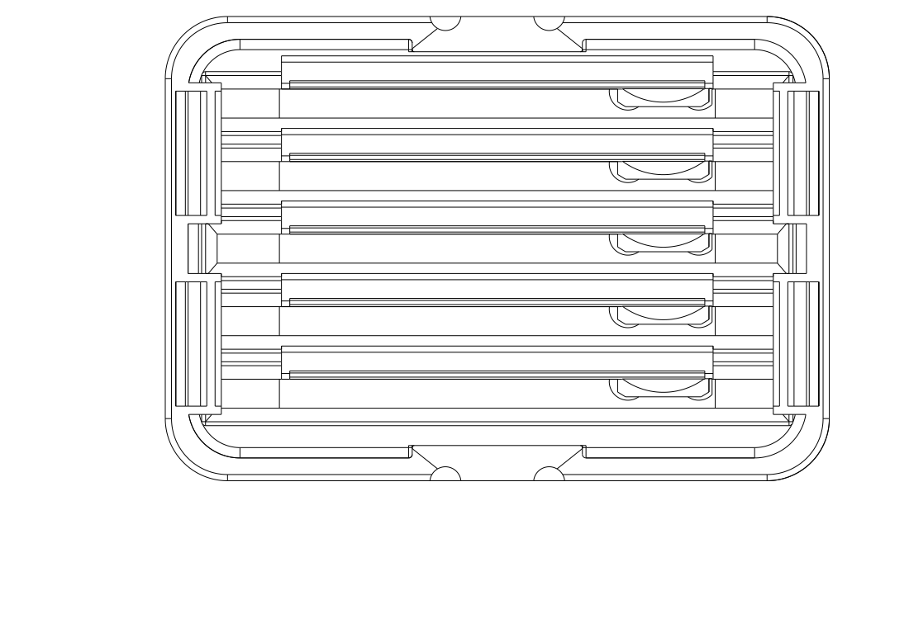
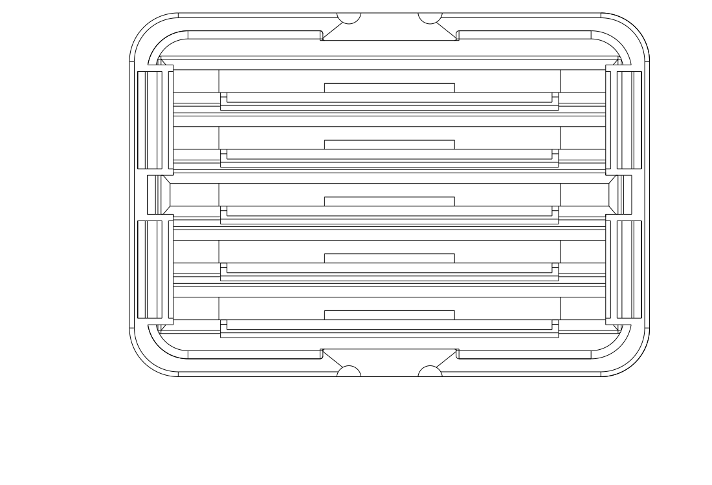
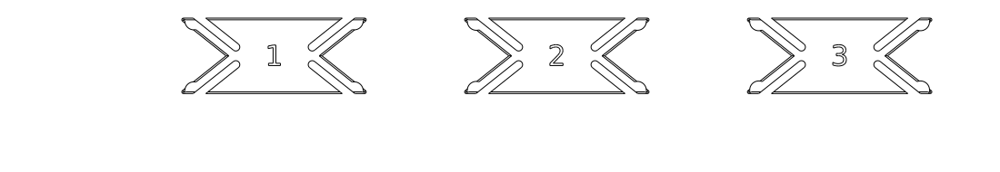
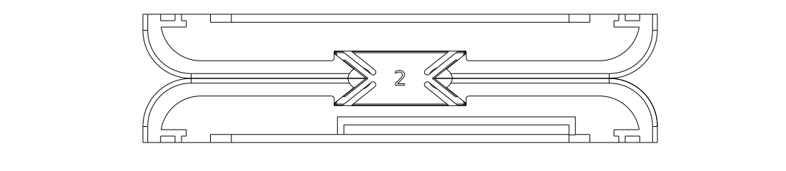

# Filament swatch box — display and compact archive

## Archive R1 — 15-card base, current print trial

[STEP](archive_r1_base_15.step) · [STL](archive_r1_base_15.stl) ·
[Parametric source](archive_r1_base_15.py). Use the **exact existing
[G hood](cap_g_hood_5.step)** and existing I key 3; no new or resized hood/key.
The source selects only the new base for printing. Earlier display variants
are preserved. Complete archive use has not been physically reported.

The foot remains **64 × 44.8 mm**. A **50.4 × 30.3 mm** shared pocket takes
15 nominal 50 × 80 × 2 mm cards, notch up. Total seated allowance is .4 mm
across card width and .3 mm across the stack. The floor is flat at Z2.4;
41 mm straight guides lead into a 4 mm funnel widened 1.2 mm per side.
Side walls/end corners are 45 mm above the floor, with rounded front/back
scoops down to 27 mm. Base height is 47.4 mm; closed G appearance is unchanged.
No spring or adjustable follower is needed for this nominal rigid fit.

Print **base floor down**, PETG, .4 mm nozzle/.2 mm layers, two walls and
7% adaptive cubic, ordinary slicing. The final reference slice needs no generated
supports. Hood reliefs have sloped ceilings and chamfered floors to keep support
out of clip clearances; catch stems/pads and recessed opening grips are preserved.
Keep the bundle square while lowering it. Browse with the tray on the desk;
remaining cards may lean, while the full stack is guided upright. The closed hood
keeps the joining key captive. Open-box carrying/inversion is outside this design.

Try 15 cards, then leave one, three and five while selecting others. Check easy
insertion, upright full seating, cards not dragging neighbours out, containment,
hood release and joining to J4 at both ends. Nominal dimensions are accepted by
the user; actual fit/comfort remain physical checks, not printer-error predictions.

[Empty base](renders/archive_r1_base/archive_r1_base_15_isometric.png) ·
[Full stack and browsing](renders/archive_r1_open/inspect_archive_r1_isometric.png) ·
[Closed with unchanged G](renders/archive_r1_closed/inspect_archive_r1_closed_isometric.png).
[CAD intent checks](notes/archive_r1_checks.json),
[native export/slice review](notes/archive_r1_review.json) and
[design record](notes/cap_comparison.md#archive-r1--15-card-compact-base) document
source-card seating, entry/extraction, sparse lean, actual G seating/lift and
both complete J4 joining orientations. CAD/slicing do not establish physical use.

| Item | Print status | Artifact(s) | User result or remaining physical checks |
| --- | --- | --- | --- |
| Test piece(s) | N/A — no detached coupon | None | Complete tray is the useful trial; local geometry is checked in CAD |
| Final printable object(s) | Unknown — no archive print report | `archive_r1_base_15.step/.stl`; existing G hood and I key 3 | Nominal CAD and reference slice pass; actual insertion, alignment, selective browsing, hood effort and joined use await printing |

**Latest print feedback — 2026-10-04:** J4 and K4 have been printed. J4 is the
preferred current base: firmer card retention, working connection key and good
upward-facing recesses. Fully inserted cards still tilt, and the user can move
them near the bottom. Excess bottom clearance is the user's hypothesis, not an
established cause. Keep J4 as it is; improvement is deferred at the user's request.

K4 retention is considered reasonable but feels looser/flappier than J4. Its
upward recesses are good. Only one connection-key end works: the user reports
the other end lacks a stopping wall. The initial concern about J4's key was
explicitly withdrawn after rechecking; **J4's key works**. K4's two-ended joining
claim is therefore not qualified. Exact printed hashes/material/settings are
unconfirmed. See the [print report and deferred issues](notes/cap_comparison.md#j4k4-print-report--2026-10-04).

**Earlier hood feedback:** V1 has been printed in PETG vase mode. It holds the base,
but the sides deform easily: pressing one side makes another bulge, accompanied
by popping/crackling sounds. Shell shape and feel are rejected; no print-process
or material cause is established. Keep the accepted G hood; the user explicitly
ends hood exploration. Exact printed artifact, mating base and settings remain
unconfirmed.

J2/K2 and J3/K3 are explicitly unprinted. The user declines these grip designs,
especially J3/K3's outward flaps; this is rejection before printing, not a
physical card-support result. J4/K4 use upward-facing recessed contacts inside
the original footprint. Preserve all earlier artifacts and the
shared I key 3. The original J/K failures and V1 feedback remain in the history;
they are not claims about J4/K4 card engagement.

## Requirements to preserve

- Store the cards with their long dimension vertical and notch at the top; the
  closed hood fully covers them.
- For display, keep seated cards upright and aligned even with only a few occupied positions.
  A final downward press is acceptable. The broad clip was liked; the tiny end
  spring gave no useful centering in the earlier PETG print.
- Guide insertion from left/right and front/back so replacing thin cards does
  not require precise alignment with a narrow slot.
- Use printed parts throughout. Seat the hood's lower rim against the base while
  retaining a practical grip and deliberate opening motion.
- Support adding modules with modest repeated material and part overhead.
  Occasional separation should remain possible; joined carrying is unqualified.
- Keep the five-card display variants; the archive trial holds a compact stack
  of 15. In the archive, a full stack sits upright, while a sparse remainder may
  lean during desk browsing provided it stays contained.

Reusable form preferences are maintained in the
[design preference reference](../../.codex/skills/cadquery-3d-design/references/user-preferences.md).
Exact dimensions, artifact compatibility and physical results remain here and
in the linked object records. The H connector sample has been printed and rejected
for excessive looseness. Its I replacement keys now work in the printed sample;
J4's complete-base key now works in the reported print, while K4 has the
one-ended stopping-wall problem described above.

The [earlier archive discussion](notes/cap_comparison.md#future-compact-archival-module--recorded-2026-10-04)
and [SVG proposal](renders/concepts/archive_containment.svg) are concept history.
The user rejects panel 1's drawn side construction as a CAD reference; R1's
actual CAD above supersedes it. Larger capacity and additional mechanisms remain
undecided. No new hood exploration is authorized or needed for R1.

## J4/K4 recessed upward-facing grips — current base trials

**J4:** [STEP](cap_j4_base_5.step), [STL](cap_j4_base_5.stl),
[source](cap_j4_base_5.py). **K4:** [STEP](cap_k4_base_5.step),
[STL](cap_k4_base_5.stl), [source](cap_k4_base_5.py).
Reuse the [accepted G hood](cap_g_hood_5.step) and existing I key 3.
No new hood is required. Bases retain the original **64 × 44.8 mm footprint**
and matching joining pitch. J4 preserves J2's
broad spring and opposing upright rails; K4 preserves K2's corrected dome
follower and opposing rails. Earlier checks preserved each parent's geometry;
they did not qualify K4's key capture at both ends. Use J4 as the preferred
current baseline; K4's reported one-ended stop failure remains unresolved.

The two recesses are 18 mm long, 2.2 mm deep from each X side and open above
a 2 mm floor. Enter from the side through the **3 mm gap below the closed
hood**, rest a fingertip edge on the upward floor and press the base down while
lifting the hood with the other hand. The thick finger body stays outside the
hood. There are no outward ledges. The inner root has a .6 mm radius, the
exposed floor edge .35 mm and plan ends 1 mm; original perimeter rounding is
retained. The grip is intentionally small: reach and skin/nail comfort require
the complete-base trial, not just a detached pocket coupon.

Print floor down in PETG with the established .4 mm nozzle, .2 mm layers,
two walls and 7% adaptive cubic, using **ordinary slicing**. G prints roof down
with ordinary slicing if another is needed. Use J4 with the plain back toward
the broad spring; use K4 with the domed/engraved face toward the shaped follower.
Try one, three and five cards: check upright alignment, entry/removal, actual
K4 dome contact, grip and recovery after dwell. Try opening while modules are
joined, keeping the row supported; carrying remains unqualified.

[Closed appearance](renders/recessed_grip_assembled/inspect_recessed_grip_isometric.png)
contains actual printable parts only. The
[access section](renders/recessed_grip_section/inspect_recessed_grip_section_front.png)
includes an assumed 12 mm wide/2.6 mm thick distal contact edge; its larger outer
body is a reference, not another printed part. [Targeted checks](notes/recessed_grip_checks.json)
cover upward bearing contact, horizontal side approach past the closed hood
and joined neighbour, no outward additions, preserved card/support/catch/key
geometry and four remaining G rim seats outside the recesses. These do not
establish actual finger comfort, card performance or calibrated forces.
[J4 export/slice review](notes/j4_review.json) and
[K4 export/slice review](notes/k4_review.json) retain the final manufacturing evidence.
Both complete bases are now reported printed. Upward recesses are liked and
J4's key works. J4's full-seat tilt remains; K4 is less firm and has a failed
key stop at one end. Further modelling is explicitly deferred. The retained
CAD/slice reports describe geometry/manufacturing checks, not resolutions of
these physical issues.

## J3/K3 upward-facing ledges — rejected before printing

**Historical files, not the recommended next print.** Their accessible ledges
passed geometric checks but the user rejects the outward projections. J4/K4
replace this treatment with recessed contacts.

**J3:** [STEP](cap_j3_base_5.step), [STL](cap_j3_base_5.stl),
[source](cap_j3_base_5.py). **K3:** [STEP](cap_k3_base_5.step),
[STL](cap_k3_base_5.stl), [source](cap_k3_base_5.py).
They added 7 mm per side, giving 78 mm overall width. Upward contact and assumed
access passed CAD checks; exports and reference slices passed. That narrower
evidence did not establish an acceptable overall form. Their complete rationale,
dimensions and evidence remain in the
[historical J3/K3 record](notes/cap_comparison.md#j3k3--upward-facing-base-holding-ledges).

## Preserved J2/K2 card-support revisions

**J2 alignment trial:** [STEP](cap_j2_base_5.step),
[STL](cap_j2_base_5.stl), [source](cap_j2_base_5.py). It preserves J's broad
spring and adds two opposing datum rails, extending straight support above the
grip. Print floor down with the existing PETG/.4/.2/two-wall/7% setup and reuse
the accepted G hood and I key 3. Engraved/domed face points toward the rails,
away from the broad spring. Try one, three and five cards; check side-view
alignment after pressing fully down, entry from all four directions and removal.
Any remaining lean, binding or poor grip requires revision; printed success and
dwell are not established by the [CAD checks](notes/j2_checks.json) or
[export/slice review](notes/j2_review.json).

**K2 for the corrected dome trial:** [STEP](cap_k2_base_5.step),
[STL](cap_k2_base_5.stl), [source](cap_k2_base_5.py). The catch moves to the
correct lateral side of the real notch-up swatch, with opposing rails on its
plain back. The **domed/engraved face points toward the shaped follower**.
The G hood interface and nominal I-key joining pitch are retained. The user
now reports the same one-ended key-stop problem in K2's form as in printed K4;
K2 is still unprinted, and two-ended joining is not established. Print settings
and orientation match J2. Check that the follower
actually enters the recess, cards stand upright and deliberate removal feels
comfortable. [Actual-bowl section](renders/k2_section/inspect_k2_section_right.png),
[source-card checks](notes/k2_checks.json) and [reference review](notes/k2_review.json)
cover the correction. These are unprinted complete-base trials; a geometric
seated-contact check is not a printed grip or creep result.

## V1 single-wall vase hood — additional transparency trial

**Printed: retention works, shell shape/feel rejected.** Pressing one side
makes another bulge, with popping/crackling sounds; the PETG wall deforms easily.
Exact settings, printed hash and mating base are unknown. Earlier CAD and
path checks established mating geometry, not shape stability or comfortable
handling. Preserve this experiment; use the accepted G hood instead. The user
has ended further hood exploration. Instructions below describe the historical
V1 experiment, not a new print recommendation.

[Vase-only STEP](cap_v1_vase_hood_5.step), [STL](cap_v1_vase_hood_5.stl),
[source](cap_v1_vase_hood_5.py), [Orca process snapshot](notes/vase_process.json),
[assembled view](renders/v1_assembled/inspect_v1_isometric.png),
[thin-wall catch section](renders/v1_contact/inspect_v1_contact_front.png).
The export is deliberately a **filled slicer envelope**. Use Orca spiral/vase
mode to produce its shell; ordinary slicing would produce the wrong object.
Print **one hood at a time, roof down as supplied**, in PETG with the .4 mm
nozzle, .2 mm layers, one .42 mm outer perimeter, zero infill, zero top layers,
four solid bottom layers (.8 mm closed roof), and 30 mm/s outer-wall speed.
Disable spiral smoothing, supports and elephant-foot compensation as in the
snapshot. Inspect your effective GUI settings; STEP import is a separate path
from the diagnostic STL slice.

V1 fits J2/K2 and J3/K3 bases with I key 3. Its maximum X/Y dimensions and
seated rim height match G. The 5.8 mm outside corner radius is concentric with
the base foot; a smooth .2 mm inward rim taper over 1.2 mm gives the thin wall
a wider landing on the foot's rounded top. A .7 mm inward waist on each X side replaces
G's hidden retaining pockets; the main side walls above it stay straight, the
roof retains the 3 mm exterior round, and there is no raised band. This is the
explicit form tradeoff for using one continuous wall with the existing catches.
The dense lines at the waist in the technical view are CAD section seams, not
added wall thickness. The catch section shows intentional relaxed overlap;
it is not a solved deformed pose.
The thinner wall has more internal clearance above the waist, without requiring
an oversized outer hood or a raised seam. The accepted G hood remains available.

[CAD checks](notes/v1_checks.json) cover both bases, actual cards, rim seating,
four catch contacts, sampled opening and key coverage; about 46% of the nominal
rim area rests on actual flat base faces. The
[reference slice](notes/v1_review.json) succeeds without primary notices;
**its support probe is N/A** because Orca forbids supports with spiral mode.
The native report deliberately retains that probe failure/review flag. Its
saved log and the [actual path check](notes/v1_path_checks.json) resolve this
specific review: one .42 mm continuous outer wall reaches every catch, has
.077–.117 mm sampled closed overlap, requires more deflection while opening,
and subsequently clears. This is geometry/manufacturing evidence, not a measured
holding force. The final contour is level at the rim height and lands over
.2 mm onto the base at the four measured side sections. The diagnostic slice
estimates 10.68 g and 1 h 17 min; actual
calibrated settings can differ.

**Historical experiment instructions:** try V1 on one existing compatible base first. Check
full rim seating, resistance to accidental separation, comfortable deliberate
opening, wall/rim feel and recovery; compare translucency with the accepted G
hood using the same filament. The .42 mm wall itself can flex, so retention,
durability and optical clarity require this complete-hood trial. A cropped
collar would omit the tall walls and roof that determine that response.

### Historical J/K files — preserve the rejected bases

The earlier rejected joined-pair trial used these files; preferred J4 above is
the current baseline. K4 is retained with its reported key-stop defect:

- **One J base:** [Centered-panel STEP](cap_j_base_5.step), [STL](cap_j_base_5.stl), [source](cap_j_base_5.py).
- **One K base:** [Dome-shoulder STEP](cap_k_base_5.step), [STL](cap_k_base_5.stl), [source](cap_k_base_5.py).
- **Two hoods:** [Unchanged G thin hood STEP](cap_g_hood_5.step), [STL](cap_g_hood_5.stl).
- **One I number 3 key:** reuse the one already printed. The [three-key STEP](cap_i_grip_keys.step) and [STL](cap_i_grip_keys.stl) remain available.

Print in PETG with a 0.4 mm nozzle, 0.2 mm layers, two walls and 7% adaptive cubic.
Bases print floor down, hoods roof down in the supplied poses. Translucent PETG
may be used for the hood. Both bases change card holding only: reuse the G hood
and I key if already available. The old combined H
layout includes the failed rigid key and is not the current matching set.

Hold the bases on a desk with their end faces touching and press I key 3 down
to the pocket floor. Insert cards long dimension upright, notches above.
**J: flat back toward its broad spring panel. K: domed/engraved face toward
its shaped dome follower.** Press down until both bottom-corner seats engage;
K must locate its follower in the existing bowl. Close each hood to the rim.
These historical instructions did not produce correct engagement in K and are
retained as the prior intent; use the corrected K2 orientation and geometry.
Try one, three and five cards per box: check easy
entry from every side, firm final seating, upright alignment, deliberate card
withdrawal and opening either hood while joined. Check thin-shell/edge comfort.
Leave a card seated for several days and compare grip and alignment, then
inspect recovery after removal. This checks early relaxation, not years of use.
Keep the boxes supported while opening; loaded-row carrying remains unqualified.

## K — existing dome shoulder with less seated spring bend

**Printed and rejected for failed dome engagement.** The explanation below is
historical design intent. Its synthetic reference was reflected; earlier checks
did not verify the real swatch's pose. See the [revision diagnosis](notes/cap_comparison.md#jk-print-feedback-and-revisions).

K keeps the 40 mm broad panel centered. Its shaped follower is necessarily
at the existing off-center dome, rather than at the middle of the card.
The source dome is a **concave pocket** with a very thin center, so the follower
uses two rounded noses on the outer shoulder; their backing stays clear of the
center. The seated spring has positive
preload; it bends farther while the card passes the follower, then returns
partway into the pocket. This targets easier long-term storage without promising
that PETG cannot relax. Withdrawal still deliberately bends the spring.



The base uses the unchanged G hood and accepted I key 3; it joins J directly.
[Mixed K/J inspection](renders/dome_mixed/dome_latch_study_isometric_back.png)
and [local dome section](renders/dome_section/inspect_dome_section_right.png)
show the changed relationship. Inspection entries include reference cards and
must not be exported for printing. The supplied K STEP/STL contain only the base.
[CAD checks](notes/dome_study_checks.json), [local mechanics](notes/cap_k_physics.json),
[export/reference slice](notes/cap_k_review.json)
and [design record](notes/cap_comparison.md#k--dome-shoulder-follower-compatible-with-j)
record evidence and limits. Actual dome fit, entry/removal force, card steadiness,
material recovery and dwell remain physical trial questions. Two meshes of the
actual spring passed a conditional normal-passage/return screen: about 1.03%
peak strain against a provisional 1.5% limit. This is uncalibrated solid-PETG
evidence, rather than a measured force or lifetime rating. Compare against J
with the same swatches and print setup before choosing a larger repeated row.

Reproduce the local mesh review from saved native evidence with
`uv run --locked python model/filament_swatch_box_study/analyze_cap_k.py --review-evidence`.
This uses the shared `QuestionStudy` API, verifies the saved inputs and rewrites
`notes/cap_k_physics.json` without solving again. It checks force and strain
sensitivity plus changes in the provisional pass/fail decision; no printed
validation is added. The CAD entry, seating, hood and mixed-module checks remain
in `check_dome_study.py` because their geometry and acceptable relationships are
specific to this box.

## J — centered, broader card panels

**Printed: strong grip, but cards visibly tilt.** Keep this version as historical
evidence; J2 adds opposing support spanning the load region. Earlier upright
fixture checks did not establish actual upright seating.

The user requested this before printing the prior complete matching pair. It is
a design request, not a reported H-base card-grip failure. Each panel is now
centered at **X=0 instead of X=7 mm**, **40 mm wide instead of 28 mm**, with a
**16 mm centered contact instead of 4 mm**. The panel contacts the swatch's
plain back so engraved/domed surface details cannot interrupt its contact patch.
Rigid bottom-corner seats still set lateral card alignment.

Thickness remains 1.2 mm and nominal squeeze remains 0.35 mm for a 2 mm card.
The contact is 1 mm higher and the root relief is rounded. The wider, slightly
longer panel targets more grip without simply increasing its bend. A uniform
full-width, short-term beam comparison using measured rounded contact predicts
about **32% more force and 5% less bending strain**. These are conditional design
screens under an uncalibrated effective-material assumption, not measured
holding forces, a complete plate analysis or a durability rating.



[CAD and beam checks](notes/cap_j_checks.json) passed centered symmetry, 25 seated
card cases, 88 sampled rigid funnel poses and the changed card/hood relationships.
The foot, hood closure contacts, exterior and H sockets outside the old/new card
panel regions match the prior base. [Final base export/slice](notes/cap_j_review.json)
and the [unchanged hood slice](notes/cap_g_review.json) provide manufacturing
evidence. The key's accepted geometry is unchanged; no new connector coupon is
needed. [Complete inspection view](renders/cap_j_assembled/inspect_cap_j_isometric.png).

PETG can show time-dependent deformation under sustained load;
[printed-PETG creep research](https://pmc.ncbi.nlm.nih.gov/articles/PMC12349189/)
supports treating that as an uncertainty. Its specimen properties are not
transferred to this spring. Wider contact and the force/strain tradeoff address
the concern without extra squeeze, but no long-term grip guarantee is established.
The complete small pair now tests the remaining actual force, insertion,
recovery, hood use and comfort. [Design record](notes/cap_comparison.md#j--centered-broader-card-panels).

## I — printed replacement-key result

On 2026-10-03 the user reported all three replacement keys printed and working.
Number 3 felt a little better, without an identified reason. Keep number 3 as
the preferred baseline for the complete-box trial; preserve 1 and 2 as working
alternatives. The report does not confirm every previously suggested test step,
exact printed artifact hash or current print settings. PETG was the planned
setup; the material for this new print was not separately reconfirmed.



The core has 0.05 mm nominal normal clearance. Four integral 0.8 mm spring arms
with rounded pads supply seated normal interference of **0.10 / 0.15 / 0.20 mm**
for keys 1 / 2 / 3. Number 3 is intended to give the most grip; that is a
plausible explanation for the preference, not a measured explanation of feel.
The pads ramp in over 0.8 mm vertically. There is no projecting
handle and the H pockets and G hood stay unchanged. The zero-gap seam matters:
closing a 0.3 mm seam would consume about 0.117 mm of normal preload.



[CAD checks](notes/cap_i_checks.json) cover four intended contact pads, entry,
release and hood clearance/escape coverage. [Local contact evidence](notes/cap_i_physics.json)
models one actual arm under an explicit, uncalibrated effective-solid PETG
assumption. Its force comparison changed 0.48% with finer mesh; peak strain
changed 15.4%, so strain is not precisely converged. Both meshes remained below
the provisional 1.5% screen; this supports a fit trial, not a strength rating.
[Reference slice](notes/cap_i_review.json) completed with no notices or generated
supports. [Sampled arm paths](notes/cap_i_paths.json) support the solid-section
assumption only; they do not establish printed material properties. Actual
retention force, separately verified release/recovery, dwell and joined carrying
remain unqualified. The user's positive result establishes reported sample use,
not calibrated material properties or a holding-force rating. [Design record](notes/cap_comparison.md#i--preloaded-replacement-key-experiment).

## H — connector without a handle

**Historical failed connector sample. Use the I replacement-key trial above.**

- [Small connector test, STEP](cap_h_connector_test.step), [STL](cap_h_connector_test.stl).
- [One base, G hood and key, STEP](cap_h_module_5.step), [STL](cap_h_module_5.stl), [source](cap_h_module_5.py).
- Separate [H base STEP](cap_h_base_5.step), [H key STEP](cap_h_key.step), with matching same-name STLs. The [unchanged G hood](cap_g_hood_5.step) is compatible.

The original H key is **16 × 6.7 × 3.4 mm**, with an 8 mm waist. The long arm and its
foot channel are gone; nothing projects from the side. The deeper head needs a
straight-sided entry notch in the base wall, visible when the hood is removed.
The notch is beyond the last card clip relief. Foot depth remains 44.8 mm and
hood walls/roof remain 0.8 mm. H keys/pockets differ from G; print matching parts.


Sideways spreading is the motion the bow tie prevents. To separate occasionally,
remove both hoods, lift one base about 4 mm relative to the other, then move it
away. Its pocket floor can carry the key upward until it clears the other foot;
which half retains the key and the actual effort depend on printed fit. Two
small nail recesses also let you lift the key directly. These are occasional
release provisions, not a frequent-operation handle. The key is intended to
seat without a forced interference fit; closed hoods cover upward key release.


Use the same PETG, 0.4 mm nozzle, 0.2 mm layers, two walls and 7% adaptive cubic.
Print bases floor down, keys flat and hoods roof down. The small sample uses two
actual end crops and one key: bring end faces about 0.3 mm apart, seat the key,
check planar play, then try lifting one half and moving it away. Check nail
access separately. The sample omits the tall wall and hoods; full-base CAD checks
cover their geometry, but actual loaded handling, closure and frame stiffness
require the complete pair. Never infer whole-product success from the sample.

[CAD checks](notes/cap_h_checks.json) cover full-base entry, a lifted-base release
path, hood clearance/coverage and nominal nail-tip access. [Reference slices](notes/cap_h_review.json)
cover the original layouts. The printed H sample failed retention; nail comfort,
strength and full-module handling remain unqualified.
This is a desk-supported storage proof, with no joined carrying rating.
[Design record](notes/cap_comparison.md#h--wider-connector-without-a-handle).

## G — retained modular five-card proof

- [Small connector test, STEP](cap_g_connector_test.step), [STL](cap_g_connector_test.stl): two actual base-end crops and one key.
- [One base, hood and key, STEP](cap_g_module_5.step), [STL](cap_g_module_5.stl), [parametric source](cap_g_module_5.py).
- Separate [base STEP](cap_g_base_5.step), [hood STEP](cap_g_hood_5.step) and [key STEP](cap_g_key.step), each with a matching same-name STL.

The foot is **44.8 mm deep**, down from F/E's 48.8 mm. Four five-card modules
with 0.3 mm joint gaps occupy 180.1 mm instead of 196.1 mm, about 8% less row
length. Each join adds one printed key; the same base repeats at either end.
The hood's main walls and roof remain 0.8 mm, with hidden reinforcement and
rounded edges. **Use G's matching base and hood together.** F/E are retained.


The user finds the long arm unnecessary before any reported G print. The
retained connector has a bow-tie head, a slim arm and a rounded side tab. Remove both
hoods, place the bases together on a desk and lower the key into the top pockets.
Its wide ends constrain spreading and planar movement. The closed hoods cover
straight upward withdrawal. To separate, remove both hoods and lift the key by
its side tab. Individual hoods can open with the key installed; keep the bases
supported while operating. This proof does not qualify group carrying.


The [joined underside](renders/cap_g_joined/inspect_joined_g_bottom.png) shows
two flat bottom skins and the exposed side tab; most of the key sits above those
skins. The [joined pocket close-up from above](renders/cap_g_joined/inspect_joined_connector_g_top.png)
omits the hoods and crops the bases to expose the seated bow-tie head and arm.
These are inspection views of the existing G geometry, not revised print files.

Print **PETG, 0.4 mm nozzle, 0.2 mm layers, two walls, 7% adaptive cubic**.
The supplied poses are base/sample floor down, hood roof down and key flat.
Separate files allow translucent PETG for the hood. Start with the small
connector test to check lowering/lifting effort, binding and desk-supported
alignment. Its two end faces should be approximately 0.3 mm apart; it has no
hoods, so upward key removal is deliberately free. The sample cannot test
closed-hood restraint, full-module stiffness or tall-box handling.

The full two-module trial needs **two bases, two hoods and one key**; the combined
file contains one of each. Check cards with one, three and five occupied slots,
then hood seating, grip/release and the joined pair's handling. G has no reported
print result. [CAD checks](notes/cap_g_checks.json), [manufacturing review](notes/cap_g_review.json)
and [local path checks](notes/cap_g_paths.json) passed. The final combined,
component and sample layouts sliced with no notices or generated supports.
Actual fit, force, comfort, optics and durability remain physical questions.
See the [design and trial record](notes/cap_comparison.md#g--compact-five-card-modules-and-drop-in-connector-proof).

## F — smooth exterior hood

- [Hood only, STEP](cap_f_hood_5.step), [matching STL](cap_f_hood_5.stl).
- [Both parts, STEP](cap_f_flat_5.step), [STL](cap_f_flat_5.stl),
  [parametric source](cap_f_flat_5.py).
- [Compatible E base, STEP](cap_e_base_5.step), [STL](cap_e_base_5.stl).

Use the same **PETG, 0.4 mm nozzle, 0.2 mm layers, two walls and 7% adaptive cubic**.
Print the hood roof down and E base floor down as supplied. If the E base is
already printed, only the F hood is needed; earlier D/ungrooved bases remain
incompatible. Hold the exposed base foot and pull the hood near its bottom,
where its concealed 1.6 mm wall supports the pockets and grip. The 0.8 mm inner
transition grows gradually in the roof-down orientation. The external band and
shoulder are gone; roof rounding remains 3 mm.


The paired and hood-only exports passed their OrcaSlicer 2.4.2 Q2C PETG reference
slices, with no notices or generated supports. The source's E base geometry,
separate exports and base-only slice evidence are unchanged. Targeted F checks
and [manufacturing evidence](notes/cap_f_review.json) cover affected guidance,
rim seating, pocket material and selected toolpaths; they do not establish
printed smoothness, optical clarity or actual holding/opening force.

Test the complete pair empty, then with one, three and five cards: check the rim
meets the foot, the sides feel comfortable, the cap stays attached under loaded
own weight, and pulling near the bottom releases it without buckling. Repeat
and compare after an overnight closed dwell. Twenty-card geometry is checked,
but this phase still supplies the five-card physical trial only. G above
separately explores joined modules; F is unchanged. See the [F design record](notes/cap_comparison.md#f--flush-exterior-reinforcement-inside),
[affected CAD checks](notes/cap_f_checks.json) and [local path record](notes/cap_f_paths.json).

## Earlier thin hood — E

E's exports and evidence below are retained history; F is the next proposed print.
The printed D fit was okay, but the hood was too bulky and exposed edges were
insufficiently rounded. The user authorizes a new matching base and mechanism
to prioritize a thin hood. E is not yet physically tested; D's fit result does
not qualify this new closure.

### E — thin hood and matching base

- [Both parts, STEP](cap_e_thin_5.step), [matching STL](cap_e_thin_5.stl),
  [parametric source](cap_e_thin_5.py).
- [Thin hood only, STEP](cap_e_hood_5.step), [STL](cap_e_hood_5.stl).
- [Matching base only, STEP](cap_e_base_5.step), [STL](cap_e_base_5.stl).

Print **both E parts**; the D base and older bases are not matching mates.
Separate files let you print the hood in translucent PETG and the base in a
different PETG colour. Use **0.4 mm nozzle, 0.2 mm layers, two walls, 7% adaptive
cubic** as before. Supplied geometry places the base floor down and hood roof
down; supports are not requested. These are reference-profile assumptions,
not confirmation of the user's exact settings or optical appearance.

The main hood walls and roof are **0.8 mm**. A **1.6 mm** lower band holds four
shallow blind snap pockets and provides a stronger place to grip. The flexing
leaves now belong to the base, so the hood no longer needs D's 6 mm wall envelope.
The upper outline is approximately **62 × 46.8 mm**, versus D's 72.4 × 57.2 mm;
the lower band is 63.6 × 48.4 mm. A 3 mm outside roof round has a matching
2.2 mm cavity round to preserve the thin shell. Corners, rim and base foot have
deliberate edge treatment; broad underside recesses return on sloped surfaces.

The hood's lower rim rests directly on the rounded base foot at Z = 5 mm.
Four-sided entry clearance guides it, the foot stops it, and four base-mounted
detents provide retention. Hold the exposed foot using its two underside grip
recesses, grip the hood's **lower band**, and pull upward. Avoid relying on
squeezing the thin upper panels to open it. Card clips and low corner seats
reuse the previous builders; local exterior-wall relief now accommodates the
closure leaves. There are only two printed parts and no release button/hardware.


The paired and separate layouts passed the OrcaSlicer 2.4.2 Q2C PETG reference
reviews with no notices or generated supports. Targeted path review found
36 sampled sections filled through the base leaves, thin long-side walls and
four roof layers; this does not establish material properties or transparency.
Rigid five/twenty-card checks confirm rim seating, sampled clear withdrawal,
blind-pocket skin and depressed pad escape space. The twenty-card geometry is
checked but is not exported or recommended before this complete five-card trial.

A conservative effective-solid beam screen predicts approximately 1.25% maximum
root strain and 1.61 mm free-end travel within 2 mm relief. The 1.5% strain screen
and 1000–2000 MPa modulus range are provisional uncalibrated assumptions; actual
hood compliance, friction, layer bonding and elastic passage are not established.
No measured retention or release force is claimed. STEP GUI import remains
separate from the successful STL smoke slices.

Try the empty pair first, then one, three and five cards. Report whether the
rim meets the foot, the corners feel comfortable, the hood feels acceptably
thin, and deliberate pulling opens it without buckling the shell. Check loaded
own-weight retention a few centimetres over a table with a hand beneath it;
repeat closure/opening and compare after an overnight closed dwell. Translucent
appearance, spring return, pocket wear and grip are physical questions. This
complete sample represents the thin hood and new base together, rather than a
local latch coupon. Joined modules remain future work.

[E design record](notes/cap_comparison.md#e--thin-hood-with-base-mounted-detents),
[geometry/beam checks](notes/cap_e_checks.json), [local path evidence](notes/cap_e_paths.json)
and [manufacturing review](notes/cap_e_review.json) retain the actual evidence.

## Printed reference — D

The previous PETG print's broad clip grips nicely, but its tiny end spring gives
no useful sideways pressure. The new base removes that spring, adds two fixed
seats matching each card's bottom corners, and strengthens the broad clip.
The user accepts a final downward press and specifically requests firmer grip.
Lateral alignment and the stronger grip still need a physical trial. The user now
authorizes autonomous cap exploration while away; this permits independent cap
concept work without promoting the corner seat to printed validation. They now
select a simple lift-off cover with retention: press it on from above and pull
deliberately to separate it.

The user confirms translucent spools are **PETG** and requests discussion only
of a thinner hood and expandable joined five-card boxes. Both remain
[future ideas](notes/cap_comparison.md#future-ideas--translucent-petg-and-joined-modules),
initially deferred until the print finished. The subsequent report makes a
slimmer hood and more pronounced rounding the next concept priorities, including
for opaque filament. The base is probably fine according to the user. The later
authorization produced the E thin-hood prototype above; modular joints remain
discussion only. D artifacts remain the printed reference, not an accepted
finished product.

Additional closure requirement: the user wants the hood's lower rim to meet
the base neatly when fully closed, while remaining easy to pull apart. The
preferred concept is a rounded base ledge supporting that rim, with accessible
base grips below the seam. This is recorded in the
[closure/handling notes](notes/cap_comparison.md#closed-seam-and-opening-grip).
The existing source seats on internal pads; that does not establish the desired
visible rim-to-base contact in the printed object.

### Historical matched prototype — D

- [Both parts, STEP](cap_d_snap_5.step), [matching STL](cap_d_snap_5.stl),
  [parametric source](cap_d_snap_5.py).
- [Cap only, STEP](cap_d_hood_5.step), [STL](cap_d_hood_5.stl).
- [Matching base only, STEP](cap_d_base_5.step), [STL](cap_d_base_5.stl).

**Print the matching base as well as the cap.** Earlier ungrooved bases are not
the intended mate. Four 0.8 mm-deep exterior grooves are the base's only functional
change; the card seats, guides and stronger broad clips stay as before. The plain
rounded hood has four hidden integral spring pads, ramped for downward entry and
upward release. Four separate end-rim pads stop the cap independently of its
snaps and contents. A continuous outer wall covers the spring relief pockets.
There are only two printed parts, with no release button or extra materials.


Use **PETG, 0.4 mm nozzle, 0.2 mm layers, two walls, 7% adaptive cubic**. Print
the base floor down and cap roof down as supplied; no supports are requested.
The paired reference slice preserves the source's Q2C coordinates, enabling a
specific stem-path review. GUI rearrangement is allowed but is a different slice.
Hold the base's lower 6.4 mm band/underside, align the hood, and press straight
down until it reaches the rim stops. Grip the hood and pull straight up to open.
Its approximately 86 mm withdrawal clears the cap skirt past the full-height cards.

First test the empty matched pair, then one, three and five cards. Check:

1. The cap seats fully, with a distinct hold, without binding or excessive force.
2. Hold the cap a few centimetres over the table and check that the loaded base
   stays attached under its own weight; keep a hand ready beneath the base.
3. Deliberate two-hand pulling releases it cleanly, and both parts are easy to grip.
4. Repeat opening/closing, then leave it closed overnight and compare the hold.
   Report remaining play, slipping, rubbing, cracking, whitening or lost spring return.

The 5–20 N deliberate pull band is a provisional target. Nominal beam/ramp
estimates are only an order-of-force screen, not measured press, release or
retention forces. The complete five-card prototype represents the tall shell,
four interacting detents, guidance, seating and opposing grips that a local
coupon would omit. It does not qualify twenty-card holding strength, loaded
transport, creep life or fatigue. Five/twenty-card rigid checks include actual
rounded pads and sampled withdrawal; elastic motion and friction remain physical
questions. No loaded carry rating is claimed before the trial.

Likely adjustments live in `cap_d_snap_5.py`: `TIP_EXTRA_REACH` changes pad reach;
`STEM_THICKNESS` and `FLEX_LENGTH` change stiffness; `FIT_GAP` is currently inherited
from the shared dimensions. Change reach in small steps after observing actual
hold/binding; rerun the affected checks and exports. Keep earlier successful
trial files intact. Do not change the shared gap casually, since it affects A/B/C.

[D design decision](notes/cap_comparison.md#d--selected-press-on--pull-off-direction),
[rigid and beam checks](notes/cap_d_checks.json), [paired manufacturing review](notes/cap_d_review.json)
and [targeted stem-path record](notes/cap_d_paths.json) retain the assumptions and
scope. Fit was reported okay; force and spring return remain unreported, while
hood bulk and edge comfort require revision. Lower-rim contact is now also a
next-iteration requirement.

## Earlier cap alternatives

[Architecture and comparison record](notes/cap_comparison.md) owns this phase.
**A: removable hood** is the first finished five-card prototype. It continuously
covers the cards, stops on four internal rim pads, has a four-sided skirt lead-in,
and lifts off for unrestricted access. It is an unlatched desk cover; fit/friction
and any transport retention are unqualified. Its roof prints on the bed, leaving
all internal pads supported by gradual ramps.

- [A cap only](cap_a_hood_5.step), [matching STL](cap_a_hood_5.stl): try this on the
  nominal existing five-card footprint without printing a new base.
- [A cap + softer base layout](cap_a_lift_off_5.step), [STL](cap_a_lift_off_5.stl).
- [Softer base alone](base_rounded_5.step), [STL](base_rounded_5.stl): exterior corner
  radius 5 mm and upper rim radius 1 mm; functional slot crests stay 0.4 mm.
- [Twenty-card closed/open inspection](renders/cap_a_comparison/inspect_cap_a_isometric.png)
  is a full-size concept view, not a twenty-card export or physical test.

Use the existing PETG / 0.4 mm / 0.2 mm / two-wall / 7% setup. The cap requires
about 76 mm upward travel to clear the tall cards. Its 0.4 mm per-side running
gap is provisional. The full five-card cap is the meaningful first trial: check
corner fit, rim seating, easy lift/replacement, headroom and overall handling.
It includes actual height and stop geometry which a short rim coupon would omit;
twenty-row rigidity, friction and carrying behaviour remain unqualified.

[A rigid checks](notes/cap_a_checks.json) cover five/twenty-card configurations,
four-pad seating, conservative contents and sampled vertical lift. [A layout
review](notes/cap_a_review.json) records successful CAD, matching STEP/STL,
OrcaSlicer 2.4.2 Q2C PETG slice, no notices and no generated supports. No physical
cap report yet. Sources and exports for the earlier printed bases remain intact.

**B: upright-card drawer** is the second five-card prototype: [STEP layout](cap_b_drawer_5.step),
[STL](cap_b_drawer_5.stl), [source](cap_b_drawer_5.py). Pull the tray fully from its
fixed cover and place it on the table to browse. The closed front panel seats on
the housing rim; 3 mm side/top lips overlap the opening. The tray prints floor
down and the enclosure prints closed-back down, opening upward. The cap stays on
the desk, with the cost of greater table travel and a tall tray-front panel.
[Twenty-card comparison](renders/cap_b_comparison/inspect_cap_b_isometric_back.png)
and [rigid travel checks](notes/cap_b_checks.json) review this whole interaction.
The full five-card prototype preserves floor contact, guide length, contents and
front-lip geometry; test running fit, support the tray as it comes free, and
check access/reinsertion in sparse/full rows. It does not qualify twenty-row
flexure, tipping, drawer retention or loaded transport. [B reference slice](notes/cap_b_review.json)
completed with no notices/review flags and no generated supports. Actual fit and
handling are unknown, and neither B nor A has a positive closure latch.

**C: attached hinged hood** is the third five-card prototype: [STEP layout](cap_c_hinged_5.step),
[STL](cap_c_hinged_5.stl), [source](cap_c_hinged_5.py). Four printed parts comprise
the base/rear frame, U-shaped hood, axle and tapered keeper key. A fixed rear wall
and roof-height pivot let the hood swing clear of tall cards. It opens to a
180-degree shelf stop; a rear foot extends 40 mm beyond the seating base's rear
edge to improve open-box stability. This adds bulk and a permanent wall behind
the last card. [Twenty-card closed/open view](renders/cap_c_comparison/inspect_cap_c_isometric_back.png)
shows the cost of keeping the cap attached. Prefer A unless that benefit matters.

Print the layout as supplied: base floor down, hood roof down, axle head down,
key flat. Diamond bearing holes and beveled crowns avoid unsupported round-hole
roofs in the two opposite print orientations. Align the centre hood bearing
between the fixed ears, insert the axle from its headed end, then push the key
through its exposed cross slot. The key's head stays outside the shaft; its loose
taper is a trial fit, with no calibrated interference. Keep the key installed
during operation. Check that it stays in during repeated opening; a slipping key
means this retention is unqualified and needs adjustment. The cap has no closed
latch, and lifting/carrying by the cap is unqualified.

The complete five-card C print is the useful test because it retains the tall
frame, lid sweep, roof stop, foot and actual card access. A bearing coupon would
miss those relationships. With the base on a table, try empty, one, three and
five cards; support the hood while first opening, check axle/key fit, clearance,
open-stop contact, tipping and easy access to the last card, then close it.
Actual mass distribution, touch forces, hinge/stop strength, key friction, wear
and twenty-row stability remain unknown. [C rigid checks](notes/cap_c_checks.json)
cover five/twenty-card sampled opening with conservative contents and axle/key
fit; the stability sensitivity uses explicit assumed mass-density ratios, not
slicer-derived weights. [C CAD/export/slice record](notes/cap_c_review.json) is
reference manufacturing evidence; it does not establish physical operation.

The earlier recommendation to start with A cap only applied to an unlatched desk
cover. The current request selects D with press-on retention. A/B/C remain useful
historical comparisons; D's matching five-card pair is now the first print.

| Version | Primary print file | Matching STL | Status |
| --- | --- | --- | --- |
| **Current five-card corner seat** | [card_base_corner_seat_5.step](card_base_corner_seat_5.step) | [STL](card_base_corner_seat_5.stl) | CAD/slice checked; no print report |
| Previous five-card spring seat | [card_base_petg_5.step](card_base_petg_5.step) | [STL](card_base_petg_5.stl) | Printed: broad clip works; tiny end spring ineffective |
| First five-card free-clearance base | [card_base_test_5.step](card_base_test_5.step) | [STL](card_base_test_5.stl) | Printed: excessive seated rocking and lateral variation |
| First fifteen-card base | [card_base_test.step](card_base_test.step) | [STL](card_base_test.stl) | No print report; unchanged earlier interface |

The current base retains the **59.6 × 44.4 × 20.4 mm** footprint/height, five
positions on **7 mm centres**, and **80 mm tall × 50 mm wide × 2 mm thick**
nominal cards with the notch at the top. These dimensions come from the user's
[swatch source](../filament_archive_swatch/filament_archive_swatch.scad), not
measurements of printed cards. [Parametric source](card_base_corner_seat_5.py)
owns the current trial; earlier printed sources and exports remain unchanged.


## Seating and handling

The four-sided funnel corrects hand placement before the lower guide. Both broad
faces and both ends open outward; the entrance is 5.6 mm across card thickness
and 56.4 mm along card width before crest rounding. The lower slot is 2.8 mm
across thickness and 54 mm along width. The wider lower ends allow initial
sideways correction, rather than demanding early alignment with a tight end stop.

Two fixed **45-degree ramps** mate with the swatch's **4 mm bottom-corner
chamfers**. At the nominal seat, both corners touch: lateral translation needs
upward movement. A final downward press can guide the card toward the centre;
front-clip friction means automatic gravity-only settling is not claimed.
The central bottom edge has 0.6 mm depth relief, leaving 1.8 mm of floor.
This lets modestly narrower cards reach both ramps instead of stopping on a
flat floor with sideways play. Actual width/corner variation can alter seated
height slightly; nominal cards retain the previous 2.4 mm bottom height.


This inspection shows a thin section through one seat and only the lower
28 mm of a conservative card envelope. The spring is omitted to expose the
rigid support relationship; it is not a loaded-flexure simulation or print file.

The front clip presses the card against its flat, unengraved back face. Its
**28 mm stem width, 13 mm contact height, narrow 4 mm pad and rounded ramps**
are preserved from the printed clip. The stem is **1.2 mm thick**, increased
from 1.0 mm; the simple beam model predicts **1.728 times the stiffness**, not
a calibrated increase in grip. The pad still contacts original swatch Y=16–20 mm,
clear of labels, dome and thin opacity regions. No wider contact pad or second
clip is needed for this trial. The tiny end spring and its pocket are removed.
There is 1.0 mm nominal rearward stem headroom and 0.8 mm side relief.

The task is unchanged: lower a notch-up card through the funnel, give a final
press, release it into an aligned row, then pull upward for removal. Each slot
works independently of neighbours. The back plane locates front/back angle;
corner seats locate sideways position and support the card; the clip provides
front/back pressure. Removal has no separate release action.

## Print and test

Use **PETG, 0.4 mm nozzle, 0.2 mm layers, two walls and 7% adaptive cubic**,
with the flat underside on the bed. The reference slice needs no supports.
Keep the five positions in one piece. Put the card's flat back toward the
uninterrupted groove wall, its labelled face toward the broad clip, notch up.

1. Try one card in the middle and then an end slot; press until it reaches the
   corner seat. Check sideways alignment and front/back rocking after release.
2. Try three cards and all five. Compare their resting positions and grip with
   the previous PETG print. Touch the tops lightly in both directions and release.
3. Remove/reinsert from left, right, front and back. Report sticking, excessive
   pressing/pulling effort, base lifting during removal, or awkward correction.
4. Leave cards seated overnight and check return again. Report whitening,
   cracking, permanent spring set, unequal heights or remaining lateral play.

This five-position partial-product print tests coupled corner seating, firmer
grip and reinsertion with full-size cards, real divider pitch and surrounding
geometry. It omits the cover and long row, so it does not qualify box handling,
protection, large-base tipping or long-term fatigue. A single leaf coupon would
miss the corner-seat/friction interaction; CAD cannot supply actual feel.
Accept the interface for integration only if it produces an aligned row with
firmer but usable grip. Binding or excessive effort calls for clip/preload
revision; inconsistent corner seating calls for actual card-width/chamfer
measurements before changing the ramps. Do not force a binding card.

## Decisions and evidence

The front/back clip is worth retaining because the user physically likes its
grip. Refining the rejected tiny end spring is unnecessary: fixed corner seats
perform its locating job without another flexible part, force balance or release
operation. The card's own chamfers already provide the mating geometry. A tighter
rectangular guide would retain some clearance or bind variable cards; the relieved
corner seat instead establishes two contacts, with slight height variation as its
tradeoff. The user explicitly accepts pressing and stronger grip, and subsequently
authorizes independent cap exploration. Full-product validation remains dependent
on actual seating and cap use.

[Geometric and mechanical checks](notes/corner_seat_checks.json) establish:

- 25 seating cases across all five slots, using conservative chamfered envelopes
  49.6–50.4 mm wide, 1.8–2.2 mm thick, with selected 3.8–4.2 mm corner chamfers.
  Both ramp distances are zero, rigid seat intersections are absent, the clip has
  positive relaxed interference, and ±0.1 mm lateral moves intersect the seat.
  These assumed variations are not measurements. Seated height in those cases is
  2.0–2.8 mm; the relieved central floor does not interrupt corner contact.
- 88 hand-corrected funnel poses and 22 final corner-guided poses have no rigid
  intersection with leaves omitted. Funnel travel is 3.8 mm in 0.38 mm steps;
  offsets start at ±1.5 mm X / ±1 mm Y, lean ±2°, yaw ±1°. Final corner correction
  samples 1.5 mm lateral travel in 0.15 mm steps. This is sampled path evidence,
  not passive centering, friction or elastic insertion proof.
- Shared cantilever screens use an explicit uncalibrated homogeneous isotropic
  modulus range of 1000–2000 MPa and the 13 mm contact height. Stem travels of
  0.35, 0.55 and 0.85 mm remain within 1.0 mm relief and below a provisional
  1.5% strain screen; the largest predicted strain is about 0.91%.
  The actual pad/plate bending, root concentration, layers, friction and creep
  are omitted. This is a trial screen, not printed strength or force calibration.

[Final CAD/export/slice record](notes/corner_seat_review.json): valid geometry,
matching STEP/STL, OrcaSlicer 2.4.2 reference Q2C PETG slice, no notices/review
flags, and no generated automatic supports. [Targeted stem path review](notes/corner_seat_paths.json)
found filled 1.2 mm stem sections at three X positions on each of Z=8 and 11 mm.
That supports the local solid idealization, not isotropy or layer bonding.
Source, export, profile and G-code identities are retained with the reports.

FDM review: a continuous flat floor provides bed contact; leaves and seats grow
from attached floor/body geometry. Ramps have no suspended starts or roofs;
relief pockets open upward. Outer corners, bed edges, divider crests and contact
pad have deliberate edge treatment; exact ramp mating faces remain planar.
Vertical layers make spring-root bonding a physical uncertainty. Orca accepted
the unchanged small layout under its selected printer profile, including print
aids. The user's actual profile remains unknown; the STL smoke slice does not
verify Orca's GUI STEP import. No physical claim is made for this revision.

```sh
uv run --locked python model/filament_swatch_box_study/check_corner_seat.py
./evaluate_model.py model/filament_swatch_box_study/card_base_corner_seat_5.py --views none --slice
```

## Physical history and print status

The first five-card baseline (`ff71602`) generally worked but rocked strongly
front/back when touched and varied laterally, spoiling row alignment. PETG was
confirmed; actual dimensions and settings were not. Floor contact did not tighten
its 0.8 mm thickness clearance or 4 mm width clearance. Its CAD entry checks
(1,008 sampled poses) and clean reference slices established possible entry and
slice acceptance, not seated steadiness; details remain in [baseline evidence](notes/base_tests_review.json).

The PETG locating revision (`cfa8988`) was then printed. The user reports its broad
clip pushes/grips nicely, while the tiny end spring has no useful pushing force.
They confirmed keeping the broad clip, accepted a final press and requested a
much firmer grip. This is partial physical success, not an accepted lateral seat.
Earlier [spring screens](notes/petg_seat_checks.json), [local path review](notes/petg_leaf_paths.json)
and [slice record](notes/petg_seat_review.json) did not establish useful opposing
force in the real contact sequence. The report neither calibrates material nor
identifies a print defect. Actual printed file hashes and latest settings remain
unconfirmed; PETG remains the agreed next-trial material.

The earlier straight-slot concepts were questioned for difficult reinsertion
before printing. `study.py`, `inspect_lift_off.py`, `inspect_flip.py`,
`inspect_full.py`, `inspect_guides.py` and `check_study.py` retain rough 20-slot
concept history. Their cover/hinge envelopes do not qualify any current closure.
All `inspect_*.py` entries are display-only; never export their reference cards.

The latest D prototype was then reported printed on 2026-10-02. Fit was okay;
the base is probably fine, but the hood feels too fat even for opaque filament.
The base/bottom and hood/top feel square or flat with inadequate edge rounding.
This is a physical form/handling rejection with partial fit success, not a
reported mating failure. Existing source includes small rim fillets/chamfers;
their presence did not establish the user's desired comfort. No print defect,
material cause or missing-feature diagnosis is established. The earlier rigid
checks, beam screens and clean slices remain narrower geometry/manufacturing
evidence; they did not qualify hood bulk or hand comfort. Release force, loaded
retention and durability remain unreported. Exact printed files and settings
are still unconfirmed; PETG is confirmed for the proposed translucent variant.

The H connector sample was reported printed in PETG on 2026-10-03. The user says
the bow tie falls out and nothing grips or joins: this is a physical retention
failure, beyond small wobble. H deliberately used 0.2 mm normal clearance and no
preloading feature; that CAD fact does not establish the actual printed gap or
identify a printer/material defect. Exact printed artifacts, dimensions and
settings are unconfirmed. The full H module is not qualified by earlier rigid
capture or clean slice checks. Preserve H as failed-fit evidence.

On 2026-10-03 the user then reported the three I replacement keys printed and
all working. Number 3 felt better; the user could not identify why and had not
fully read the earlier instructions. This is a positive sample result,
not confirmation of all suggested release, handling or recovery checks. The
reported set corresponds to the three-key deliverable in revision `9d05287`;
actual printed file hashes, material and settings were not separately confirmed.
Retain the unchanged I geometry and select number 3 for the next complete pair.
No new connector iteration is justified by this feedback.

The user subsequently requested centered, firmer broad card panels before
printing the recommended complete pair. This is a design preference/long-term
PETG concern, not a physical failure report for H card grip. J changes the panels
and preserves the accepted sockets, hood interfaces and I key. The subsequent
print report confirms strong grip but rejects visible side-view tilt. K was
also printed and rejected for failed dome engagement; the current hood was
printed and accepted. Exact hashes/settings and long-term response are unknown.

The table preserves completed physical trial reports and distinguishes them
from other unreported prototypes. Printed and usable remain separate questions.

| Item | Print status | Artifact(s) | User result or remaining physical checks |
| --- | --- | --- | --- |
| Complete base — J4 recessed upward grips | Yes — reported 2026-10-04; exact hash/material/settings unconfirmed | `cap_j4_base_5.step/.stl`, delivered in `684ed0e`; actual printed file hash unconfirmed | Preferred over K4 for firmer card retention; upward recesses good and key works after explicit recheck. Fully seated cards still tilt and can move near the bottom. Excess bottom clearance is user hypothesis only. Keep current geometry; alignment improvement deferred. Dwell/strength unqualified |
| Complete base — K4 recessed upward grips | Yes — reported 2026-10-04; exact hash/material/settings unconfirmed | `cap_k4_base_5.step/.stl`, delivered in `684ed0e`; actual printed file hash unconfirmed | Retention concept okay but looser/flappier than J4; upward recesses good. Key works at one end only; user reports missing stopping wall at the other. Two-ended joining is defective in reported use; repair deferred. No calibrated force/durability result |
| Base underside-grip feature — shared E/G/H/J/K family | Yes — base reported printed; exact variant/artifacts/settings unknown | Two sloped underside recesses inherited by J2/K2 | User questions direction/purpose and misprint-like appearance. Normal contact pushes the base upward. No inability-to-open result reported. User chose upward-facing replacement ledges, implemented in J3/K3 |
| Complete base — J3 upward holding ledges | No — user explicitly confirms not printed | `cap_j3_base_5.step/.stl`, accepted G hood, I key 3 | Rejected before printing for outward flaps. Narrower CAD/access and slice passes remain; card alignment, force and opening comfort were not physically tested |
| Complete base — K3 upward holding ledges | No — user explicitly confirms not printed | `cap_k3_base_5.step/.stl`, accepted G hood, I key 3 | Rejected before printing for outward flaps; appearance of the card mechanism looked plausible. Dome engagement, alignment and grip remain physically untested |
| Complete hood — V1 spiral .42 mm wall | Yes — PETG vase print reported; exact artifact/settings/base unknown | `cap_v1_vase_hood_5.step/.stl` candidate; `notes/vase_process.json` is diagnostic, not confirmed actual settings | Holds the base. Shell shape/feel rejected: easy deformation, opposite-side bulging and popping/crackling sounds. No established root cause or calibrated force/durability. Use accepted G hood; further hood exploration ended |
| Complete base — J2 opposing upright rails | No — user explicitly confirms not printed | `cap_j2_base_5.step/.stl`, accepted G hood and I key 3 | Source-card contact/entry checks and reference slice cover the revision; actual upright alignment, entry/removal and dwell require use |
| Complete base — K2 proper source-card catch | No — user explicitly confirms not printed | `cap_k2_base_5.step/.stl`, accepted G hood and I key 3 | Source-face/contact and entry checks retained. User reports the same missing key-stop wall in K2's form as in printed K4; this K2 concern is visual, not a print result. Two-ended joining and physical grip remain unqualified |
| Test — I replacement keys in printed H blocks | Yes — all three reported printed, 2026-10-03; actual hashes/material/settings unconfirmed | `cap_i_grip_keys.step/.stl`, delivered in `9d05287` | All three work; number 3 feels better, reason unclear. Select 3 without geometry changes. Detailed release/recovery, dwell, calibrated force and full-box use remain unreported |
| Complete base — K dome shoulders | Yes — user reports printed; exact artifact/settings unconfirmed | `cap_k_base_5.step/.stl` | Rejected: catch does not enter dome; both card orientations tried, back face is pressed instead. Earlier checks used a reflected reference card and cannot qualify actual engagement |
| Complete base — J centered panels | Yes — user reports printed; exact artifact/settings unconfirmed | `cap_j_base_5.step/.stl` | Strong grip, but visible tilt from the side. Revise opposing support; strong grip is not upright alignment |
| Complete hood — current G thin hood | Yes — user reports printed and good to use; exact artifact/settings unconfirmed | Current `cap_g_hood_5.step/.stl` deliverable | Accepted without a reported hood problem. Preserve it; the requested vase-mode hood is an additional transparency experiment |
| Test — H connector without handle | Yes — PETG sample reported printed; exact files/settings unconfirmed | `cap_h_connector_test.step/.stl` | Failed: bow tie falls out, excessive space and no useful grip/join. Rigid CAD/slice passes did not establish retention. No tall wall/hoods represented by sample |
| Test — H complete five-card module | Unknown — no print report | `cap_h_module_5.step/.stl`, `cap_h_base_5.step/.stl`, `cap_h_key.step/.stl`; unchanged G hood | Original rigid CAD checks passed; H sample joining failed. Complete-module stiffness, comfort and carrying remain unqualified |
| Test — G modular connector | Unknown — no print report | `cap_g_connector_test.step/.stl` | Actual end geometry; vertical fit, planar play and removal await the small trial. No hood restraint or full-module stiffness represented |
| Test — G compact five-card module | Unknown — no print report | `cap_g_module_5.step/.stl`, `cap_g_base_5.step/.stl`, `cap_g_hood_5.step/.stl`, `cap_g_key.step/.stl` | CAD/reference slices passed; reduced frame, card grip, hood seating/release and joined handling untested. Desk-supported proof only |
| Test — F flush hood with E five-card base | No — user explicitly has not printed it yet | `cap_f_flat_5.step/.stl`, `cap_f_hood_5.step/.stl`, unchanged `cap_e_base_5.step/.stl` | User prefers appearance and keeps this version; CAD/reference slices passed. Comfort, thin-shell feel, fit/seam contact, optics and retention need the complete trial |
| Test — E thin hood and matching five-card base | Unknown — no print report | `cap_e_thin_5.step/.stl`, `cap_e_hood_5.step/.stl`, `cap_e_base_5.step/.stl` | Raised exterior band rejected before printing; narrower CAD/slice evidence retained. F uses this same base with a flush hood |
| Test — selected D five-card press-on cap/base | Yes — latest prototype reported printed | `cap_d_snap_5.step/.stl`, `cap_d_hood_5.step/.stl`, `cap_d_base_5.step/.stl`; printed files unconfirmed | Fit okay; base probably fine; hood too bulky and exposed edges insufficiently rounded. Partial success; revision required. Loaded retention, force, recovery and dwell unqualified |
| Test — current five-card corner seat | Unknown — standalone artifact unconfirmed | `card_base_corner_seat_5.step/.stl` | D's integrated base reported probably fine; this separate trial and detailed centering/grip result remain unconfirmed |
| Test — A five-card hood/rounded base | Unknown | `cap_a_lift_off_5.step/.stl`, `cap_a_hood_5.step/.stl`, `base_rounded_5.step/.stl` | No report; cap fit, seating, lift, protection and handling unqualified |
| Test — B five-card drawer/enclosure | Unknown | `cap_b_drawer_5.step/.stl` | No report; running fit, overlap, tray support and card access unqualified |
| Test — C five-card hinged hood | Unknown | `cap_c_hinged_5.step/.stl` | No report; axle/key fit, last-card access, stop strength, stability and handling unqualified |
| Test — five-card PETG spring seat | Yes | `card_base_petg_5.step/.stl`, `cfa8988`; printed hash unconfirmed | Broad clip grips nicely; tiny end spring ineffective; actual forces/setup unknown |
| Test — five-card free-clearance base | Yes | `card_base_test_5.step/.stl`, `ff71602`; printed hash unconfirmed | Generally works, but rocking and sideways variation unacceptable; PETG, settings unknown |
| Test — fifteen-card first base | Unknown | `card_base_test.step/.stl` | No report; earlier clearance interface remains provisional |
| Final printable object | Partial — J4 preferred with working recesses/key but seated tilt unresolved; K4 one-ended joining failure; G hood accepted | Preferred baseline J4 + accepted G hood + I key 3; K4 retained experiment | User considers J4 good overall and defers fixes. No fully upright storage, loaded-row carrying or durability qualification. V1 shape/feel rejected; J2/K2/J3/K3 remain unprinted |

## Attribution

Primary language model: **GPT-6.1 Sol**. Reasoning effort: **high**. The exact
model and effort are explicitly user-provided, refining the earlier family-only
**GPT-6** record where variant and effort were not exposed. Harness: **Codex**,
shared repository workspace. Provider: **OpenAI**. No subagents. Swatch dimensions and reference
outline derive from the existing user-provided SCAD source; its historical
Gemini attribution remains with that object.
