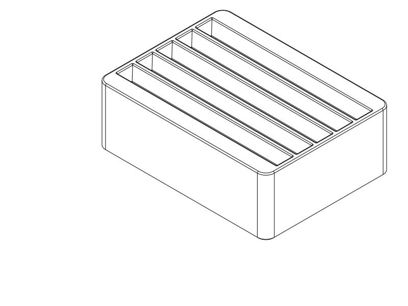

# Filament swatch box — five- and fifteen-card base trials

**Five-card baseline printed; seated movement needs revision.** The user reports
that it generally works, but cards still move too much when fully bottomed out.
The files below preserve that baseline, not a fix for the seated movement.
Both bases are standalone, fully printed
handling trials for the existing **80 mm tall × 50 mm wide × 2 mm thick** cards,
with the notch at the top. No cover, button, latch, hardware or assembly is
included. The user requested these base prints to resolve card return before
investing in the enclosure.

| Base | Primary print file | Matching secondary file | Size from source, mm |
| --- | --- | --- | --- |
| Five cards — first trial | [card_base_test_5.step](card_base_test_5.step) | [card_base_test_5.stl](card_base_test_5.stl) | 59.6 × 44.4 × 20.4 |
| Fifteen cards — larger base | [card_base_test.step](card_base_test.step) | [card_base_test.stl](card_base_test.stl) | 59.6 × 114.4 × 20.4 |



[Five-card base with three swatches](renders/handling_test_5/inspect_base_test_5_isometric.png)
and [fifteen-card base with six swatches](renders/handling_test_15/inspect_base_test_isometric.png)
show sparse independent support. The larger base's [empty view](renders/base_test/card_base_test_isometric.png)
shows all fifteen positions. Card references are inspection geometry, never
included in either printable export.

## Entrance and support

### Physical feedback and the next decision

The user reports a printed five-card version which generally works, but cards
move excessively at their deepest seated position. Movement direction/magnitude,
actual card thickness, filament, nozzle/layers and slicer settings remain unknown.
This is partial physical success; the steady-upright requirement is not met.
It does not establish a print-process defect or comfortable entry from every direction.

Feedback arrived at repository commit `64986ae`. Swatch source and artifacts are
unchanged from delivery `ff71602`; the intervening commit concerned the phone
stand. The user's actual printed file/hash is not independently confirmed.
[The retained export hashes](notes/base_tests_review.json) identify the baseline.

The lower groove has 0.8 mm nominal total thickness clearance and 4 mm along the
card's bottom edge. Floor contact does not tighten either fit. A simple 0.8/14
clearance/depth screen permits roughly 3.3° of lean; this is a nominal geometric
possibility, not measured play or a diagnosis of the reported motion.

Preserve the four-sided entrances while revising the lower locating surfaces.
Closer rigid clearances are the cheapest change for consistent card dimensions.
For varied cards that must feel fixed, gentle printed spring preload against
fixed locating faces is a possible alternative, pending material and contact/
release review. Identify movement direction and actual dimensions before sizing
the next five-card trial. Cover integration remains dependent on seated restraint.

The earlier straight-slot study provided nominal support but left the user to
find a narrow entrance. The user questioned that interaction before printing;
no physical failure was reported. These trials replace that entrance with a
**four-sided funnel**, keeping the lower support section separate:

- Slots are on 7 mm centres, leaving 5 mm between adjacent nominal card faces.
- Each lower groove is 2.8 mm wide and 14 mm deep: 0.8 mm total allowance for a
  nominal 2 mm card. It constrains lean without gripping by interference or
  relying on neighbouring cards. The five-card print does not meet the user's
  desired seated steadiness; actual clearance is unmeasured.
- A 4 mm deep taper widens the entrance to 5.6 mm across card thickness. The
  two end faces also flare: the width available to the 50 mm edge grows from
  54 mm below to 56.4 mm at the entrance. It is not just a chamfer on two sides.
- A 0.4 mm fillet rounds the entrance perimeter and both edges of each divider
  crest. The 1.4 mm divider width before rounding leaves a small flat crest;
  landing directly on a divider can still need a small sideways movement. No
  claim is made that every initial position automatically finds the right slot.
- The taper guides small left/right and front/back errors before the card
  engages the straight section. Fully seated cards rest on the 2.4 mm floor;
  there is no lip, roof, snap or horizontal step inside the return path.
- Outer corners are rounded, with a 0.4 mm bed-edge chamfer. The 2.8 mm walls
  remain outside the card and provide a continuous low body for a later cover.

The five-card specimen is a shorter section with **identical** groove width,
pitch, funnel geometry, depth, walls and print orientation. Its middle slot has
neighbours on both sides; its end slots reproduce the larger base's ends. It
is useful for insertion, grip, friction and independent card support. Its
smaller footprint, mass and wall span do not establish the larger base's tipping
behaviour or handling with all fifteen cards. Neither base establishes cover fit
or protection. The older cover sketches are not compatible print-ready covers
for these revised bases.

## Baseline print setup and check procedure

Use the supplied orientation: **flat underside on the bed, entrances upward**.
Recommended starting setup is **PETG, 0.4 mm nozzle, 0.2 mm layers, two walls,
7% adaptive cubic infill, supports off**. Use calibrated settings for your
filament and plate; record the actual setup with the result. No flexible action
or calibrated material strength is assumed. The continuous flat underside has
stable bed contact; the grooves are open upward, and their outward-opening
voids leave supported narrowing ribs. There are no bridges or enclosed supports.

1. Put one card in the middle slot, notch up. Leave it standing without neighbours
   and note lean, wobble and whether it seats fully. Also try a single end card.
2. Fill all five positions. Remove the middle card and return it using your normal
   grip. Hold the small base on the desk during insertion and removal.
3. Try returning it with a small left/right offset, front/back offset and slight
   tilt. The desired result is a gentle hand-guided return without hunting for a
   narrow slit or needing to force the card. Try the first and last slots too.
4. Note where an awkward return happens: finding the opening, catching an end,
   entering the lower groove, or gripping between the other cards. Try several
   actual swatches so thickness or warping differences are visible.

A useful result is easy ordinary return, individual selection and near-upright
support. If the entrance finds the card but the lower groove binds, reconsider
`SLOT_WIDTH`. End catches implicate the end lead/clearance; repeated hunting
implicates the mouth/pitch; excessive lean implicates lower clearance/depth.
These are directions for interpreting observations, not diagnosed print causes.
If the interaction still needs precise alignment, revisit the rack arrangement
before developing the cover. Report filament/setup, cards tried and what happened.

This five-slot physical trial is preferable to more nominal CAD checks because
real card flatness, printed surface friction and hand-guided correction decide
usability. It costs less than printing the long base and cover while preserving
the relevant middle and end interfaces. The larger base is available as requested;
the **whole box remains outside this test phase**. Use the first print's feedback
to decide whether to retain or revise these guides before enclosure integration.

## Source and verification

[card_base_test.py](card_base_test.py) owns the shared parameters and
`build_base(card_count=15)`. [card_base_test_5.py](card_base_test_5.py) selects
five positions from the same builder. Dimensions are derived from the existing
SCAD swatch through [study.py](study.py); its surface details are omitted only
in inspection references. Both STEP/STL pairs come from their respective same
print geometry. Do not scale the exports to change card count or fit.

Evaluated 2026-10-02 through the shared evaluator, **CadQuery 2.7.0 / Python
3.12.14**. Both printable entries and their handling views built valid geometry.
The [targeted entry checks](check_base_test.py) passed for both sizes:
nominal seating in every groove, a conservative 51 mm wide × 2.2 mm thick
card envelope, and 1,008 sampled entry poses in first, middle and last slots.
Paths combine up to 1.5 mm sideways offset, 1 mm fore/aft offset, 1° yaw and
2° lean in each axis, correcting through the funnel in 0.19 mm travel steps.
They include adjacent seated card envelopes. Tilted entry starts at the lowest
corner, rather than incorrectly placing that corner below the entrance.

These checks establish **possible hand-guided paths**, not passive self-centring,
a continuous-motion proof, printed fit, comfortable grip or automatic insertion
from arbitrary angles. The physical trial is needed for those handling questions.
The user's five-card print now shows excessive seated movement, which these
entry-path and slice checks did not qualify.

Both final STLs completed their **OrcaSlicer 2.4.2** reference slices on the
Qidi Q2C profile, centred without rotation, with no notices or review flags.
Effective settings were 0.4 mm nozzle, 0.2 mm layers, PETG, two walls and 7%
adaptive cubic. The automatic-support probes generated no supports. Printer
fit, including print aids, was accepted by Orca using the profile's
270 × 270 × 256 mm limits. These are diagnostic PETG paths; they do not verify
Orca's separate GUI STEP import or the user's dimensional calibration.
[The retained review](notes/base_tests_review.json) records native export/slice
status, effective profiles and source/artifact/profile hashes.

```sh
./evaluate_model.py model/filament_swatch_box_study/card_base_test_5.py --views none --slice
./evaluate_model.py model/filament_swatch_box_study/card_base_test.py --views none --slice
./evaluate_model.py model/filament_swatch_box_study/check_base_test.py --views none
```

`inspect_base_test_5.py` and `inspect_base_test.py` are display-only entries.
The earlier `study.py`, `inspect_lift_off.py`, `inspect_flip.py`,
`inspect_full.py`, `inspect_guides.py` and `check_study.py` remain rough concept
history using the old 20-slot layout; their enclosure/clearance evidence does
not establish the revised bases' usability. Never export those inspection
poses as the current test pieces.

## Physical print status

Status reviewed 2026-10-02. Printable deliverables in this phase are base trials.

| Item | Print status | Artifact(s) | User result or remaining physical checks |
| --- | --- | --- | --- |
| Test piece(s) — five-card baseline | Yes | `card_base_test_5.step/.stl`, delivery `ff71602`; actual printed hash unconfirmed | User reports generally works, but fully seated cards move excessively; motion direction and print details unreported |
| Test piece(s) — fifteen-card baseline | Unknown | `card_base_test.step/.stl` | No print report; same lower seat is provisional after five-card feedback |
| Final printable object(s) | N/A | No final covered box in this test phase | Seated restraint needs revision before cover integration or final acceptance |

## Attribution

Primary language model: **GPT-6** (runtime identifies this family; exact variant
and reasoning effort not exposed). Harness: **Codex**, shared repository
workspace. Provider: **OpenAI**. No subagents. Swatch dimensions and reference
outline derive from the existing user-provided SCAD source; its historical
Gemini attribution remains with that object.
