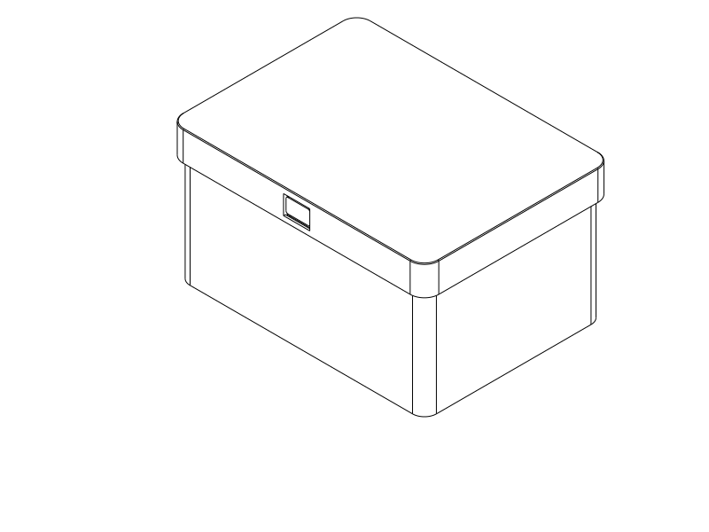
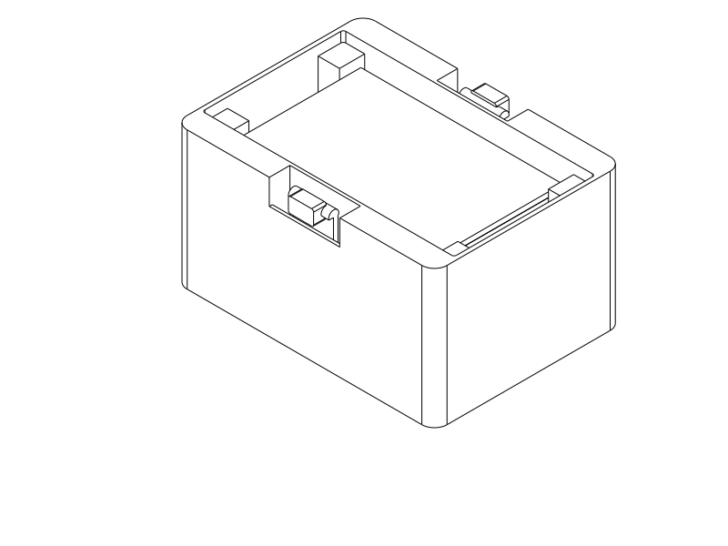
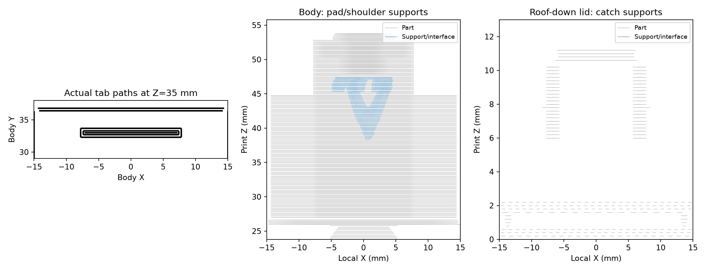

# Lift-off twenty-swatch archive box

Covered storage for bulk insertion/removal of twenty existing archive swatches.
Two recessed press pads release a removable lid; the beams and catch faces are
covered when assembled. The storage walls and roof are continuous. Exterior
snap recesses are separated from the contents by an unbroken wall, with a 4 mm
overlapping inner lid lip. This is dust-resistant geometry that sheds ordinary
top spills, not a tested airtight or watertight seal.

Print [the main STEP](filament_swatch_lift_box.step) or matching
[STL](filament_swatch_lift_box.stl). Both contain the upright body and roof-down
lid side by side; retain their orientation. The source is
[components.py](components.py), selected by [the main entry point](filament_swatch_lift_box.py).
Inspection entry points contain assembled or reference geometry and are not
print files.

## Use and fit

Rest the box on a surface, pinch the opposed pads inward with one hand and lift
the lid about 2 mm by its end rim with the other. Release the pads, then finish
lifting the lid. The cap rim holds the tabs clear after that first movement;
keeping fingers inside the windows throughout removal would obstruct the cap.
Put twenty cards on the raised central
platform. Reach into the internal end wells to grip the stack; the platform
leaves the bottom card's edges accessible. Corner stops keep the stack near the
middle of those wells. Align the lid and press down to close. Actual comfort,
coordination and tactile feedback require the complete print.

| Decision | Current geometry |
| --- | --- |
| Swatch source | `../filament_archive_swatch/filament_archive_swatch.scad`, read directly: 80 × 50 × 2 mm |
| Capacity | 20 nominal cards; explicit trial 81 × 51 × 42 mm, including displaced positions |
| Cavity | 100 × 56 mm; nominal stack headroom 6.4 mm above the 6 mm platform |
| Finger wells | 10 mm nominal at each card end; 5 mm card overhang beyond the platform |
| Lid lip | 4 mm overlap, 0.35 mm gap per side |
| Cavity protection | Continuous 1.2 mm local liner behind the snap recesses; 1.6 mm end walls |
| Each snap | 24 mm beam, 16 mm width, 1.8 mm bending thickness, filleted root |
| Release | 1.4 mm inward movement; flat retaining shoulders, rounded closing leads |
| Window release lead | Internal 0.8 mm bevel at the lower ledge, for passage after releasing the pads |
| Appearance | Continuous roof and covered flexures; only 10 × 6 mm press pads visible |

## Manufacture

Use PETG, 0.4 mm nozzle, 0.2 mm layers, **six walls**, 7% adaptive cubic infill,
and the object-owned [process profile](notes/process.json). Six walls were chosen
because the four-wall slice left hollow pad regions; actual paths, not the wall
count alone, establish the reviewed section's fill. They do not establish a
modulus, strength or strain limit. The body prints upright with solid floor
contact; the lid prints roof-down on a broad flat face. Round corners and an
inner leading bevel preserve the functional interfaces.

The upright tabs put axial bending stress across printed layers. This is a
material/process uncertainty; the isotropic analysis does not qualify bonding.
Printing the whole body on its side would introduce extensive cavity support.
The selected strategy instead limits strain, fills the tabs and uses the complete
box as the first functional trial. Do not substitute PLA, TPU, a different nozzle
or different layer orientation and transfer these numerical results unchanged.

Removable tree support is enabled with a requested 0.4 mm top/bottom vertical
separation. Review the retained feature plot below, and remove support from the
separate parts before assembly. Branches reach the pads through the exposed upper
recesses; remove them outward while supporting the tab. The desired light
adhesion, dimensional finish and easy removal remain physical checks. Use actual
filament flow/temperature calibration; the generic reference profile is not a
calibration of the user's PETG. Headless slicing covers STL, not GUI STEP import.

## Evidence and remaining uncertainty

Run `uv run --locked python model/filament_swatch_lift_box/verify.py` from the
repository root. It checks nominal/variation capacity, displaced stacks,
continuous cavity walls and cover, sampled rigid lid travel, positive shoulder
retention, released travel, the whole free-tab envelope and assumed end-finger
access. CAD clearance for an assumed fingertip is not comfortable handling.
The flat shoulders overlap by 0.616 mm nominally and 0.266 mm at the
outward nominal guide-play limit. This is positive geometric engagement, not
measured retention strength or compensation for arbitrary printing errors.
The straight-beam screen gives 0.375% root strain at 0.8 mm travel and about
2.03 N/mm stiffness using an explicitly assumed 1200 MPa modulus. It omits head
offset, contact and printed material behavior.
An assumed 250 g payload at 2 g gives 2.45 N per snap; an ideal axial-plus-
eccentric beam calculation gives 0.066% root strain. This cheaply screens
ordinary contents weight without another solve; it does not rate the catch,
shell, bonding or accidental pulling/dropping.

The object-owned [analysis](analyze.py) uses the shared physical-intent API:
the actual local cap rim/window/catches close onto the actual tab, a rigid pad
presses it inward, the cap lifts 2 mm, the pad withdraws, and the cap finishes
lifting. No tab displacement is
prescribed. The root is locally clamped; the moving cap/pad are rigid engineering
drivers. Only the pad's frontal face transfers normal contact; its finite side
edges do not represent skin or vertically restrain the button. A shared sampled
CAD preflight checks rigid cap/actuator clearance before meshing. The pad is not
a skin, fingertip-clearance or human-force model. Friction, complete shell
compliance, plasticity, bonding, creep and fatigue remain outside the fixture.

Study decisions: test passage/release/recovery first; use a provisional 1.5%
absolute-principal-strain screen, penetration below 0.02 mm, and complete-path
force balance below 1%. Seek broad hand-usable operation (combined actuation
below a provisional 20 N engineering target), not precise comfort prediction.
Mesh, penalty and travel-increment studies must leave the decision stable;
target 20% force and 15% strain changes, tightening review if near a screen.
These are design acceptance targets, not measured PETG or human limits.

The retained [rejected flat-edge solve](notes/analysis/rejected_flat_leading_edge/result.json)
failed penetration quality and folded the pad downward. Its large force/strain
numbers are not operating predictions. The cap's lower inner edge was bevelled
to create a real inward lead; the failed result is retained as an explanation of
that geometry change, without refining an already rejected operation.

The [rejected held-pad cycle](notes/analysis/rejected_held_pad_cycle/result.json)
also failed quality. Its cap/finger path was physically obstructed; the new
rigid-driver preflight rejects the saved fixtures. The present path withdraws
the press actuator after the first 2 mm lift. The first staged run then exposed
another transition at the window's lower ledge. Its
[retained history](notes/analysis/staged_base/result.json) is diagnostic evidence,
not an accepted force/strain prediction. A release bevel addresses that ledge;
numerical refinement of the former edge and the revised contact geometry are
recorded separately.

The final-geometry [generated study table](notes/numerical_results.md),
[complete summary](notes/numerical_summary.json) and retained native runs are
the numerical record. Surface-to-surface runs completed the requested closing,
pressing, staged lift and unloading path. Their elastic-model tabs returned to
their starting geometry, but **none passed the contact-quality screen**. Mesh
refinement reduced release penetration without resolving it; tighter penalty
and smaller travel increments changed the release response substantially and
still failed penetration, including during closing. The existing node-to-surface
alternative failed to converge on both coarse and finer meshes. These results do
not establish robust snap passage, operating force or printed recovery. No quantitative force
rating is transferred from these failed studies.

The [controlled diagnosis](notes/debug/README.md) found an inaccurate description
of the selected contact formulation and a missing guard for fixed-mesh studies.
Those shared issues are corrected. Smaller increments on an identical mesh
still produce unstable edge-transition results, so the failed studies do not
establish that the object is impossible or that CalculiX is incapable of solving
it. The concrete remaining numerical need is robust sliding contact through
the pad/window/catch transitions, with adequately small penetration and stable
forces/strains under mesh, penalty and motion-increment changes. Piecewise staged
driver motion is already supported; adding another staging API would not resolve
this observed issue. The follow-up [alternate contact investigation](notes/contact_exploration/README.md)
qualifies an optional FEBio adapter on benchmarks and tests this actual release
transition, while leaving the print geometry unchanged. It exposes geometric
overlap missed by native contact samples and retains convergence failures;
the complete mechanism remains numerically unqualified. The analytical beam screen and positive CAD
engagement support a **provisional complete-box trial**, not a validated mechanism.

Material/process uncertainty is separate: the assumed homogeneous isotropic
1200 MPa elastic solid and provisional 1.5% strain screen are uncalibrated, especially
across the upright tab's printed layers. Solidity does not establish bonding,
failure strain, permanent set, creep or fatigue. Physical uncertainty includes
actual fit, friction, pad coordination, support removal and long-term recovery.
Stop a trial if closing or opening binds or needs excessive force; do not force
the mechanism merely because a solver completed.

The final [Orca review](notes/slice_review.json) completed with no notices.
Its automatic-support signal was resolved by reviewing actual local paths in
[the feature report](notes/path_review.json): the sampled tab and pad sections
have no uncovered width or internal gap. Support reaches the exposed recess
from outside before lid assembly. Actual easy removal remains untested. The
effective Generic PETG slice used 245 °C initially / 250 °C afterward and a
60 °C Cool Plate; the profile's unused 80 °C hot-plate value is not the sliced
bed temperature. Use settings appropriate to the user's filament and plate.

## First print and feedback

Print the complete pair, not a separate coupon: it tests coverage, support
removal, stack access, root/cap compliance and the mechanism together. Record the
source revision or artifact hashes, material, printer/profile, nozzle and layers.
Try twenty real cards; note end-well access including the last card, closure
alignment, perceived/measured closing and pinch/lift effort, and retention when
gently inverted over a surface. Record rubbing, snagging, slips, awkward regrips,
support damage and dimensional fit separately from suspected causes. Cycle the
lid several times, check recovery/set and wear, then repeat after an extended
closed dwell. Inspect ordinary dust/spill paths without inferring a sealing
rating. Preserve results here and update the root model-index status together;
force alone cannot calibrate modulus because friction and fit also contribute.

| Item | Print status | Artifact(s) | User result or remaining physical checks |
| --- | --- | --- | --- |
| Test piece(s) | N/A | None | Complete box is the primary trial |
| Final printable object(s) | Unknown | `filament_swatch_lift_box.step`, `filament_swatch_lift_box.stl` | No print report; checks above remain |

## Shared snap question and negative regression

[analyze.py](analyze.py) states the staged cap/pad motions with `SnapFitQuestion`.
Its eleven case-construction calls (three parts, root, two motions, two contacts,
two observations and case initialization) move into the shared constructor;
the actual head, finite pad faces, root and motion timing remain explicit here.
`operation()` still exposes the constructed `AnalysisCase` for the isolated
release/master-union and experimental-backend investigations in `analyze_release.py`.
Those investigations are not silently generalized into the normal snap interface.

The [generated summary](notes/numerical_summary.json) binds applicable retained
window-lead cases to the question. The baseline retains `quality_failed`:
0.09338 mm penetration exceeds 0.02 mm. The extracted history reaches the end,
but accepted operation, adequate passage evidence and design acceptance remain
false/unknown. A study rejects this baseline before launching force refinements.
Numerical return in that history does not qualify the contact sequence or printed
recovery. Historical variants that fail input identity are explicitly rejected
for reuse; they are not relabelled as successful results. The finite-edge release
and experimental contact witnesses remain unresolved as described above.

## Attribution

Primary model: GPT-6.1 Sol, high reasoning effort, as identified by the user.
Harness: Codex shared repository workspace. Provider: not separately exposed.
No subagents. The existing swatch and sliding-box records retain their historical
attribution; their source dimensions and analysis/path-review patterns informed
this independent variant.

Engineering-question migration contributor: GPT-6 family (specific runtime variant
and reasoning effort not exposed); Codex shared-workspace API agent; provider not
separately exposed. No sub-agents. Historical model attribution above is preserved.
