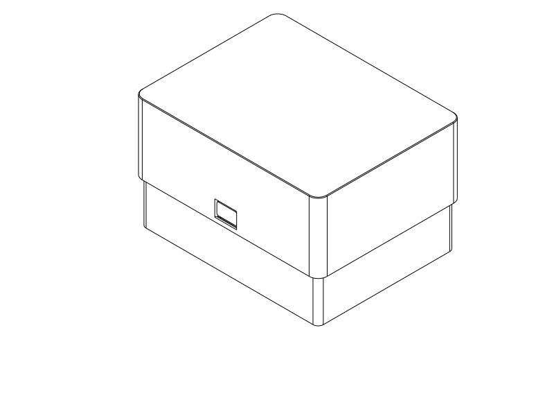
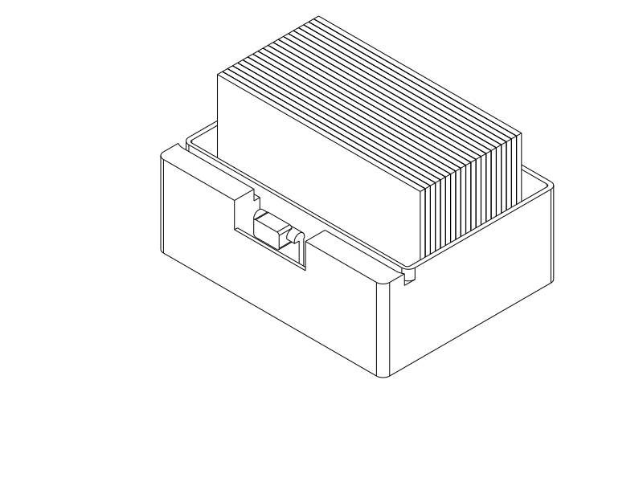
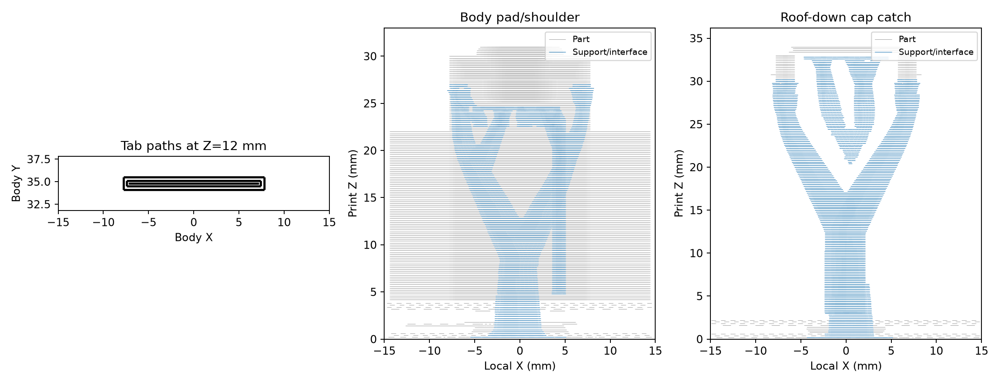

# Upright twenty-swatch card file

Twenty archive swatches stand on their long edge in a low body. Removing the
deep cap exposes 20.4 mm of each card for browsing and individual selection.
The assembled box has a continuous cover and one recessed front release pad;
the flexible beam and catches are concealed. An overlapping inner shield
separates the contents from the exterior mechanism window. This is ordinary
dust-resistant storage and incidental spill shedding, not a tested seal.

Print [the STEP](filament_swatch_upright_box.step) or matching
[STL](filament_swatch_upright_box.stl): upright body and roof-down cap, side by
side. The parametric [components](components.py) reuse the lift-off box's snap
builder and the original swatch's SCAD dimensions directly. Those files are
explicit source dependencies. The main entry point selects only print geometry;
the closed/open entry points are inspection only.

## Handling and dimensions

Rest the body on a surface. Press the front pad inward with one hand, lift the
cap about 2 mm with the other, release the pad, then finish lifting. The lower
cap rim holds the tab clear after the initial movement; keeping a finger in the
window during the whole lift would obstruct the cap. Return all cards upright
before closing, align the cap and press down. Try the complete object for actual
comfort and coordination; the CAD checks do not establish either.

Store the brand-label edge upward. The upper brand/material fields are exposed
when open; full color detail requires lifting a card. There are no tight
individual slots. Use the spare front/back space to fan an end card, move others
aside and lift the selected card by its exposed edge. This variant is intended
for browsing; the [lift-off box](../filament_swatch_lift_box/README.md) provides
internal finger wells for bulk stack removal.

| Decision | Upright file |
| --- | --- |
| Source and capacity | Existing 80 × 50 × 2 mm SCAD swatch; 20 cards |
| Lower cavity | 86 × 56 mm; nominal stack depth 40 mm leaves 16 mm for browsing |
| Explicit variation trial | 81 × 42 × 51 mm, displaced ±2 mm along X / ±4 mm along Y |
| Body rim / floor | 32 mm / 2.4 mm |
| Roof clearance | 2.4 mm above nominal cards; 1.4 mm above the taller variation trial |
| Assembled exterior | 93.1 × 72.7 × 57.2 mm, derived from named source dimensions |
| Protection | Continuous body wall, roof and outboard inner shield; 4 mm overlap and 0.35 mm fit gap |
| Snap | One translated 24 × 16 × 1.8 mm beam; rounded closing leads and flat retaining shoulders |

Outer corners, the press pad and roof edge receive deliberate rounding/edge
treatment. The upper body rim is a square mating land; normal card gripping
happens above it. Inspect that rim and the exposed card edges for actual comfort.

## Print plan and evidence

Use PETG, 0.4 mm nozzle, 0.2 mm layers, six walls and 7% adaptive cubic, with
[this process profile](notes/process.json). The material, layer-direction limits,
temperature/flow calibration and support-removal guidance are shared with the
[lift-off print plan](../filament_swatch_lift_box/README.md#manufacture).
The upright profile additionally disables removal of small overhang support:
the initial slice omitted support beneath the fit-critical cap catch ledges.
Requested top/bottom support gaps remain 0.4 mm, with 0.35 mm XY separation.
Remove support before assembly, hold the tab while working and inspect both
retaining shoulders. Light adhesion and easy removal are goals, not proven
physical outcomes. The cap's deeper wall makes support access a distinct check.

The final [Orca review](notes/slice_review.json) completed with no notices.
[Actual local paths](notes/path_review.json) show no uncovered width or internal
gap in the sampled tab/pad sections. The revised slice supplies support at the
cap catches; its branches approach from outside the front wall and can be
accessed through the window and open rim before assembly. Remove branches in
pieces rather than levering against the catches. Actual ease and surface finish
remain untested. The Generic PETG diagnostic slice used a 60 °C Cool Plate and
245 / 250 °C nozzle settings; calibrate the user's filament and plate. Headless
STL slicing does not verify Orca's GUI STEP import.

Run `uv run --locked python model/filament_swatch_upright_box/verify.py` from the
repository root. [The retained CAD record](notes/verification.json) checks the
variation stack at nine displaced positions, continuous enclosure targets
including a complete 1 mm rounded body boundary, sampled cap travel, retained
and released shoulders, whole free-tab relief and the added inner shield.
It also samples end-card fanning through 12° about the outward bottom edge and
assumed fingertip access above the rim. These are rigid clearance checks, not
a simulated human hand or printed friction test.
The selected rear-peeling path meets the body at 6°, including a 0.7 mm front
retaining-play trial. This removes a simple rigid bypass in that sampled path;
it does not rate flexible-wall retention or establish every possible motion.

The single snap carries the full assumed contents load in the cheap retention
screen: an explicitly assumed 250 g payload at 2 g gives 4.91 N and 0.132%
ideal axial/eccentric root strain. The straight cantilever screen gives 0.375%
root strain at 0.8 mm travel. Both assume 1200 MPa elasticity and omit local
notches, bearing, shell compliance and printed bonding; they are not load ratings.

The actual contacting cap band matches the lift-off interface exactly after
translation, as checked by CAD subtraction. Its free-tab envelope also clears
the new shield. Therefore the [retained contact studies](../filament_swatch_lift_box/notes/numerical_results.md)
are reused for that local clamped-root, rigid-driver question. Their unresolved
penetration and convergence failures still apply. **This is not a qualified
contact-driven mechanism or operating-force prediction.** The subsequent
[controlled diagnosis](../filament_swatch_lift_box/notes/debug/README.md) separates
analysis mistakes from unresolved contact behavior; it does not establish that
the box is impossible or that CalculiX cannot solve it. The deep
cap, full-body compliance, asymmetric single catch and printed friction have
not been numerically established. Physical retention and cap rocking matter.

The assumed homogeneous, isotropic elastic solid and provisional 1.5% strain
screen remain material/process uncertainties, particularly across upright tab
layers. Actual sliced fill does not establish calibrated strength or bonding.
Physical fit, support removal, effort, comfort, recovery, wear and closed-dwell
set remain separate questions. This complete box is a provisional functional
trial. Stop if the cap binds or needs excessive force.

## First print record

Print the complete pair; no separate coupon is needed for the present questions.
Record filament/printer/profile, source or artifact hashes and actual nozzle/layers.
Try all twenty real cards, label visibility, end-card fanning and selection of a
middle/last card. Note closing and press/lift effort, regrips, support removal,
catch surface quality, cap rocking and retention during gentle inversion over
a surface. Cycle it, check recovery/permanent set and wear, then repeat after a
closed dwell. Record dust/spill paths without inferring an ingress rating.
Preserve observations here and update the root model index together; measured
force alone does not calibrate modulus because fit and friction also contribute.

| Item | Print status | Artifact(s) | User result or remaining physical checks |
| --- | --- | --- | --- |
| Test piece(s) | N/A | None | Complete file is the primary trial |
| Final printable object(s) | Unknown | `filament_swatch_upright_box.step`, `filament_swatch_upright_box.stl` | No print report; checks above remain |

## Attribution

Primary model: GPT-6.1 Sol, high reasoning effort, as identified by the user.
Harness: Codex shared repository workspace. Provider: not separately exposed.
No subagents. Swatch dimensions and the lift-off closure source/evidence are
explicitly reused; their historical attribution remains intact.
