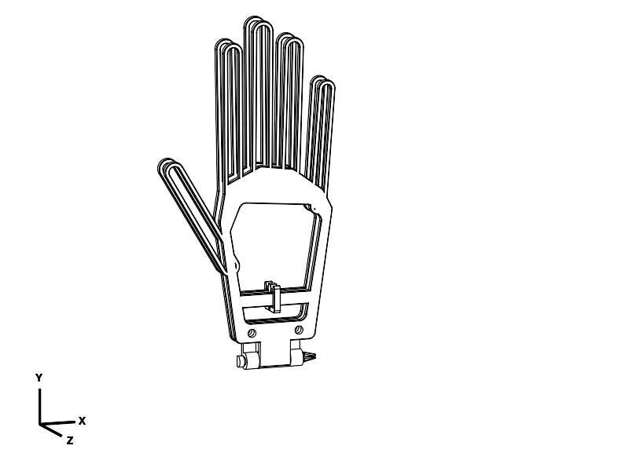

# Five-finger folding glove drying insert

One insert per glove: **two skeletal hand panels, five paired slotted branches,
a wrist hinge and a removable opening brace**. The branches enter the index,
middle, ring, little-finger and thumb compartments. Separating the panels holds
an air space along each digit, connected to the open palm and cuff.

This replaces the earlier cuff/palm-only design. All current source, exports,
renders and evidence describe the five-finger version. The old design is in Git
history only. General adult/size-8 dimensions are assumptions, as requested by
the user; actual glove measurements were deliberately not required.

## Fit and folding

The two hand panels are mirrored in the print layout. Turn one over to align all
five branches during assembly. The completed insert can be turned over to suit
left or right gloves. The thumb is a fixed angled branch; finger positions are
not individually articulated. It can also go into a mitten's shared finger
pocket, provided that its width and thumb position fit.

| Dimension | Default |
| --- | --- |
| Folded hand mechanism | 215.5 × 108.3 × 10 mm |
| Expanded assembly | 215.4 × 108.3 × 17.4 mm |
| Middle fingertip reach from cuff-bar far edge | approximately 186.5 mm |
| Separate removable brace | approximately 16.5 × 17.4 × 4 mm |
| Panel thickness | 3.2 mm |
| Angle between panels | 2 degrees |
| Four-part print layout before brim/skirt | 228.5 × 235.5 × 10 mm |

It folds through its **thickness**, not into a shorter hand. Pack the small brace
alongside the joined hand panels; there is no integrated storage latch. The
narrow rounded branches leave room around their sides and through their slots.
They should reach well into adult glove fingers without needing an exact cast
of the hand. They are not guaranteed to fit every glove labelled size 8.

| Branch | Width | Long slot width | Clear gap between panels near tip |
| --- | --- | --- | --- |
| Index | 12 mm | 6.8 mm | 10.3 mm |
| Middle | 13 mm | 7.8 mm | 10.7 mm |
| Ring | 12 mm | 6.8 mm | 10.3 mm |
| Little | 10.5 mm | 5.3 mm | 9.4 mm |
| Thumb | 12 mm | 6.8 mm | 7.8 mm |

These are empty-geometry gaps; a soft or loose glove liner can intrude. Neither
CAD nor slicing verifies real drying rate, fit or the position of wet lining.

## Files and adjustments

- `glove_drying_insert.py`: authoritative parametric source; evaluates to the print layout.
- `glove_drying_insert.stl` / `.step`: matching four-part print-ready geometry in millimetres.
- `glove_drying_insert_assembled.step`: expanded inspection pose, not for printing.
- `hinge_fit_sample.stl` / `.step`: optional three-part sample of the current wrist hinge.
- `inspect.py` / `inspect_folded.py`: assembled inspection entry points.
- `verify.py`: validity, sampled motion, retention, five digit slots and alternate sizing.
- `export.py`: batch export and repository STEP/STL consistency checks.
- `renders/`: final print/open/folded views; `notes/`: hashes, checks and slice evidence.

Edit `HAND_SCALE` for overall hand proportions, `FINGER_LENGTH_SCALE` to lengthen
or shorten just the digit centerlines, and `FINGER_WIDTH_SCALE` for branch widths.
`DIGITS` supplies individual roots and tips if only one finger or thumb needs
adjustment. `OPEN_HALF_ANGLE` changes finger depth; a new brace must be exported
with it. Start with a smaller angle if the glove is narrow through its thickness.
Keep hinge fit dimensions unchanged when changing hand size. Do not scale the STL.

A 1.04 hand scale / 1.05 finger-length scale / 0.7-degree half-angle configuration
was also built and checked. This is one verified variant, not validation of every
parameter combination or its print layout. Larger versions may need the panels
printed separately to stay inside the bed limits.

Use CadQuery MCP `evaluate_file` on the source and the relevant entry points.
Wrappers reload the source module to avoid stale imports in the MCP process.
Re-run the affected geometry/export/slicer checks after changing dimensions.

## Printing and assembly

Use PETG and your printer's actual profile. Diagnostic starting settings were a
0.4 mm nozzle, 0.2 mm layers, 4 perimeters, 5 top/bottom layers, 25% gyroid infill,
3 mm outer brim and no supports. Preserve the supplied orientation: both panels
and brace lie flat; the axle lies horizontally with its split arms in the print
plane. Remove brim from all slots and the axle slit. Smooth rough glove-contact
edges before insertion.

1. Optionally print the **hinge-fit sample first**, about **6.3 g / 42 minutes**.
   It preserves the current hinge, axle and orientation, with the hand cropped
   away. Check insertion, rotation, snap retention and release. It does not test
   finger fit, full-hand stiffness, brace force or drying performance.
2. Turn one panel over, align all five branches, and interleave the wrist
   knuckles. Push the axle through the aligned holes, gently squeezing its split
   tip. Its shoulders must emerge beyond the last knuckle. Confirm free movement
   and retention; leave the axle installed during normal packing.
3. Keep the panels folded and guide **each paired branch into its corresponding
   glove finger**, including the thumb. Seat them gradually; do not force long
   branches against the ends of a glove or pull a loose lining out of position.
4. Separate the panels slightly. Push the brace from the cuff toward the palm
   over the dedicated wrist crossbars (the second bars above the hinge, not the
   bars with hanging holes). Both slots must seat; their small lips catch the
   far edges. The brace then resists closing. It can be fitted before insertion
   if the glove cuff makes it difficult to reach.
5. To remove, pull the brace back toward the cuff, easing its outer fingers if
   necessary, fold the hand panels together, and withdraw them gently.

If the axle is tight, first remove brim/first-layer flare; `BORE_RADIUS` controls
radial clearance (0.4 mm nominal). The split tip needs about 0.5 mm inward motion
per arm to pass the bore. `SLOT_CLEARANCE` and `SNAP_OVERLAP` control the brace fit.
Actual force, flexibility and wear require a PETG print. Do not hammer or force
stiff snaps. The long narrow finger rails are intended for light glove pressure,
not prying, clamping or hanging heavy loads.

## Airflow and optional hanging

The insert keeps all five digit corridors open without suspension. Rest/support
the glove cuff-down over a dehumidifier's outgoing airflow while keeping the
appliance's required ventilation clear. It is not a freestanding pedestal or a
sealed air adapter. Air may bypass the fingers, so drying performance needs a
real wet-glove trial.

The 5 mm cuff holes accept an optional hanging loop or existing accessory; pass
a loop through both panels and check that the glove cannot slide off. Use the
glove's own cuff strap if needed. The brace also has a small tether eye. No cord,
hook, screws or other purchased hardware is required for the folding mechanism.
There is no radiator-specific hook. Use nearby airflow rather than assuming the
PETG or glove can tolerate direct contact with an unknown hot radiator; follow
the glove, filament and appliance temperature guidance.

## Verification

CadQuery MCP built four valid production solids and the three-part hinge sample.
Checks at half-angles 0, 0.5, 1, 1.7, 3 and 5 degrees found no frame/frame or
axle/bearing collisions. At the default opening, both brace slots clear their
crossbars. Closing the mechanism meets the brace; withdrawing the brace or axle
2 mm meets the retaining lips/shoulder. A compressed barb cross-section clears
a conservative circular bore with 0.1 mm remaining slit space. An empty-space
probe passed through the long slot near the tip of **each of the five branches**.
These checks establish geometric room and contacts, not elastic stress or force.

Final STEP/STL pairs passed validity, closed/wound mesh, per-component bounds,
volume and bed-contact checks. Reports record the source and exported hashes.
The assembled STEP is explicitly separate from the primary print-ready pair.

PrusaSlicer 2.9.6: approximately **45.3 g / 4 hours** per complete insert. No
support paths or slicer notices; deposited paths including brim/skirt fit the
confirmed **260 × 260 × 250 mm** usable limits. Inspected layers show the five
finger slots remain open, the rails start on the bed, the axle slit and brace
lips are retained, and the bore roof closes over a narrow bridge. The diagnostic
profile/G-code is not a tuned machine job; slice the STL with your own profile.

Still untested physically: general glove fit, fingertip reach, liner behavior,
brace/pin forces, fatigue, heat exposure, hanging security and drying rate. Try
one complete insert before printing a collection.

## Attribution

Attribution: **GPT-6 Astra, low reasoning effort**, confirmed by the user;
harness **Codex**; provider **user-provided / not separately recorded**. This
attribution covers the five-finger redesign as well as the previous iteration.
