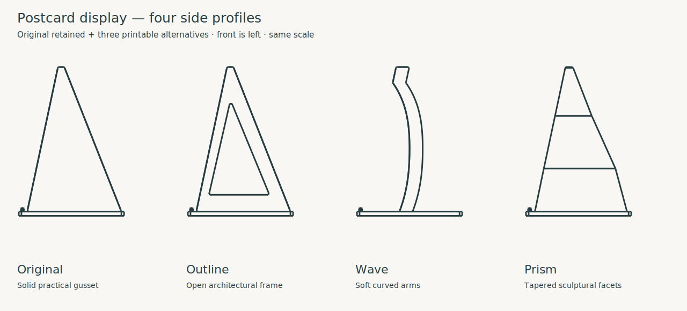

# Minimal single-postcard display

Print **[postcard_display.step](postcard_display.step)**, or the matching
[STL](postcard_display.stl). One piece, no assembly or hardware. Source:
[postcard_display.py](postcard_display.py). The two low stops face the viewer;
the long feet run behind the card. Lower the card onto both feet, centre it,
and lean it against the two rear ribs. Lift it out to change orientation.

## Three aesthetic alternatives

The original `postcard_display.py`, STEP and STL are retained unchanged.
All three alternatives are complete one-piece holders using the same PETG,
0.4 mm nozzle, 0.2 mm layer, two-wall, 7% adaptive cubic setup described below.
They keep the 64 × 40 mm footprint, approximately 56.6 mm height, low 1.4 mm
front stops, and support for A6 / 100 × 150 mm cards in both orientations.



| Style | Character and tradeoff | Print STEP | Matching STL |
| --- | --- | --- | --- |
| Outline | Open triangular frames; light architectural side profile, retaining the original continuous backing line | [STEP](postcard_outline.step) | [STL](postcard_outline.stl) |
| Wave | Two curved arms with open space behind the card; softest silhouette, upper backing contact only, best with flat stiff cards | [STEP](postcard_wave.step) | [STL](postcard_wave.stl) |
| Prism | Broad facets and inward-tapering fins; a more substantial sculptural appearance, upper supports closer together | [STEP](postcard_prism.step) | [STL](postcard_prism.stl) |

For the largest aesthetic departure, start with **Wave**. Outline is the choice
for visual lightness with distributed backing. Prism deliberately retains more
material for its broad surfaces. These are geometric differences, not verified
claims about transparency: translucent PETG can show infill and seams, and the
actual lighting effect needs a print.

Sources: `postcard_outline.py`, `postcard_wave.py`, `postcard_prism.py` call the
shared builders in [style_variants.py](style_variants.py), which imports original
interface dimensions. Keep these modules and `postcard_display.py` together.
The frame window, wave width/depth and prism section table are the main style
adjustments. The prism's backing surface has a deliberate 0.10 mm setback;
the card settles slightly beyond the nominal 12° lean.

[Outline perspective](renders/outline/postcard_outline_isometric.png) ·
[Wave perspective](renders/wave/postcard_wave_isometric.png) ·
[Prism perspective](renders/prism/postcard_prism_isometric.png) ·
[Vector comparison](renders/style_comparison.svg)

### Variant verification

The original gravity/stability screen below still applies to the shared card
size, lean and footprint. Wave carries the approximately 0.03 N backing reaction
through two 4.8 mm-wide, nominally 5 mm-deep curved stems; it is not a spring
clip. Frame openings retain connected front and rear rails. Prism fins grow
from overlapping bases and narrow toward their tops. All are open from above
for insertion and removal without flexing or squeezing the postcard. All remain
concealed behind a centred opaque postcard when viewed from the front.

Each final variant passed CadQuery 2.7.0 validity and matching STEP/STL export.
[style_review.py](style_review.py) passed targeted seated-card collision checks
for both card sizes, both orientations, and 0.2/0.8 mm thickness endpoints on
all three variants. The [assembled front scene](renders/styles_assembled/style_review_front.png)
was inspected for concealment. Individual side and perspective views were
inspected for the distinct profiles, contact areas and base connections.

Final OrcaSlicer 2.4.2 checks, separately for each exported STL: completed one
centred plate, **no notices, no review conditions, and no generated support**.
The same diagnostic profiles and effective settings recorded below were used
for all three (PETG, 0.4 mm, 0.2 mm, two walls, 7% adaptive cubic, supports off,
auto brim 5 mm; probe 30° / 10 mm). This establishes selected-profile path
acceptance, not physical quality or GUI STEP-import behavior.

FDM review: all feet and crossbars start on the bed. Outline's pointed opening
closes gradually rather than with a broad horizontal roof. Wave's smooth stems
grow from the feet without unsupported starts, with rounded profile corners
and short upper contact lands. Prism's sloping facets taper in both directions;
its upper contact edges have a 0.3 mm bevel. Facet boundaries intentionally stay
crisp; the feet and front stops retain rounded corners. No trapped supports or
assembly joints are required. Print all variants feet down as supplied, supports
off; use a brim if your adhesion needs it. Handle Wave by its base.

All variants are untested physically. First-print observations: seating on both
feet, forward retention, rocking/tipping on the intended shelf, postcard curl,
and whether the side silhouette and translucent appearance suit the location.
No separate coupons were made: complete small holders are the useful comparison.

Reproduce a variant (replace `outline` with `wave` or `prism`):

```sh
./evaluate_model.py model/postcard_display/postcard_outline.py --views isometric,right --output-dir renders/outline --slice
./evaluate_model.py model/postcard_display/style_review.py --views front --output-dir renders/styles_assembled
uv run --locked python model/postcard_display/style_review.py
```

The last command creates the native vector comparison and its PNG; the review
scene includes reference cards and **must not be printed**. The original and all
three alternatives share the attribution below, supplied by the user. No
physical print success is inferred from the user's approval of the original CAD.

## Design and use

Designed for stiff, flat 100 × 150 mm and A6 (105 × 148 mm) postcards in either
portrait or landscape, assuming 0.2–0.8 mm card thickness. A6 is offered by
[VistaPrint Sweden](https://www.vistaprint.se/reklammaterial/vykort); postcard
sizes are not universal. No side channels impose an exact card width.

The nominal footprint is 64 × 40 mm, height 56.6 mm. Two 8 mm-wide feet support
the bottom edge; there is no full-width front rail. Each front stop is 7 mm wide
and rises only 1.4 mm above the seating surface. The 3.2 mm-wide rear ribs extend
55 mm above the seat and support a nominal 12° backward lean. The loose 1.2 mm
bottom opening allows small settling changes in angle without squeezing the
card. Rear ribs and the low rear crossbar are concealed by a centred opaque
card from the front; transparent filament is optional, not needed for concealment.
Rounded foot corners, rounded rib corners and bevelled stop tops soften contact.

This is a gravity easel for an undisturbed, level bookshelf. It does not clamp
the card or flatten curled paper. Very thin paper, strongly curled cards,
large/heavy mounted cards and resistance to knocks are outside the checked use.
The top portion of the card remains unsupported; ordinary postcard stiffness
is assumed. Visibility of the holder from the side is intentional.

## Printing

- Qidi Q2C, PETG (transparent if desired), 0.4 mm nozzle, 0.2 mm layers.
- Two walls, 7% adaptive cubic infill; ordinary solid top/bottom layers.
- Use the supplied orientation: flat feet and crossbar on the bed, ribs upright.
- Supports off. Brim only if needed for your bed adhesion; remove it before use.
- Use your filament's calibrated PETG temperature/flow settings. No clarity claim
  is made for transparent PETG; layer lines and internal paths remain visible.
- Smooth any stringing or burrs at the card contacts before inserting a card.

The small complete holder is the first trial; no separate coupon saves useful
material. Check that both stops retain your card, it sits without rocking,
and its upper corners stay acceptably flat. Printed fit and handling have not
been physically tested. The 0.8 mm nozzle is not the reviewed setup.

## Decisions and verification

A tiny slotted block was rejected because it would concentrate support at the
bottom edge. The two triangular ribs spread backing contact up the card without
a visible frame or a full backing plate. The rear crossbar connects the feet
on the bed, avoiding an elevated bridge.

Concept screen: a 150 mm-high card at 12° places its centre of mass about
17 mm behind the seating origin, inside the feet's −2 to 38 mm fore/aft span.
The centred card's lateral centre of mass is between the two feet. This supports
static gravity stability, not resistance to impacts or drafts. For an assumed
10 g card, backing reaction at 55 mm is only about 0.03 N; no spring or
structurally demanding joint is needed. The 64 × 40 × 56.6 mm plan leaves ample
space for print aids within the 270 × 270 × 256 mm printer envelope.

Final CAD evaluated successfully with CadQuery 2.7.0 / Python 3.12.14.
[display_preview.py](display_preview.py) is an **inspection-only scene**, not a
print file. Its targeted collision assertions passed for 100 × 150 mm and A6,
both orientations, at 0.2 and 0.8 mm thickness. This checks that seated cards
clear the stand; it does not model card flexibility or friction. Inspected the
[front scene](renders/assembled/display_preview_front.png) for concealment,
and [side](renders/print/postcard_display_right.png) and
[isometric](renders/print/postcard_display_isometric.png) views for the backing,
contact stops and base connections. Render image orientation follows the shared
renderer; the STEP/STL print orientation is feet down, Z up.

FDM review: flat connected bed contact, 1.6 mm base, 1.2 mm stop thickness and
3.2 mm gussets suit multiple extrusion paths with the selected nozzle. The
backing face grows rearward only about 0.043 mm per 0.2 mm layer; the opposite
edge retreats as it rises. There are no elevated crossbars, trapped cavities
or unsupported starts. Gussets carry the small card reaction into the feet.

Final matching STEP and STL exports succeeded. OrcaSlicer **2.4.2** completed
one centred plate with no notices, no review conditions, and **no support
generated** by its automatic-support probe (30° threshold, 10 mm maximum bridge
length). Profiles: repository `.codex/skills/orca-slicer-printability/profiles/`
`qidi-q2c-petg/` printer `qidi-q2c-0.4-nozzle.json`, process
`qidi-q2c-0.20-standard-adaptive-cubic-7.json`, filament
`generic-petg-qidi-q2c-0.4.json`. Effective settings matched the intended nozzle,
material, layer height, walls and infill; support disabled, auto brim 5 mm.
Diagnostic temperatures were 245°C first layer / 250°C thereafter, bed 80°C;
these are not a calibration for the user's transparent PETG. This STL smoke
slice establishes profile-specific path acceptance, not physical print quality
or Orca GUI STEP-import verification.

Reproduce exports/review from repository root:

```sh
./evaluate_model.py model/postcard_display/postcard_display.py --views isometric,right --output-dir renders/print --slice
./evaluate_model.py model/postcard_display/display_preview.py --views front --output-dir renders/assembled
```

## Print status

| Item | Print status | Artifact(s) | User result or remaining physical checks |
| --- | --- | --- | --- |
| Test piece(s) | N/A | None | Full holder is the trial |
| Final printable object(s) | Unknown | `postcard_display.step`, `postcard_display.stl` | No user print report; check card seating, stability, curl and contact finish |
| Final printable object — Outline | Unknown | `postcard_outline.step`, `postcard_outline.stl` | No print report; check seating, stability, frame finish and appearance |
| Final printable object — Wave | Unknown | `postcard_wave.step`, `postcard_wave.stl` | No print report; check upper backing contact, curl, stability and appearance |
| Final printable object — Prism | Unknown | `postcard_prism.step`, `postcard_prism.stl` | No print report; check backing contact, stability, facet finish and appearance |

## Attribution

Primary model: **GPT-6 Astra, reasoning effort low**, as explicitly supplied by
the user on 2026-09-28. Harness: Codex agent environment. Provider: OpenAI.
No sub-agents or third-party model geometry used. Repository MIT licence applies.
