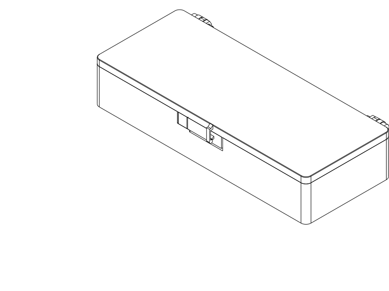
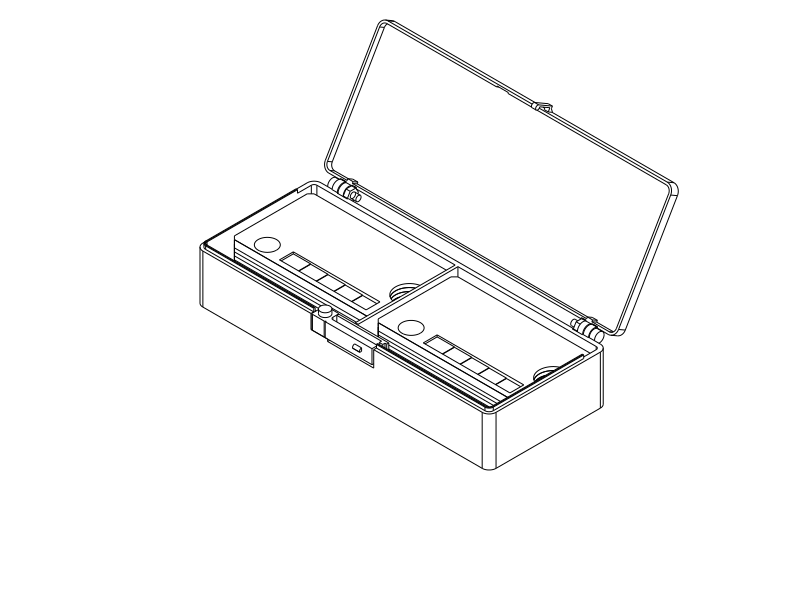
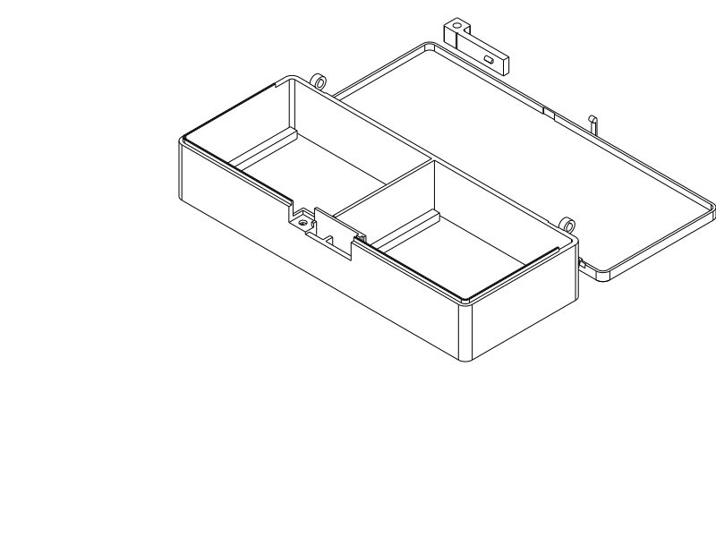
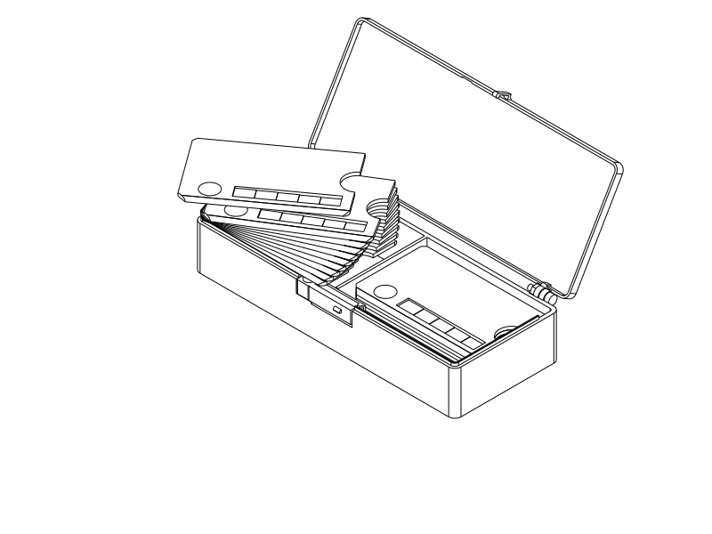
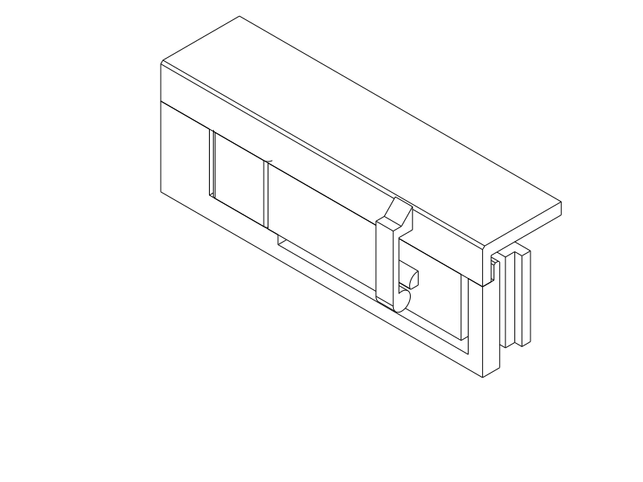

# Twenty-swatch hinged deck case

One shallow case holds two flat ten-swatch packets side by side. Open the lid,
lift either packet through its front finger bay, fan it in your hand and select
a swatch. The approximately **169 × 77 × 33 mm** closed object has a hinged lid
and one exposed press-to-release catch. It contains all twenty cards without
putting loose cards in the moving lid.

This is a complete **first-print design**, with matching printable files and
virtual evidence. It has not been physically validated. The small retention
coupon is the recommended first print: local tooth contact/wear and actual
release feel remain uncertain.




## Files and print plan

| File pair | Purpose |
| --- | --- |
| `swatch_book_case.step` / `.stl` | All three production components, arranged for printing |
| `body.step` / `.stl` | Body alone, floor down |
| `cover.step` / `.stl` | Cover alone, exterior roof down |
| `catch.step` / `.stl` | Separate flexible catch, base down |
| `retention_coupon.step` / `.stl` | One local production-interface sample, three pieces |

[swatch_book_case.py](swatch_book_case.py) is authoritative parametric CadQuery
source; wrappers select components or inspection states. Reference swatches and
screws/nuts occur only in inspection entry points. Likely adjustments are named
parameters: `CARD_ALLOWANCE`, `LIP_INSET`, `LEAF_T`, `PRESS_TRAVEL`, bead/keeper
positions and hinge bore dimensions. Change the actual interface and repeat its
affected checks after physical feedback.

Use **PETG, Qidi Q2C, 0.4 mm nozzle, 0.2 mm layers, four walls and 7% adaptive
cubic infill**. Four walls are consequential: the first three-wall slice left
approximately 0.74 mm unfilled through the catch section. The final actual paths
fill all eight registered sections through the 3.2 mm leaf. This supports a
solid-section idealization; it does not establish isotropy, layer strength or a
quantitative modulus. The leaf bends in XY, with its 8 mm height built in Z.

Use automatic tree supports. Reviewed support locations are the accessible
rear hinge barrels and front screw/nut seat; remove these before assembly.
The slicer generates no support below the small tooth underside. Check its
printed flat retaining edge for droop/roughness on the coupon. Keep the original
component orientations and relative arrangement when using the combined file.

The owned [process profile](notes/process.json) uses the repository's Q2C and
generic PETG profiles: 250°C first layer, 245°C thereafter, 80°C bed and 0.95
flow. Calibrate these for the actual PETG. Final STL smoke slices completed
without log notices, accepted the layouts and generated supports. Their
`review_required` flags record that automatic-support review was needed; the
[reviewed locations](renders/print/support_locations.png) and
[catch paths](renders/print/catch_paths.png) are retained. The main estimate is
94 g / 2 h 24 min; the coupon is 11 g / 42 min. These are profile estimates.
STL smoke acceptance does not verify Orca's separate GUI STEP tessellation.



## Assembly and use

Use **three M3 × 12 mm machine screws and three M3 nuts** from the on-hand
[Jula assortment](https://www.jula.se/catalog/bygg-och-farg/infastning/sortimentsatser/skruvsatser/skruv-muttersats-002837/).
Two screws are pivots; one fastens the catch. The manufacturer's image shows
cross-recess pan heads. CAD checks use nominal 5.5 mm diameter × 2.4 mm heads
and 5.5 mm across-flats × 2.4 mm nuts; actual stock head dimensions have not
been measured. Use a matching screwdriver and small nut tool/pliers.

1. Remove supports and burrs, including in bores and the front nut-access slot.
2. Put one nut in the keyed catch seat's underside pocket. Fit the catch root
   into the seat and fasten it from above. Tighten enough to prevent root motion.
3. Interleave the cover and body hinge lugs and fit one screw/nut per pivot.
   Leave the pivots free to rotate; check nut/head clearance through the opening.
4. Open the lid, load ten face-up cards into each pocket and keep both packets
   below the rim. Lower the lid until its skirt seats and the catch clicks.

Support the case in one hand or on a table. Press the exposed right-hand end of
the front catch inward, then lift the lid with the other hand. One press releases
it. At about 120° open, slip a fingertip into a packet's front bay, lift the
packet clear of the rim, fan it and remove the selected card. Return the packet
flat and lower the cover. The whole packet can come out; the design does not
promise individual card separation while twenty cards remain trapped in a slot.




## Architecture and whole-product checks

The body supports both packets on low ledges. Its perimeter and central divider
locate them; front bays and 4 mm under-packet space admit a fingertip. The lid's
roof contains the contents in carrying orientations. Two screw pivots guide
opening; a U-shaped inner body lip aligns final closure. The lid skirt's lower
face stops on the body rim shoulder. Those functions remain intact with the
catch temporarily omitted.

The separately fastened catch has one job: retain the seated lid. Its rounded
upper bead admits the cover keeper during closing; its flat lower retaining
surface resists unpressed opening. Pressing the accessible leaf end retracts
that bead. A separate inner barrier keeps cards away from the leaf, and a
positive travel stop limits overpressing. The root seat and bolt restrain the
catch; the spring does not locate the lid or establish seating. Hinge hardware
and front mount reliefs are represented in inspection CAD.

The authoritative swatch source is
[filament_archive_swatch.scad](../filament_archive_swatch/filament_archive_swatch.scad).
Its 80 × 50 × 2 mm envelope includes subtractive notch, asymmetric corner
features, surface steps, recesses and lettering. Reference cards reproduce the
consequential corner/notch/step features; full uncut envelope packets conservatively
screen capacity. Text is omitted from inspection cards because it removes
material. All twenty reference cards appear in open/access views.

Rough closed/open geometry and the packet-lifting sequence were reviewed before
refining the mechanism. [check_product.py](check_product.py) checks the complete
assembly; [the retained result](notes/product_checks.json) covers:

- Two 20 mm packets with 0.7 mm nominal clearance per card edge, roof clearance,
  a clear straight lift, front finger access and the actual fanned/selected pose.
- Body, lid, catch and nominal screw/nut envelopes; cover sweep 0–180° at 2°
  spacing; guidance/seating with retention omitted; positive shoulder contact,
  rejection of overclosing and of a 0.6 mm lateral misalignment.
- Loaded, aligned, partly closed, first-contact, maximum-interference, seated,
  release and open states. Named bead/keeper contact is sampled at 0.01° near
  engagement. First contact is about 2.97°, maximum interference about 1.55°.
- A conservative circular-envelope bound of 0.763 mm deflection on the actual
  hinge arc; real tooth/keeper overlap where retention is required; a clear
  seated keeper below the returned flat retaining surface.
- A conservative 1.15 mm rigid bead retraction clears opening through 120°.
  Separate leaf/barrier clearance and a 2 mm travel stop leave room for the
  numerically observed bending. Closed walls, roof and overlapping lip contain
  the full cards; the lower 1.2 mm slit is smaller than an intact 2 mm card.

These are nominal CAD relationships and sampled rigid paths, not measurements
of printed grip, shell warping, friction, wear or carrying reliability.

## Retention physics and its limits

[analyze_catch.py](analyze_catch.py) uses the shared **SnapFitQuestion** and
**QuestionStudy**, Gmsh and CalculiX; no model-specific solver pipeline or
experimental backend is required. The analytical screen brackets modulus
800/1200/1800 MPa and closing interference 0.7/0.9/1.1 mm. Its cantilever/circular
cam estimates include stiffness, closing and release force and root strain.
The ±0.2 mm variation is an assumed clearance sensitivity, not measured Q2C
accuracy. The beam is short enough that these are rough screens.

The [generated numerical summary](notes/analysis_summary.json) separates native
completion, bounded numerical comparisons and provisional material screens:

| Actual local operation | Result | What remains uncertain |
| --- | --- | --- |
| Contact-driven 1.35 mm thumb press and withdrawal | About 10 N and 1.3% peak root strain; motion-step and mesh refinements stable within the selected tolerance; unloaded leaf returns | Actual PETG force/recovery, friction, printed root restraint and clearance |
| Actual keeper closes over bead and finishes seated | About 4.8 N, passage and unloaded return complete | Local tooth-contact peak strain **3.23% exceeds the provisional 1.5% screen**; closing force/strain not refinement-qualified; indentation/wear needs a coupon |

The flexible leaf has no prescribed displacement. Release is driven by a rigid
4 × 4 mm thumb proxy against the actual catch, with the root ideally restrained.
A stationary conservative wider keeper checks that pressing does not hit it.
The observed bead travel is 0.876–0.883 mm, about 0.11–0.12 mm beyond the arc
bound; maximum tip travel leaves about 0.22 mm before the real stop. Those modest
nominal margins make printed clearance testing consequential.

Closing uses the real 2.4 mm-wide keeper contact surface, following the chord of
its last 4° hinged path. The circle about the hinge differs by at most 0.045 mm
and the chord slightly increases inward interference. The keeper finishes in
its real seated position; there is no artificial reverse pull-through opening.
Surrounding shell, hardware, barrier and stops are checked separately in CAD.

The homogeneous isotropic PETG model uses uncalibrated E=1200 MPa, ν=0.38,
frictionless contact and ideal root fixation. Actual four-wall paths have been
bound to identity-checked retained question evidence: a solid leaf is consistent
with the inspected slice, but printed material strength is still unknown.
Penalty contact penetration was 0.003 mm on release and 0.023 mm on closing
(below the chosen 0.03 mm numerical screen). Force balance passed. Contact-law
sensitivity was not run. The closing contact peak is a local material-screen
failure, not solver failure or proof of printed failure; further local numerical
tuning would not establish actual tooth wear. No fatigue life or holding load
has been qualified.

Earlier retained local runs explain the increased press stroke, narrower keeper
and 0.2 mm tooth-edge blend. They are superseded physics diagnostics, not other
finished product concepts. Final release passes the supplied provisional screen;
final closing retains its failed material screen explicitly.

A small shared helper correction allows stationary mates during press/return,
and one-way closing with `require_driver_return=False` only when an explicit
final contact-free checkpoint and observed unloaded leaf return both pass.
The default still requires moving drivers to return. This avoids simulating an
unintended opening sequence. Fourteen engineering-question tests pass; the
actual one-way native closing is the consumer of this capability.

## First physical prints and status

Print the included coupon first with the production settings. It preserves the
actual catch, keyed seat/bolt, keeper, shoulder, barrier and travel stop. Align
its front faces and cut ends and lower its cap onto the shoulder. Its straight
local closing path conservatively replaces the short hinge arc; it omits hinge
guidance, full-shell stiffness, packet access and carrying behavior.

Try about twenty gentle closing/release cycles. Check a clean tooth underside,
positive retention against an ordinary upward pull, comfortable one-button
release **before reaching the stop**, spring return and any indentation,
whitening, cracking or progressive looseness. Note which contact is troublesome;
measure actual clearance/force if possible. This is an informative trial, not a
fatigue qualification. If closing is rough, lightly press the button while
lowering the cap rather than forcing damaged surfaces.

For the complete print, load all twenty actual swatches and test normal packet
lifting, fanning, selection and return. Check pivot freedom, fastener security,
one-button operation, then gentle carrying/inversion and ordinary bag handling.
Observe accidental opening separately from button discomfort or tooth wear.
The coupon cannot establish these whole-product qualities.

Reviewed 2026-10-01. No user print report has been received.

| Item | Print status | Artifact(s) | User result or remaining physical checks |
| --- | --- | --- | --- |
| Test piece(s) | Unknown | `retention_coupon.step`, `retention_coupon.stl` | Printed clearance, tooth underside/wear, retention, release effort, root restraint and spring return |
| Final printable object(s) | Unknown | `swatch_book_case.step/.stl`; `body.step/.stl`, `cover.step/.stl`, `catch.step/.stl` | All twenty real cards, packet browsing, pivots, one-button operation, carrying and bag retention |

## Reproduce and attribution

From the repository root:

```sh
uv run --locked python model/swatch_book_case/check_product.py
./evaluate_model.py model/swatch_book_case/swatch_book_case.py --views isometric --slice --slice-process model/swatch_book_case/notes/process.json --slice-placement preserve
./evaluate_model.py model/swatch_book_case/retention_coupon.py --views isometric --slice --slice-process model/swatch_book_case/notes/process.json --slice-placement preserve
uv run --locked python model/swatch_book_case/analyze_catch.py /tmp/new_release release /tmp/new_release_archive
uv run --locked python model/swatch_book_case/analyze_catch.py /tmp/new_closing closing /tmp/new_closing_archive
```

Numerical run and archive destinations must be new. Existing evidence can be
read through the high-level helpers without solving; `--bind-paths GCODE` checks
native identities and refreshes only manufacturing/question interpretation.
Native inputs, geometry, logs, results and histories are under `notes/analysis/`;
[analysis_summary.json](notes/analysis_summary.json) is regenerated by
`summarize_analysis.py`. Final slice reports/commands and compressed actual
G-code are in `notes/slice*` and `notes/coupon_slice*`. `review_paths.py` makes
the targeted leaf-fill/support review. Component export checks are recorded in
`notes/evaluation.json`. No STEP reimport or redundant mesh audit was used.

Primary model: GPT-6 family; exact runtime variant and reasoning effort not
exposed. Harness: Codex API agent, provider OpenAI; no subagents. Authoritative
swatch: user-supplied Gemini 3.1 Pro OpenSCAD source, unchanged and used only as
an inspection reference. New organizer source/documentation: repository MIT.
